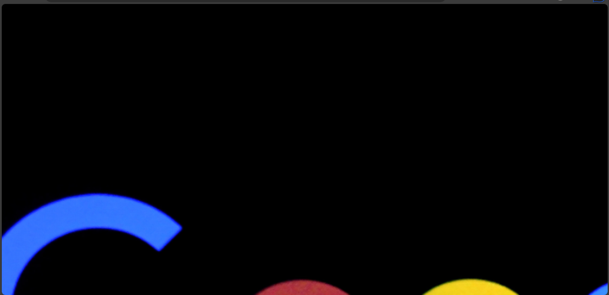
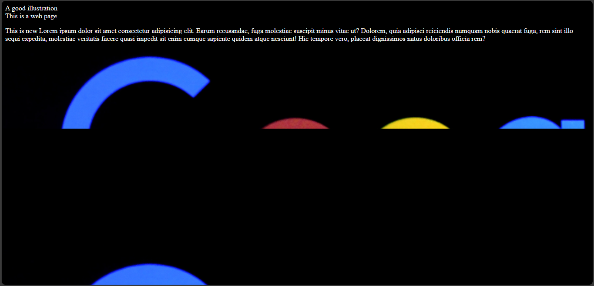

# The `background-attachment` property
The `background-attachment` property determines whether an image should remain fixed to the screen when you scroll or otherwise.

It has three common values which are:
- The `fixed` value.
- The `scroll` value.
- The `local` value.

## The `fixed` value

When you set the `background-attachment` to `fixed`, the image content does not move as you scroll up. It remains fixed to the screen.

Example,

`index.html`
```
<!DOCTYPE html>
<html>
  <head>
    <meta charset="utf-8"/>
    <title>A simple html page</title>
    <link rel="stylesheet" href="styles.css"/>
  </head>
  <body>
    <header>A good illustration</header>
    <main>This is a web page</main>
  </body>
</html>
```

`styles.css`
```
body {
  background-image: url("../img/google_image.png");
  background-size: cover;
  background-position: center;
  background-attachment: fixed;
}
```




## The `scroll` value:
When you set the `background-attachment` to `scroll`, it becomes attached to the element and does not scroll with the content of the element.

Example,

`index.html`
```
<!DOCTYPE html>
<html>
  <head>
    <meta charset="utf-8"/>
    <title>A simple html page</title>
    <link rel="stylesheet" href="styles.css"/>
  </head>
  <body>
    <header>A good illustration</header>
    <main>This is a web page</main>
    <p>This is new Lorem ipsum dolor sit amet consectetur adipisicing elit. Earum recusandae, 
      fuga molestiae suscipit minus vitae ut? Dolorem, quia adipisci reiciendis numquam nobis quaerat fuga, 
      rem sint illo sequi expedita, molestiae veritatis facere quasi impedit sit enim cumque sapiente quidem 
      atque nesciunt! Hic tempore vero, placeat dignissimos natus doloribus officia rem?
    </p>
  </body>
</html>
```

`styles.css`
```
body {
  color: white;
  background-image: url("../img/google_image.png");
  background-size: cover;
  background-position: center;
  background-attachment: scroll;
}
```
I added the `color` property to make the text show since it has a black background.


## The `local` value
When the `background-attachment` is set to `local`, the background image will scroll up with the content on it.

Example,

`index.html`
```
<!DOCTYPE html>
<html>
  <head>
    <meta charset="utf-8"/>
    <title>A simple html page</title>
    <link rel="stylesheet" href="styles.css"/>
  </head>
  <body>
    <header>A good illustration</header>
    <main>This is a web page</main>
    <p>This is new Lorem ipsum dolor sit amet consectetur adipisicing elit. Earum recusandae, 
      fuga molestiae suscipit minus vitae ut? Dolorem, quia adipisci reiciendis numquam nobis quaerat fuga, 
      rem sint illo sequi expedita, molestiae veritatis facere quasi impedit sit enim cumque sapiente quidem 
      atque nesciunt! Hic tempore vero, placeat dignissimos natus doloribus officia rem?
    </p>
  </body>
</html>
```

`styles.css`
```
body {
  color: white;
  background-image: url("../img/google_image.png");
  background-size: cover;
  background-position: center;
  background-attachment: local;
}
```


