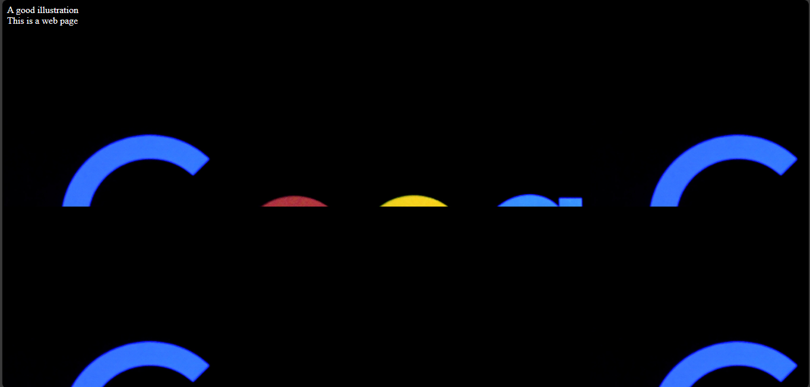

# Background images in CSS 
In the Html section, you covered media elements `img`, `audio` and `video`. These are Html elements. 

CSS has a `background-image` property which you can use to insert images in the background of your web page. You will cover the `background-image` and its values in this section.

## The `background-image` property
The `background-image` property has values which CSS uses to modify the images you add to the background of your webpage. The property has other relative properties which can enhance the look of an image and its positioning.

The `background-image` is a CSS property, hence you place it in your `.css` file.

This is the syntax of the `background-image`;

`styles.css`
```
background-image {
  url("path-to-image");
}
```

The `background-image` property has these values which are:

- **The `url` value:** You can add the image path to this value.
- **The `none` value:** When you set the value to `none`, there will be no background image.
- **The `inherit` value:** This value will make the property inherit the image from its parent element.
- **The `initial` value:** This sets it back to its default value.
- **The `linear-gradient` value:** This forms colours in a linear shape.
- **The `radial-gradient` value:** Forms colours in a radial shape.
- **The `conic-gradient` value:** Forms colours that are conic-shaped.

Example,

`index.html`
```
<!DOCTYPE html>
<html>
  <head>
    <meta charset="utf-8"/>
    <title>A simple html page</title>
    <link rel="stylesheet" href="styles.css"/>
  </head>
  <body>
    <header>A good illustration</header>
    <main>This is a web page</main>
  </body>
</html>
```

`styles.css`
```
body {
  background-image: url("../img/google_image.png");
}
```



There are key points to note about this image, 
1. It is repeating itself.
2. It is set at the top-left corner.

This is why CSS has other properties which you can use to reset your `background-image` and position it to your taste.

These properties are:
1. The `background-size` property.
2. The `background-position` property.
3. The `background-attachment` property.
4. The `background-repeat` property.