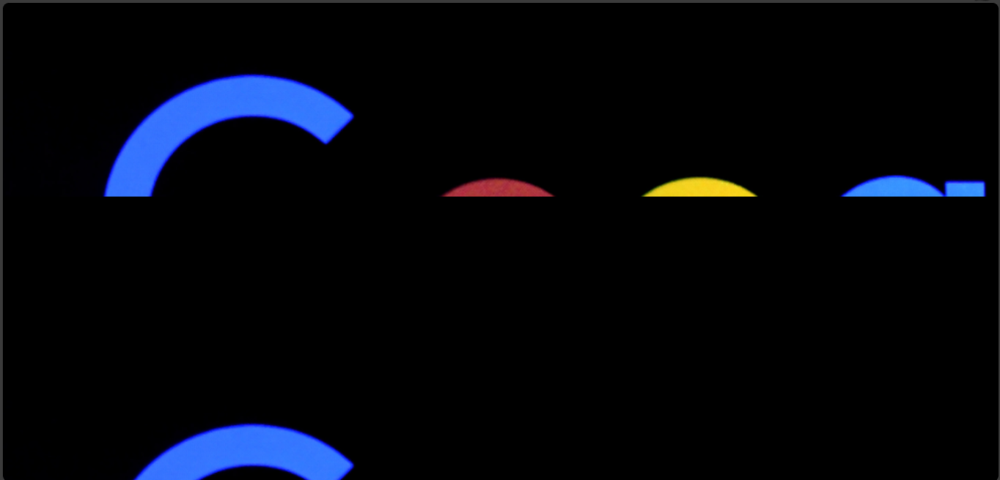

# The `background-position` property
The `background-position` property sets the position of a background image. 

The `background-position` property uses values like `left`, `right` and numbers to position images.

You can position your images how you wish using the `background-position`. I will give it a value of `center`, because I want the image to be at the center position.

Example,

`index.html`
```
<!DOCTYPE html>
<html>
  <head>
    <meta charset="utf-8"/>
    <title>A simple html page</title>
    <link rel="stylesheet" href="styles.css"/>
  </head>
  <body>
    <header>A good illustration</header>
    <main>This is a web page</main>
  </body>
</html>
```

`styles.css`
```
body {
  background-image: url("../img/google_image.png");
  background-size: cover;
  background-position: center;
}
```



This makes the image to remain at the center while occupying the full width of its container.