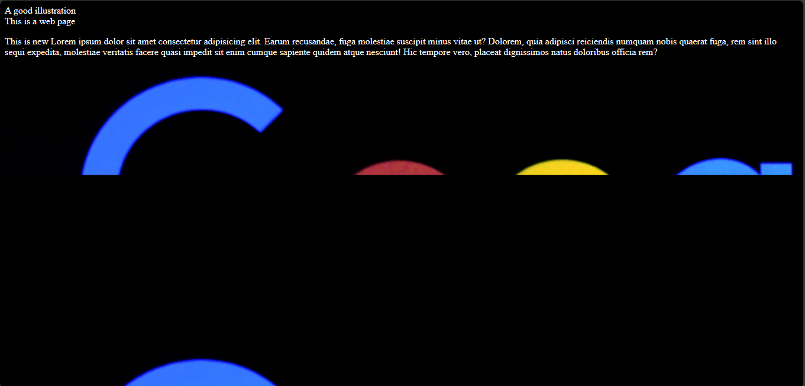
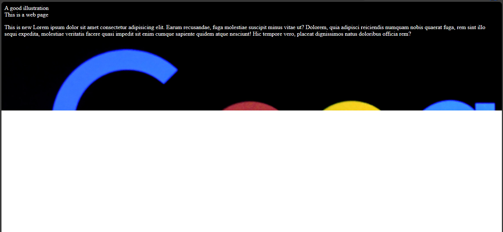
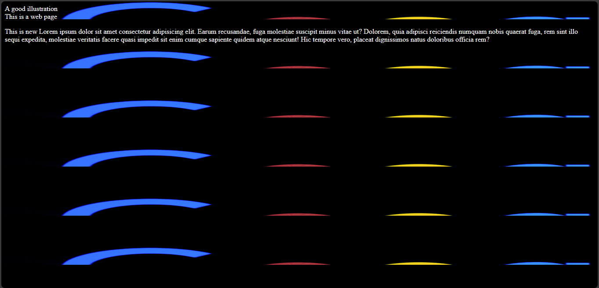
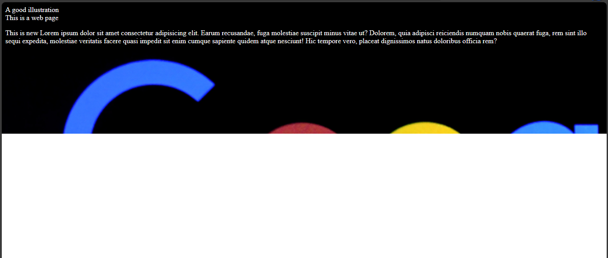
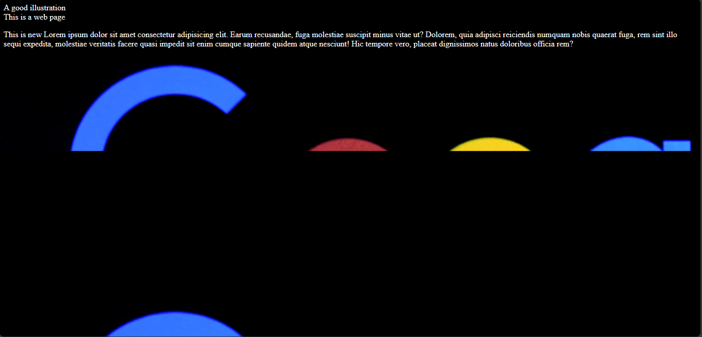

# The `background-repeat` property
With this property, you can set how you want to repeat or not repeat background images. 

The property has values which are:
- The `repeat` value.
- The `no-repeat` value.
- The `space` value.
- The `round` value.
- The `repeat-x` value.
- The `repeat-y` value.

## The `repeat` value
With the `repeat` value, you can make an image repeat itself to occupy its container. 

Example,

`index.html`
```
<!DOCTYPE html>
<html>
  <head>
    <meta charset="utf-8"/>
    <title>A simple html page</title>
    <link rel="stylesheet" href="css/styles.css"/>
  </head>
  <body>
    <header>A good illustration</header>
    <main>This is a web page</main>
    <p>This is new Lorem ipsum dolor sit amet consectetur adipisicing elit. Earum recusandae, 
      fuga molestiae suscipit minus vitae ut? Dolorem, quia adipisci reiciendis numquam nobis quaerat fuga, 
      rem sint illo sequi expedita, molestiae veritatis facere quasi impedit sit enim cumque sapiente quidem 
      atque nesciunt! Hic tempore vero, placeat dignissimos natus doloribus officia rem?
    </p>
  </body>
</html>
```

`styles.css`
```
body {
  color: white;
  background-image: url("../img/google_image.png");
  background-size: cover;
  background-position: center;
  background-repeat: repeat;
}
```



## The `no-repeat` value

The `no-repeat` value makes the image not repeat itself.

Example,

`index.html`
```
<!DOCTYPE html>
<html>
  <head>
    <meta charset="utf-8"/>
    <title>A simple html page</title>
    <link rel="stylesheet" href="styles.css"/>
  </head>
  <body>
    <header>A good illustration</header>
    <main>This is a web page</main>
    <p>This is new Lorem ipsum dolor sit amet consectetur adipisicing elit. Earum recusandae, 
      fuga molestiae suscipit minus vitae ut? Dolorem, quia adipisci reiciendis numquam nobis quaerat fuga, 
      rem sint illo sequi expedita, molestiae veritatis facere quasi impedit sit enim cumque sapiente quidem 
      atque nesciunt! Hic tempore vero, placeat dignissimos natus doloribus officia rem?
    </p>
  </body>
</html>
```

`styles.css`
```
body {
  color: white;
  background-image: url("../img/google_image.png");
  background-size: cover;
  background-position: center;
  background-repeat: no-repeat;
}
```




## The `space` value
It makes the image repeat itself with equal space margin among the repeated parts.

Example,

`index.html`
```
<!DOCTYPE html>
<html>
  <head>
    <meta charset="utf-8"/>
    <title>A simple html page</title>
    <link rel="stylesheet" href="styles.css"/>
  </head>
  <body>
    <header>A good illustration</header>
    <main>This is a web page</main>
    <p>This is new Lorem ipsum dolor sit amet consectetur adipisicing elit. Earum recusandae, 
      fuga molestiae suscipit minus vitae ut? Dolorem, quia adipisci reiciendis numquam nobis quaerat fuga, 
      rem sint illo sequi expedita, molestiae veritatis facere quasi impedit sit enim cumque sapiente quidem 
      atque nesciunt! Hic tempore vero, placeat dignissimos natus doloribus officia rem?
    </p>
  </body>
</html>
```

`styles.css`
```
body {
  color: white;
  background-image: url("../img/google_image.png");
  background-size: cover;
  background-position: center;
  background-repeat: space;
}
```


## The `round` value

The `round` value will repeat images, stretch and compress the width of the image to accommodate all repetitions.

Example,

`index.html`
```
<!DOCTYPE html>
<html>
  <head>
    <meta charset="utf-8"/>
    <title>A simple html page</title>
    <link rel="stylesheet" href="styles.css"/>
  </head>
  <body>
    <header>A good illustration</header>
    <main>This is a web page</main>
    <p>This is new Lorem ipsum dolor sit amet consectetur adipisicing elit. Earum recusandae, 
      fuga molestiae suscipit minus vitae ut? Dolorem, quia adipisci reiciendis numquam nobis quaerat fuga, 
      rem sint illo sequi expedita, molestiae veritatis facere quasi impedit sit enim cumque sapiente quidem 
      atque nesciunt! Hic tempore vero, placeat dignissimos natus doloribus officia rem?
    </p>
  </body>
</html>
```

`styles.css`
```
body {
  color: white;
  background-image: url("../img/google_image.png");
  background-size: cover;
  background-position: center;
  background-repeat: round; 
}
```



## The `repeat-x` and `repeat-y` values

The `repeat-x` repeats an image along the horizontal axis while the `repeat-y` repeats an image along the vertical axis.

### For repeat-x
Example,

`index.html`
```
<!DOCTYPE html>
<html>
  <head>
    <meta charset="utf-8"/>
    <title>A simple html page</title>
    <link rel="stylesheet" href="styles.css"/>
  </head>
  <body>
    <header>A good illustration</header>
    <main>This is a web page</main>
    <p>This is new Lorem ipsum dolor sit amet consectetur adipisicing elit. Earum recusandae, 
      fuga molestiae suscipit minus vitae ut? Dolorem, quia adipisci reiciendis numquam nobis quaerat fuga, 
      rem sint illo sequi expedita, molestiae veritatis facere quasi impedit sit enim cumque sapiente quidem 
      atque nesciunt! Hic tempore vero, placeat dignissimos natus doloribus officia rem?
    </p>
  </body>
</html>
```

`styles.css`
```
body {
  color: white;
  background-image: url("../img/google_image.png");
  background-size: cover;
  background-position: center;
  background-repeat: repeat-x; 
}
```




### For repeat-y
Example,

`index.html`
```
<!DOCTYPE html>
<html>
  <head>
    <meta charset="utf-8"/>
    <title>A simple html page</title>
    <link rel="stylesheet" href="styles.css"/>
  </head>
  <body>
    <header>A good illustration</header>
    <main>This is a web page</main>
    <p>This is new Lorem ipsum dolor sit amet consectetur adipisicing elit. Earum recusandae, 
      fuga molestiae suscipit minus vitae ut? Dolorem, quia adipisci reiciendis numquam nobis quaerat fuga, 
      rem sint illo sequi expedita, molestiae veritatis facere quasi impedit sit enim cumque sapiente quidem 
      atque nesciunt! Hic tempore vero, placeat dignissimos natus doloribus officia rem?
    </p>
  </body>
</html>
```

`styles.css`
```
body {
  color: white;
  background-image: url("../img/google_image.png");
  background-size: cover;
  background-position: center;
  background-repeat: repeat-y; 
}
```



