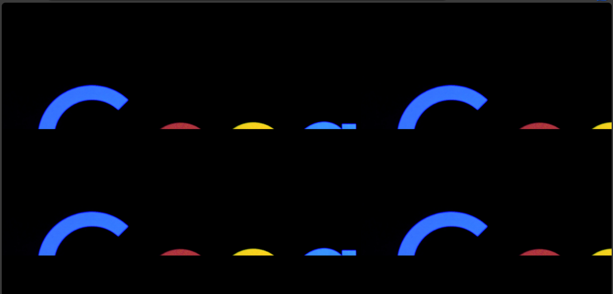
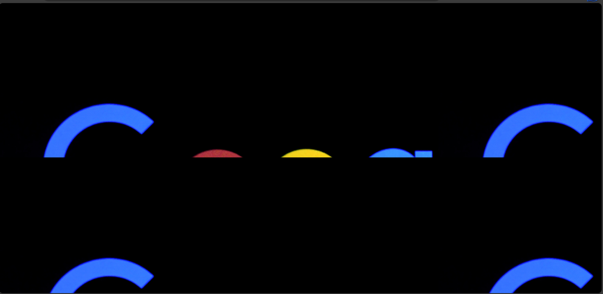
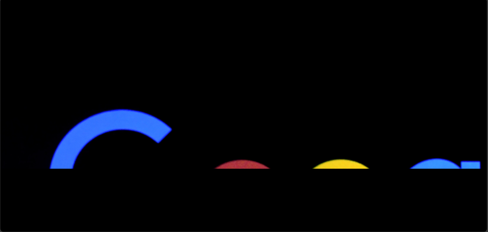

# The `background-size` property
The `background-size` property sets the size of a background image. It could make the image reverse to its normal size or even stretch or squeeze it.

The `background-size` has values of `inherit` and `initial` like `background-image`.

But the property has other values which are classified according to [MDN](https://developer.mozilla.org/en-US/docs/Web/CSS/background-size) as:
1. Single value.
2. Two values.
3. Multiple values.
4. Keyword values.

## Single value
When using a single value, you could use `em`, `rem`,`px`, percentage or `auto` to represent the width of the image.

Example,

`index.html`
```
<!DOCTYPE html>
<html>
  <head>
    <meta charset="utf-8"/>
    <title>A simple html page</title>
    <link rel="stylesheet" href="styles.css"/>
  </head>
  <body>
    <header>A good illustration</header>
    <main>This is a web page</main>
  </body>
</html>
```


`styles.css`
```
body {
  background-image: url("../img/google_image.png");
  background-size: 800px;
}
```



## Two values
When you give two values as the `background-size`, it represents the width and the height. You could use units like `em`, `rem` and so on just like in a single value.

Example,

`index.html`
```
<!DOCTYPE html>
<html>
  <head>
    <meta charset="utf-8"/>
    <title>A simple html page</title>
    <link rel="stylesheet" href="styles.css"/>
  </head>
  <body>
    <header>A good illustration</header>
    <main>This is a web page</main>
  </body>
</html>
```


`styles.css`
```
body {
  background-image: url("../img/google_image.png");
  background-size: 300px 400px;
}
```


## Multiple values
Multiple values involve when you use more than two values to specify the `background-size`.

Example,

`index.html`
```
<!DOCTYPE html>
<html>
  <head>
    <meta charset="utf-8"/>
    <title>A simple html page</title>
    <link rel="stylesheet" href="styles.css"/>
  </head>
  <body>
    <header>A good illustration</header>
    <main>This is a web page</main>
  </body>
</html>
```


`styles.css`
```
body {
  background-image: url("../img/google_image.png");
  background-size: 300px 400px auto;
}
```



## Keyword values
In keyword values, you use two words `cover` and `contain` to resize a background image.

1. `cover` - adjusts the image to fill its container and crops out unwanted parts.

2. `contain` - spreads the image over the container. It crops it but it could make images repeat in the container.

To illustrate the `background-size` property, you can give the background image size.

Example,

`index.html`
```
<!DOCTYPE html>
<html>
  <head>
    <meta charset="utf-8"/>
    <title>A simple html page</title>
    <link rel="stylesheet" href="styles.css"/>
  </head>
  <body>
    <header>A good illustration</header>
    <main>This is a web page</main>
  </body>
</html>
```

`styles.css`
```
body {
  background-image: url("../img/google_image.png");
  background-size: cover;
}
```



