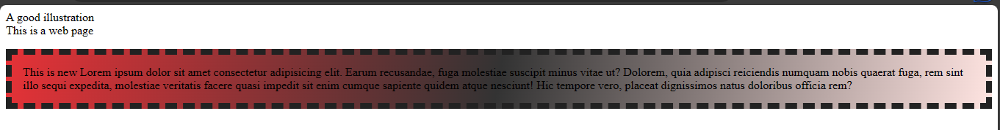
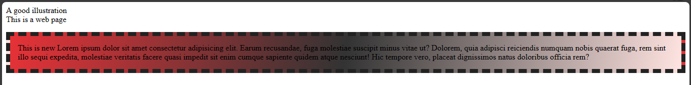
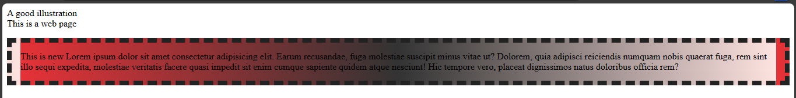
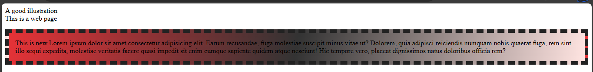
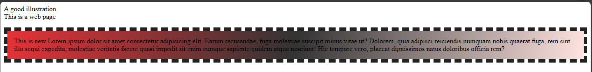
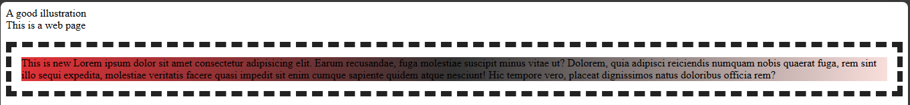

# Background property in CSS 
The `background` property is a CSS shorthand property for the various background properties. Which are,

1. The `background-color` property.
2. The `background-image` property.
3. The `background-size` property.
4. The `background-attachment` property.
5. The `background-repeat` property.
6. The `background-position` property.
7. The `background-origin` property.
8. The `background-clip` property 


CSS uses the `background` property for all these properties above. When you use the `background` property for any of the properties above. Your browser engine will determine which one by the values you pass in as the properties have their unique values.

You have covered all the properties apart from `background-origin` and `background-clip` properties.

## The `background-origin` property
This property sets the position of an image in relation to the border, padding and content.
CSS ignores the `background-origin` property when you set `background-attachment` to fixed. But you can still use the `background-origin` property when the `background-attachment` is not set to fixed.

The property has three values which are:
- The `border-box` value.
- The `padding-box` value.
- The `content-box` value.

### The `border-box` value
With this value, you get to position your background inside the border.

Example,

`index.html`
```
<!DOCTYPE html>
<html>
  <head>
    <meta charset="utf-8"/>
    <title>A simple html page</title>
    <link rel="stylesheet" href="styles.css"/>
  </head>     
  <body>
    <header>A good illustration</header>
    <main>This is a web page</main>
    <p>This is new Lorem ipsum dolor sit amet consectetur adipisicing elit. Earum recusandae, 
      fuga molestiae suscipit minus vitae ut? Dolorem, quia adipisci reiciendis numquam nobis quaerat fuga, 
      rem sint illo sequi expedita, molestiae veritatis facere quasi impedit sit enim cumque sapiente quidem 
      atque nesciunt! Hic tempore vero, placeat dignissimos natus doloribus officia rem?
    </p>
  </body>
</html>
```

`styles.css`
```
p {
  color: black;
  border: 8px dashed #222;
  padding: 15px;
  background: linear-gradient(100deg, rgb(230,50,55), #333, mistyrose);
  background-origin: border-box;
}
```



### The `padding-box` value
With this value, you get to set your background inside the padding.

Example,

`index.html`
```
<!DOCTYPE html>
<html>
  <head>
    <meta charset="utf-8"/>
    <title>A simple html page</title>
    <link rel="stylesheet" href="styles.css"/>
  </head>     
  <body>
    <header>A good illustration</header>
    <main>This is a web page</main>
    <p>This is new Lorem ipsum dolor sit amet consectetur adipisicing elit. Earum recusandae, 
      fuga molestiae suscipit minus vitae ut? Dolorem, quia adipisci reiciendis numquam nobis quaerat fuga, 
      rem sint illo sequi expedita, molestiae veritatis facere quasi impedit sit enim cumque sapiente quidem 
      atque nesciunt! Hic tempore vero, placeat dignissimos natus doloribus officia rem?
    </p>
  </body>
</html>
```

`styles.css`
```
p {
  color: black;
  border: 8px dashed #222;
  padding: 15px;
  background: linear-gradient(100deg, rgb(230,50,55), #333, mistyrose);
  background-origin: padding-box;
}
```




### The `content-box` value

The `content-box` sets the background in relation to the content.

Example,

`index.html`
```
<!DOCTYPE html>
<html>
  <head>
    <meta charset="utf-8"/>
    <title>A simple html page</title>
    <link rel="stylesheet" href="styles.css"/>
  </head>     
  <body>
    <header>A good illustration</header>
    <main>This is a web page</main>
    <p>This is new Lorem ipsum dolor sit amet consectetur adipisicing elit. Earum recusandae, 
      fuga molestiae suscipit minus vitae ut? Dolorem, quia adipisci reiciendis numquam nobis quaerat fuga, 
      rem sint illo sequi expedita, molestiae veritatis facere quasi impedit sit enim cumque sapiente quidem 
      atque nesciunt! Hic tempore vero, placeat dignissimos natus doloribus officia rem?
    </p>
  </body>
</html>
```

`styles.css`
```
p {
  color: black;
  border: 8px dashed #222;
  padding: 15px;
  background: linear-gradient(100deg, rgb(230,50,55), #333, mistyrose);
  background-origin: content-box;
}
```



Now, let's look at the `background-clip` property

## The `background-clip` property 
This property determines how the background adjusts to the border, padding or content.

It has four values which are:
- The `border-box` value.
- The `padding-box` value.
- The `content-box` value. 
- The `text` value. 

### The `border-box` value
This value makes the background to reach the border. This means applying background colour or image to an element with this value will cause the background property to cover all of the element's sides including the border. This is the default value of the clip property.

Example,

`index.html`
```
<!DOCTYPE html>
<html>
  <head>
    <meta charset="utf-8"/>
    <title>A simple html page</title>
    <link rel="stylesheet" href="styles.css"/>
  </head>     
  <body>
    <header>A good illustration</header>
    <main>This is a web page</main>
    <p>This is new Lorem ipsum dolor sit amet consectetur adipisicing elit. Earum recusandae, 
      fuga molestiae suscipit minus vitae ut? Dolorem, quia adipisci reiciendis numquam nobis quaerat fuga, 
      rem sint illo sequi expedita, molestiae veritatis facere quasi impedit sit enim cumque sapiente quidem 
      atque nesciunt! Hic tempore vero, placeat dignissimos natus doloribus officia rem?
    </p>
  </body>
</html>
```

`styles.css`
```
p {
  color: black;
  border: 8px dashed #222;
  padding: 15px;
  background: linear-gradient(100deg, rgb(230,50,55), #333, mistyrose);
  background-clip: border-box;
}
```


From the image above, the background colour extends to the border of the paragraph element because of the `border-box` value.


### The `padding-box` value
It makes the background property to cover the entire element excluding the border.

Example,

`index.html`
```
<!DOCTYPE html>
<html>
  <head>
    <meta charset="utf-8"/>
    <title>A simple html page</title>
    <link rel="stylesheet" href="styles.css"/>
  </head>     
  <body>
    <header>A good illustration</header>
    <main>This is a web page</main>
    <p>This is new Lorem ipsum dolor sit amet consectetur adipisicing elit. Earum recusandae, 
      fuga molestiae suscipit minus vitae ut? Dolorem, quia adipisci reiciendis numquam nobis quaerat fuga, 
      rem sint illo sequi expedita, molestiae veritatis facere quasi impedit sit enim cumque sapiente quidem 
      atque nesciunt! Hic tempore vero, placeat dignissimos natus doloribus officia rem?
    </p>
  </body>
</html>
```

`styles.css`
```
p {
  color: black;
  border: 8px dashed #222;
  padding: 15px;
  background: linear-gradient(100deg, rgb(230,50,55), #333, mistyrose);
  background-clip: padding-box;
}
```



The next value is the `content-box` value.

### The `content-box` value
This value makes the background cover only the body of the content.

Example,

`index.html`
```
<!DOCTYPE html>
<html>
  <head>
    <meta charset="utf-8"/>
    <title>A simple html page</title>
    <link rel="stylesheet" href="styles.css"/>
  </head>     
  <body>
    <header>A good illustration</header>
    <main>This is a web page</main>
    <p>This is new Lorem ipsum dolor sit amet consectetur adipisicing elit. Earum recusandae, 
      fuga molestiae suscipit minus vitae ut? Dolorem, quia adipisci reiciendis numquam nobis quaerat fuga, 
      rem sint illo sequi expedita, molestiae veritatis facere quasi impedit sit enim cumque sapiente quidem 
      atque nesciunt! Hic tempore vero, placeat dignissimos natus doloribus officia rem?
    </p>
  </body>
</html>
```

`styles.css`
```
p {
  color: black;
  border: 8px dashed #222;
  padding: 15px;
  background: linear-gradient(100deg, rgb(230,50,55), #333, mistyrose);
  background-clip: content-box;
}
```



That sums up the values of the `background-clip` and other background properties in css. CSS has a shorthand/shortcut property which it uses to combine some of these properties together. This property is called the `background` property. 

## The `background` shorthand property
The `background` property can combine different properties together. You could use it for a background image, color, position, origin, size and so on.

Example,

`index.html`
```
<!DOCTYPE html>
<html>
  <head>
    <meta charset="utf-8"/>
    <title>A simple html page</title>
    <link rel="stylesheet" href="styles.css"/>
  </head>    
  <body>
    <header>A good illustration</header>
    <main>This is a web page</main>
    <p>This is new Lorem ipsum dolor sit amet consectetur adipisicing elit. Earum recusandae, 
      fuga molestiae suscipit minus vitae ut? Dolorem, quia adipisci reiciendis numquam nobis quaerat fuga, 
      rem sint illo sequi expedita, molestiae veritatis facere quasi impedit sit enim cumque sapiente quidem 
      atque nesciunt! Hic tempore vero, placeat dignissimos natus doloribus officia rem?
    </p>
  </body>
</html>
```

`styles.css`
```
body {
  color: white;
  background: url("../img/momentum.jpeg") #ae99ef no-repeat center / cover;
}
```


With the property shorthand, I combined background properties like `background-size`, `background-position`, `background-repeat`, `background-image`, and `background-color`.

So that's the power of the `background` shorthand property. It lets you combine multiple properties together.
