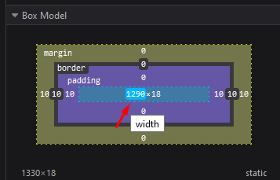
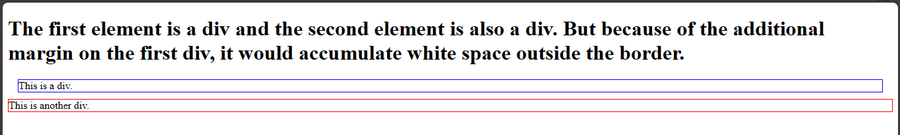
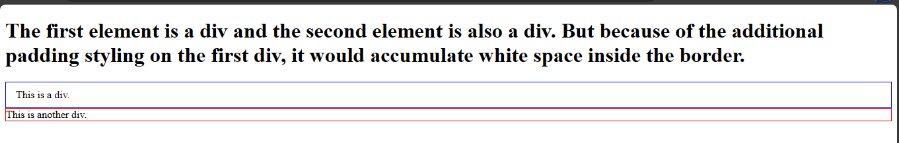

# Box model
The box model is a concept of how css styles html elements. 
The box model is an important part of css because understanding the box model would make it easier for you to style web pages.





The image above is an illustration of the box model. It has a top, bottom, left and right surrounding the box.


Each element is like a box and this box is a rectangular-shaped item. Each part of the box comprises these properties: margin, border, padding, width and height(for the content).


Margin is the outer body surrounding an element.


The border is in between the margin and padding while the padding is the inner body.


## Margin
Margins are the spaces around an element outside the border. You can set margins on an element using the margin property.
You could apply the margin on all four sides of an element which are; the right, left, top, and bottom values.


The syntax for the margin property is as follows:

```
margin: top value, right value, bottom value, left value;
```

Example,

`styles.css`
```
margin: 10px 12px 15px 20px
```

This applies a margin of 10px on the top, 12px on the right, 15px on the bottom, and 20px on the left.


You can set margin property for all values using a single value.


`styles.css`
```
margin: 10px;
```

This will apply an equal margin spacing of 10px on all sides.


You can set for the top-bottom and right-left values too.


`styles.css`
```
margin: 10px 15px;
```

This will apply a margin of 10px on the top-bottom and 15px on the right-left sides.


You can specify margin individually like this:


```
margin-top: 12px;
margin-right: 10px;
margin-bottom: 15px;
margin-left: 20px;
```


The values for margin property could be in pixels(px), percentages(%), em,rem, and other units.


Example,

`index.html`

```
<!DOCTYPE html>
<html>
  <head>
    <meta charset="utf-8"/>
    <title>A simple html page</title>
    <link rel="stylesheet" href="styles.css"/>
  </head>
  <body>
    <p>The first element is a div and the second element is also a div. 
      But because of the additional margin styling on the first div, 
      it would accumulate white space.
    </p>
    <div class="first_div">This is a div.</div>
    <div class="second_div">This is another div.</div>
  </body>
</html>
```

`styles.css`
```
.first_div {
    border: 1px solid blue;
    margin: 10px 15px;
}

.second_div {
    border: 1px solid red;
}
```



As you can see from the image, the margins will move the first div from its original position.

## Border
The border property defines the appearance, style, and size of an element's border. You can specify the border property as a shorthand or individual properties for each side of the element(top, right, bottom, left).


This is the shorthand syntax:

```
border: [border-width] [border-style] [border-color];
```

This is the individual property syntax:

```
border-width: value;
border-style: value;
border-color: value;
```

- The border-width property defines the thickness or width of the border. You can specify them in pixels(px), em, rem, percentages(%), or other units.


- The border-style property defines the style of the border such as the solid, dashed, dotted or other available styles.


- The border-color property defines the color of the border. You can set it with the predefined color names, hexadecimal values, RGB values, and other color values available.


Examples:


1. For the shorthand property:

`styles.css`
```
border: 1px solid black;
```
This combines both `border-width` for 1px, `border-style` for solid, `border-color` for color on every side of the border.


2. For individual border properties:

`styles.css`
```
border-width: 1px;
border-style: solid;
border-color: black;
```
This is how to set the individual border properties with their values.


3. Borders for different sides:

`styles.css`
```
border-top: 1px solid blue;
border-right: 1px dashed green;
border-bottom: 2px dotted black;
border-left: 1px solid red;
```
This applies unique border properties on all the border sides.

In the previous example, I used borders on the div elements to specify the sizes of their container.

## Padding 
This property controls the spacing between an element's content and its border. You can apply this property on all four sides of an element (top, right, bottom, and left) or specify them individually.
You can specify the values for the padding property in various units such as pixels(px), percentages(%), em, rem units and so on.


Example,

1. Using the shorthand property to set equal padding for all sides:


`styles.css`

```
padding: 15px;
```

This applies a padding of 15px to all sides of the element.


2. Setting different padding values for each side.


`styles.css`

```
padding-top: 10px;
padding-right: 15px;
padding-bottom: 12px;
padding-left: 4px;
```
This will apply a padding of 10px at the top, 15px at the right, 12px at the bottom, and 4px at the left.


3. You can combine both sides using the shorthand property.


`styles.css`

```
padding: 10px 15px 12px 4px;
```
This will do the same thing as the padding property above.


4. If you are using the same values for top/bottom or left/right sides then you can combine them using the shorthand property.


`styles.css`

```
padding: 10px 15px;
```
This will set 10px for the top/bottom sides and 15px for the right/left sides.

Example,

Using the previous example, you can set the padding property for the div elements.

`index.html`
```
<!DOCTYPE html>
<html>
  <head>
    <meta charset="utf-8"/>
    <title>A simple html page</title>
    <link rel="stylesheet" href="styles.css"/>
  </head>
  <body>
    <h1>The first element is a div and the second element is also a div. 
      But because of the additional padding styling on the first div, 
      it would accumulate white space inside the border.
    </h1>
    <div class="first_div">This is a div.</div>
    <div class="second_div">This is another div.</div>
  </body>
</html>
```

`styles.css`
```
.first_div {
    border: 1px solid blue;
    padding: 10px 15px;
}

.second_div {
    border: 1px solid red;
}
```



## Width and height
The width and height properties of an element determines the content area of an element. 


You can specify the values for the width and height properties using the pixels(px), percentages(%),vh,vw units and so on.


This is how you can calculate the total width of an element:


Total Width = Content Width + Left Padding + Right Padding + Left Border + Right Border + Left Margin + Right Margin


You can calculate the total height of an element like this:


Total Height = Content Height + Top Padding + Bottom Padding + Top Border + Bottom Border + Top Margin + Bottom Margin


Examples:

1. To apply fixed width and height properties on an element:

`styles.css`
```
width: 100px;
height: 50px;
```
This will apply a fixed width of 100px and a fixed height of 50px on an element. 


2. To apply relative width and height properties:

`styles.css`
```
width: 50%;
height: 25%;
```
This will set the width and height properties of the element to 50% and 25% of the parent container making them relative to the available space.


3. To apply responsiveness 

`styles.css`
```
width: 100%;
height: 100%;
```
This sets the width and height to 100% of its parent element container allowing them to fill the available space.


4. Min-width and Max-width

### Min-width:

This sets a minimum width limit for an element ensuring that its width capacity does not go beneath a specific size.

Example,

`styles.css`
```
min-width: 200px
```
This means 200px is the lowest the width of the element can go even if the parent element viewport is smaller.


### Max-width 

This sets a maximum width limit for an element ensuring that its width capacity does not exceed a specific size.

Example,

`styles.css`
```
max-width: 600px;
```
This means 600px is the maximum the element's width can go even if the parent element viewport is wider.


This same principle applies to min-height and max-height properties too.


## Using the developer tools
Using the developer tools, you can see html elements and the css properties you apply on them. You can also see the box model. The Firefox browser displays the box model on the developer tools section too. You can access the developer tools on a Firefox browser. You can [install the firefox browser here](https://www.mozilla.org/en-US/firefox/new/) if you do not have it.

