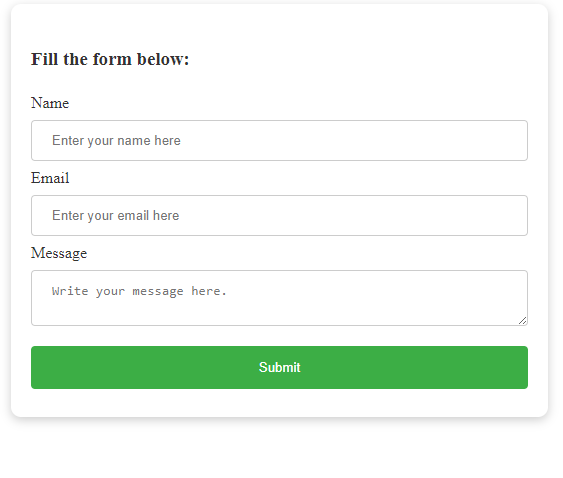

# Building a form with html and css
In this section, you are going to practice some of what you learned in html and css.


## Building a contact form
Most times, when surfing the web you could come across a contact form. In this session, you will build a static contact form that accepts user details.


### Building the html
Create a folder and save as `form`.
Create a file and save as `index.html`.
Create a folder and save as `css`.
Create a file and save as `styles.css`.
This helps to organize the different files properly to avoid possible confusion.


First you need to add the Doctype, html, head, and meta elements. 


`index.html`
```
<!Doctype html>
<html lang="en">
  <head>
    <meta charset="utf-8" />
    <meta http-equiv="X-UA-Compatible" content="ie=edge" />
    <meta name="viewport"
    content="width=device-width,
    initial-scale=1.0">
    <title>A contact form</title>
    <!--Css Link-->
    <link rel="stylesheet" href="css/styles.css"/>
  </head>
  <body>
  </body>
 </html>
```

You need to add the form details in the html so create a `div` element with the class of `form`. That is what will style the form.


`index.html`
```
<div class="form"></div>
```

You need to add some text for description using the `h3` element.

`index.html`
```
<h3 class="mar">Fill the form below:</h3>
```
The `mar` is to apply some margins.

Next, is to add the form body.

`index.html`
```
<form>
  <label>Name</label>
  <input type="text" name="name" placeholder="Enter your name here" required/>
                   
  <label>Email</label>
  <input type="email" name="email" placeholder="Enter your email here" required/>
                   
  <label>Message</label>
  <textarea name="message" placeholder="Write your message here."></textarea>


  <input type="submit" value="Submit" />            
</form>
```

The `required` attribute means the form will not submit unless it has the necessary values for the necessary fields.

It is always important to specify the correct type of an `input` element so the browser will render each properly. In the email input, if you add type of text instead of email, the browser will render it as a simple text instead of an email address.


This is entire html


`index.html`
```
<!Doctype html>
<html lang="en">
  <head>
    <meta charset="utf-8" />
    <meta http-equiv="X-UA-Compatible" content="ie=edge" />
    <meta name="viewport"
    content="width=device-width,
    initial-scale=1.0">
    <title>A contact form</title>
    <!--Css Link-->
    <link rel="stylesheet" href="css/styles.css"/>
  </head>
  <body>
    <div class="form">
      <h3 class="mar">Fill the form below:</h3>


      <form>
        <label>Name</label>
        <input type="text" name="name" placeholder="Enter your name here" required/>
                   
        <label>Email</label>
        <input type="email" name="email" placeholder="Enter your email here" required/>
                   
        <label>Message</label>
        <textarea name="message" placeholder="Write your message here."></textarea>
        <input type="submit" value="Submit" />    
      </form>
    </div>
  </body>
  </html>
```


### Building the css
When you were placing the html, there were some classes for css. Now, you are going to add the css files to make the contact form look good.


`css/styles.css`
```
.mar {
    margin: 1.5rem 0;
}

.form {
    background-color: #fff;
    color: #333;
    border-radius: 10px;
    box-shadow: 0 3px 10px rgba(0, 0, 0, 0.2);
    padding: 20px;
    margin: 10px;
}
```
First, style the class attributes for the form body and add some margin to the h3 text.


Then, you need to style the input elements and textarea.


`css/styles.css`
```
input[type=text], input[type=email], textarea {
    width: 100%;
    padding: 12px 20px;
    margin: 8px 0;
    display: inline-block;
    border: 1px solid #ccc;
    border-radius: 4px;
    box-sizing: border-box;
 }
```

The submit button would have a separate styling from the others. So here it is:

`css/styles.css`
```
input[type=submit] {
    width: 100%;
    background-color: #3cae45;
    color: white;
    padding: 14px 20px;
    margin: 8px 0;
    border: none;
    border-radius: 4px;
    cursor: pointer;
  }
 
  input[type=submit]:hover {
    background-color: #4aac32;
}
```
I added some hover effect to the submit button to make it look active.


This is the entire css.
`css/styles.css`
```
.mar {
    margin: 1.5rem 0;
}


.form {
    background-color: #fff;
    color: #333;
    border-radius: 10px;
    box-shadow: 0 3px 10px rgba(0, 0, 0, 0.2);
    padding: 20px;
    margin: 10px;
}

input[type=text], input[type=email], textarea {
    width: 100%;
    padding: 12px 20px;
    margin: 8px 0;
    display: inline-block;
    border: 1px solid #ccc;
    border-radius: 4px;
    box-sizing: border-box;
 }
 
 input[type=submit] {
    width: 100%;
    background-color: #3cae45;
    color: white;
    padding: 14px 20px;
    margin: 8px 0;
    border: none;
    border-radius: 4px;
    cursor: pointer;
  }
 
  input[type=submit]:hover {
    background-color: #4aac32;
}
```

This is what the form should look like.
