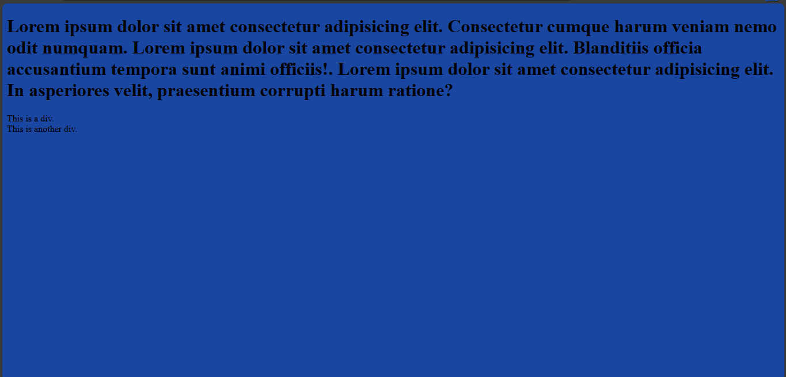
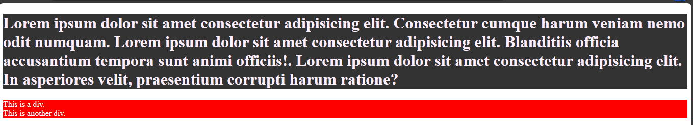

# Colours intro
In this section, you will learn about colours in css.

## Colours
Earlier, I used colours to style web pages but there are various ways you could use colours to style web pages and you will cover them in this session.

When you use the `color` property in css, you are using it to colour the text while the `background-color` is for the background of the text.

When using colours, you could use normal names like blue, yellow, lemon-green and so on as values. You could also use RGB, RGBA and hexadecimal values.

### RGB values

RGB stands for Red Green Blue. It is used to denote the range or intensity of the colours.

0 represents the lowest intensity of the colour while 255 represents the highest intensity of the colour.


rgb(255,0,0) = red 

rgb(0,255,0) = green

rgb(0,0,255) = blue

rgb(0,0,0) = black

rgb(255,255,255) = white

Example:

`index.html`
```
<!DOCTYPE html>
<html>
  <head>
    <meta charset="utf-8"/>
    <title>A simple html page</title>
    <link rel="stylesheet" href="styles.css"/>
  </head>
  <body>
    <h1>Lorem ipsum dolor sit amet consectetur adipisicing elit. Consectetur cumque harum veniam nemo odit numquam. 
      Lorem ipsum dolor sit amet consectetur adipisicing elit. Blanditiis officia accusantium tempora sunt animi officiis!.
      Lorem ipsum dolor sit amet consectetur adipisicing elit. In asperiores velit, praesentium corrupti harum ratione?
    </h1>
    <div>This is a div.</div>
    <div>This is another div.</div>
  </body>
</html>
```

`styles.css`
```
body {
  background-color: rgb(25,70,160);
}
```



### RGBA values

This is the same as the RGB Values. The difference is the "A" (Alpha) which defines the opacity or level of transparency of the colour.

The Alpha falls between 0 and 1.

Example:

`index.html`
```
<!DOCTYPE html>
<html>
  <head>
    <meta charset="utf-8"/>
    <title>A simple html page</title>
    <link rel="stylesheet" href="styles.css"/>
  </head>
  <body>
    <h1>Lorem ipsum dolor sit amet consectetur adipisicing elit. Consectetur cumque harum veniam nemo odit numquam. 
      Lorem ipsum dolor sit amet consectetur adipisicing elit. Blanditiis officia accusantium tempora sunt animi officiis!.
      Lorem ipsum dolor sit amet consectetur adipisicing elit. In asperiores velit, praesentium corrupti harum ratione?
    </h1>
    <div>This is a div.</div>
    <div>This is another div.</div>
  </body>
</html>
```

`styles.css`
```
body {
  background-color: rgba(30,205,44,0.5);
}
```


### Hexadecimal values

Hexadecimal values also known as hex values are used to denote colours using hexadecimal digits. It begins at 0 and ends at f. 0 is the lowest intensity while f is the highest intensity.

They are written as:

Red = FF0000
Green = 00FF00
Blue = 0000FF

Just like RGB values, 

White = FFFFFF
Black = 000000

Hexadecimal values can also be written in three digits (`FFF`) which means white and (`000`) which means black.

Example:
In this example, I will apply the colours on the `h1` and `div` elements instead of the body element.

`index.html`
```
<!DOCTYPE html>
<html>
  <head>
    <meta charset="utf-8"/>
    <title>A simple html page</title>
    <link rel="stylesheet" href="styles.css"/>
  </head>
  <body>
    <h1>Lorem ipsum dolor sit amet consectetur adipisicing elit. Consectetur cumque harum veniam nemo odit numquam. 
      Lorem ipsum dolor sit amet consectetur adipisicing elit. Blanditiis officia accusantium tempora sunt animi officiis!.
      Lorem ipsum dolor sit amet consectetur adipisicing elit. In asperiores velit, praesentium corrupti harum ratione?
    </h1>
    <div>This is a div.</div>
    <div>This is another div.</div>
  </body>
</html>
```


`styles.css`
```
h1 {
  background-color: #333;
  color: #fdeffe;
}

div {
  background-color: #ff0000;
  color: #fff;
}
```
