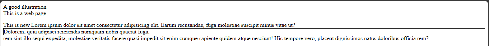
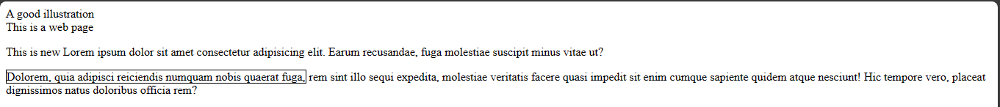
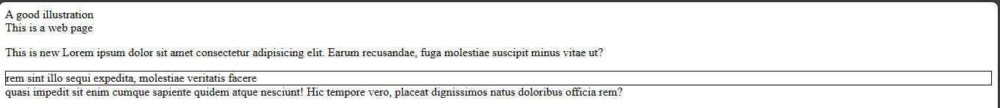
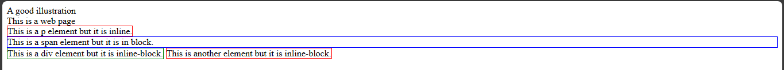
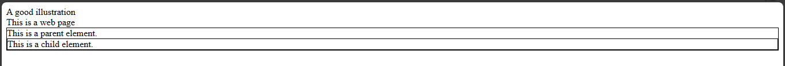

# CSS display
With CSS, you could alter your Html in so many ways. You could set the elements to appear however you want using the CSS `display` property. This section will cover CSS `display` property and its core values.

## Display
The `display` property lets you set elements to render on a web page differently. For example, the `div` element is a block element by default. With the property, you can set it to inline and it will start showcasing the properties of an inline element.

**Note:** ***The default value for display property is inline `value`.*** 


## Values of the `display` property 
It has so many values which includes:


|Values   |  Functions |
|---|---|
|`block`        |When you set an element to this value. It becomes a block element immediately.   |
|`none`         |It makes an element invisible.   |
|`inline`       |It makes an element to become inline.   |
|`contents`     |This value makes the container of an element to disappear.    |
|`flex`         |It makes the element have a `flex` display property.     |
|`grid`         |It makes the element have a `grid` display property.     |
|`table`        |It makes the element become a `table` element.     |
|`inherit`      |It makes an element to inherit the display value of it's parent element.     |
|`initial`      |It makes an element to regain it's initial or default display value.    |
|`list-item`    |It makes an element to behave like a list `li` element.      |
|`table-caption`|Element becomes a `table-caption` element.     |
|`inline-block` |It makes an element `inline-block`.     |
|`inline-flex`  |It makes an element behave like an `inline-flex` element.     |
|`inline-grid`  |It makes an element become `inline-grid`.         |


These are some of the common values of the property.


When designing web pages, there are some popular values that you will come across. So, I will give a brief explanation on them.
They are:

- The `block` value.
- The `inline` value.
- The `none` value.
- The `inline-block` value.
- The `inherit` value. 


### The `block` value
This value changes an element to possess the properties of a block element automatically. This would make the element to occupy the width of it's container.

`span` is an inline element by default but when you use the `display` property to set it's value to block, then it will be a block element.


Example,

`index.html`
```
<!DOCTYPE html>
<html>
  <head>
    <meta charset="utf-8"/>
    <title>A simple html page</title>
    <link rel="stylesheet" href="styles.css"/>
  </head>     
  <body>
    <header>A good illustration</header>
    <main>This is a web page</main>
    <p>This is new Lorem ipsum dolor sit amet consectetur adipisicing elit. Earum recusandae, 
      fuga molestiae suscipit minus vitae ut? <span>Dolorem, quia adipisci reiciendis numquam nobis quaerat fuga,</span> 
      rem sint illo sequi expedita, molestiae veritatis facere quasi impedit sit enim cumque sapiente quidem 
      atque nesciunt! Hic tempore vero, placeat dignissimos natus doloribus officia rem?
    </p>
  </body>
</html>
```

`styles.css`
```
span {
  border: 1px solid black;
  display: block;
}
```



When you run it on your browser, you notice the `span` element is occupying it's own like a block element with all the white spacing.

### The `inline` value
This value makes an element behave like an inline element. This means when a block element is set to inline, then it doesn't occupy the full width of it's container.

`div` is a block element but when you set it to inline, it becomes an inline element.

Example,

`index.html`
```
<!DOCTYPE html>
<html>
  <head>
    <meta charset="utf-8"/>
    <title>A simple html page</title>
    <link rel="stylesheet" href="styles.css"/>
  </head>     
  <body>
    <header>A good illustration</header>
    <main>This is a web page</main>
    <p>This is new Lorem ipsum dolor sit amet consectetur adipisicing elit. Earum recusandae, 
      fuga molestiae suscipit minus vitae ut? <div>Dolorem, quia adipisci reiciendis numquam nobis quaerat fuga,</div> 
      rem sint illo sequi expedita, molestiae veritatis facere quasi impedit sit enim cumque sapiente quidem 
      atque nesciunt! Hic tempore vero, placeat dignissimos natus doloribus officia rem?
    </p>
  </body>
</html>
```


`styles.css`
```
div {
  border: 1px solid black;
  display: inline;
}
```



Looking at the image, you will notice the `div` element is inline and it is not on its own line. 

### The `none` value
The `none` value makes an element disappear. When a element is set to `none`, it becomes invisible.


Example,

`index.html`
```
<!DOCTYPE html>
<html>
  <head>
    <meta charset="utf-8"/>
    <title>A simple html page</title>
    <link rel="stylesheet" href="styles.css"/>
  </head>     
  <body>
    <header>A good illustration</header>
    <main>This is a web page</main>
    <p>This is new Lorem ipsum dolor sit amet consectetur adipisicing elit. Earum recusandae, 
      fuga molestiae suscipit minus vitae ut? <div>Dolorem, quia adipisci reiciendis numquam nobis quaerat fuga,</div> 
      <span>rem sint illo sequi expedita, molestiae veritatis facere</span> quasi impedit sit enim cumque sapiente quidem 
      atque nesciunt! Hic tempore vero, placeat dignissimos natus doloribus officia rem?
    </p>
  </body>
</html>
```


`styles.css`
```
span {
  border: 1px solid black;
  display: block;
}


div {
  border: 1px solid black;
  display: none;
}
```



The `div` element is showing in the image because I set it to none.

### The `inline-block` value 
This makes an element to become an inline-block element. This means that the element will behave like an inline and block element.


Example,


`index.html`
```
<!DOCTYPE html>
<html>
  <head>
    <meta charset="utf-8"/>
    <title>A simple html page</title>
    <link rel="stylesheet" href="styles.css"/>
  </head>     
  <body>
    <header>A good illustration</header>
    <main>This is a web page</main>
    <p>This is a p element but it is inline.</p>
    <span>This is a span element but it is in block.</span>
    <div>This is a div element but it is inline-block.</div>
    <p>This is another element but it is inline-block.</p>
  </body>
</html>
```

`styles.css`
```
p {
  border: 1px solid red;
  display: inline;
}

span {
  border: 1px solid blue;
  display: block;
}

div {
  border: 1px solid green;
  display: inline-block;
}

.another-p {
  border: 1px solid black;
  display: inline-block;
}
```




### The `inherit` value
The `inherit` value will make an element to inherit the `display` value of it's parent element. What parent element means here is, an element that has another element inside it.


Example,

`index.html`
```
<!DOCTYPE html>
<html>
  <head>
    <meta charset="utf-8"/>
    <title>A simple html page</title>
    <link rel="stylesheet" href="styles.css"/>
  </head>     
  <body>
    <header>A good illustration</header>
    <main>This is a web page</main>
    <div>
      This is a parent element.
      <span>This is a child element.</span>
    </div>
  </body>
</html>
```


`styles.css`
```
div {
  border: 1px solid black;
  display: block;
}

span {
  border: 1px solid black;
  display: inherit;
}
```




`span` is an inline element by default but because you set the `display` value to `inherit`. It will inherit the value of it's parent element which is `block` and become a `block` element.


That sums up the popular `display` values that you will run into often. In the next page, you will learn about positioning in css.
