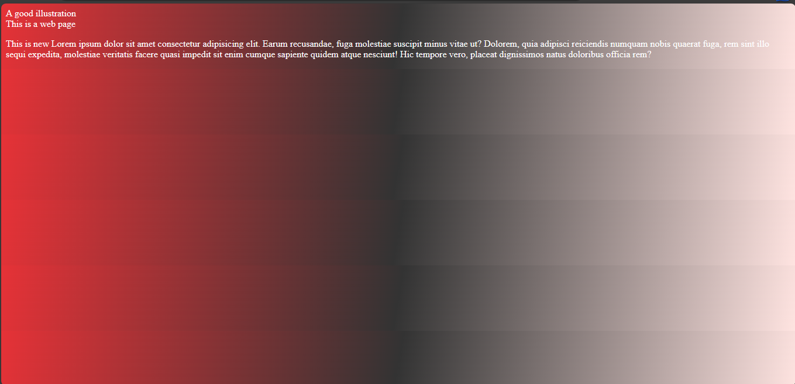
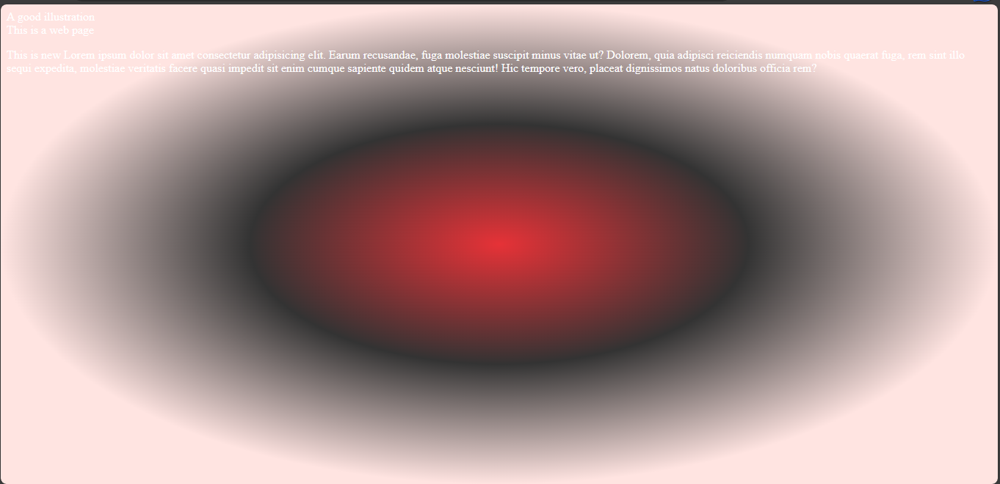
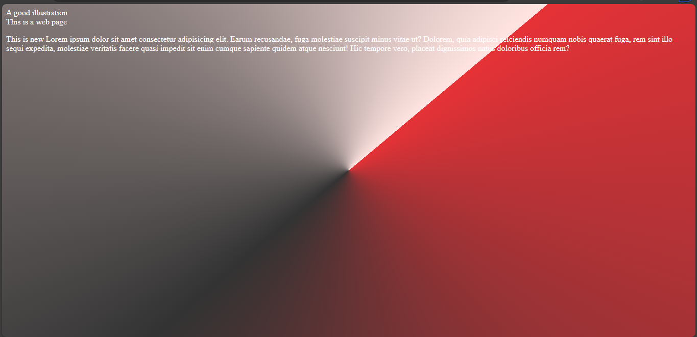

# Gradients in CSS
You have learned some of the properties of background images. Earlier on, you read that gradients were properties for background images. 

Gradients are used in background images either to modify an image or as a colour for the background.

Gradients can accept multiple values of different types.

## Types of gradients
The types of gradients are:
- Linear gradient()
- Radial gradient()
- Conic gradient()


This is the image I am using in this section.


### Linear gradient()
Linear gradient() is a CSS function that combines colours in a linear form. It can combine colours with images or use only colours. 

This is the syntax:

```
background-image: linear-gradient(direction,colourA,colourB..
.);
```

Linear gradients can use degrees(`°`), percentages and keywords (`to right`, `to left`) and so on.

**Adding linear gradient to an image**

Example,

`index.html`
```
<!DOCTYPE html>
<html>
  <head>
    <meta charset="utf-8"/>
    <title>A simple html page</title>
    <link rel="stylesheet" href="styles.css"/>
  </head>
  <body>
    <header>A good illustration</header>
    <main>This is a web page</main>
    <p>This is new Lorem ipsum dolor sit amet consectetur adipisicing elit. Earum recusandae, 
      fuga molestiae suscipit minus vitae ut? Dolorem, quia adipisci reiciendis numquam nobis quaerat fuga, 
      rem sint illo sequi expedita, molestiae veritatis facere quasi impedit sit enim cumque sapiente quidem 
      atque nesciunt! Hic tempore vero, placeat dignissimos natus doloribus officia rem?
    </p>
  </body>
</html>
```

`styles.css`
```
body {
  color: white;
  background-image: linear-gradient(50deg, rgba(239, 239, 79, 0.65), rgba(10,8,40,0.71)), url("../img/momentum.jpeg");
  background-size: cover;
  background-position: center;
  background-attachment: fixed;
  background-repeat: no-repeat;
}
```


So the linear-gradient function modifies the image with colours at a direction of 50 degrees.

What if you want to make a background-image using only colours.

**Using linear gradient with colours only**

Example,

`index.html`
```
<!DOCTYPE html>
<html>
  <head>
    <meta charset="utf-8"/>
    <title>A simple html page</title>
    <link rel="stylesheet" href="styles.css"/>
  </head>
  <body>
    <header>A good illustration</header>
    <main>This is a web page</main>
    <p>This is new Lorem ipsum dolor sit amet consectetur adipisicing elit. Earum recusandae, 
      fuga molestiae suscipit minus vitae ut? Dolorem, quia adipisci reiciendis numquam nobis quaerat fuga, 
      rem sint illo sequi expedita, molestiae veritatis facere quasi impedit sit enim cumque sapiente quidem 
      atque nesciunt! Hic tempore vero, placeat dignissimos natus doloribus officia rem?
    </p>
  </body>
</html>
```

`styles.css`
```
body {
  color: white;
  background-image: linear-gradient(100deg, rgb(230,50,55), #333, mistyrose);
}
```




Now, you have a background combined with powerful colours. I used rgb, hex and normal colour names so you can see that it is possible to combine all the names. 

**Note:** You can use gradients in `background-color` property too.

### Radial gradient()
This is a CSS function that combines colours only or colours with images in a radial shape.

This is the syntax:

```
background-image: radial-gradient(direction,colourA,colourB..
.);
```

**Using radial gradient with images**

Example,

`index.html`
```
<!DOCTYPE html>
<html>
  <head>
    <meta charset="utf-8"/>
    <title>A simple html page</title>
    <link rel="stylesheet" href="styles.css"/>
  </head>
  <body>
    <header>A good illustration</header>
    <main>This is a web page</main>
    <p>This is new Lorem ipsum dolor sit amet consectetur adipisicing elit. Earum recusandae, 
      fuga molestiae suscipit minus vitae ut? Dolorem, quia adipisci reiciendis numquam nobis quaerat fuga, 
      rem sint illo sequi expedita, molestiae veritatis facere quasi impedit sit enim cumque sapiente quidem 
      atque nesciunt! Hic tempore vero, placeat dignissimos natus doloribus officia rem?
    </p>
  </body>
</html>
```

`styles.css`
```
body {
  color: white;
  background-image: radial-gradient(closest-side, rgba(239, 239, 79, 0.65), rgba(10,8,40,0.71)), url("../img/momentum.jpeg");
  background-size: cover;
  background-position: center;
  background-repeat: no-repeat;
  background-attachment: fixed;
}
```


As you can see, the colours form a radial shape on the image with the brighter colour at the center.

**Using radial gradient function with colours only**

You could use radial gradient to create colourful background images without images in the background. The radial gradient function will position the colour in a radial shape.

Example,

`index.html`
```
<!DOCTYPE html>
<html>
  <head>
    <meta charset="utf-8"/>
    <title>A simple html page</title>
    <link rel="stylesheet" href="styles.css"/>
  </head>
  <body>
    <header>A good illustration</header>
    <main>This is a web page</main>
    <p>This is new Lorem ipsum dolor sit amet consectetur adipisicing elit. Earum recusandae, 
      fuga molestiae suscipit minus vitae ut? Dolorem, quia adipisci reiciendis numquam nobis quaerat fuga, 
      rem sint illo sequi expedita, molestiae veritatis facere quasi impedit sit enim cumque sapiente quidem 
      atque nesciunt! Hic tempore vero, placeat dignissimos natus doloribus officia rem?
    </p>
  </body>
</html>
```

`styles.css`
```
body {
  color: white;
  background-image: radial-gradient(closest-side, rgb(230,50,55), #333, mistyrose);
  background-size: cover;
  background-position: center;
  background-repeat: no-repeat;
  background-attachment: fixed;
}
```



Now you can see the previous example this time using a radial gradient. You could also use the previous colour combinations and it will work.

### Conic gradient()
Conic gradient() is a CSS function that combines colours in a conic shape . Like other gradients, it can combine colours with images or use only colours. 

This is the syntax:
```
background-image: conic-gradient(direction,colourA,colourB..
.colourN);
```

**Adding conic gradient to an image**

Example,

`index.html`
```
<!DOCTYPE html>
<html>
  <head>
    <meta charset="utf-8"/>
    <title>A simple html page</title>
    <link rel="stylesheet" href="styles.css"/>
  </head>
  <body>
    <header>A good illustration</header>
    <main>This is a web page</main>
    <p>This is new Lorem ipsum dolor sit amet consectetur adipisicing elit. Earum recusandae, 
      fuga molestiae suscipit minus vitae ut? Dolorem, quia adipisci reiciendis numquam nobis quaerat fuga, 
      rem sint illo sequi expedita, molestiae veritatis facere quasi impedit sit enim cumque sapiente quidem 
      atque nesciunt! Hic tempore vero, placeat dignissimos natus doloribus officia rem?
    </p>
  </body>
</html>
```

`styles.css`
```
body {
  color: white;
  background-image: conic-gradient(from 50deg, rgba(239, 239, 79, 0.65), rgba(10,8,40,0.71)), url("../img/momentum.jpeg");
  background-size: cover;
  background-position: center;
  background-repeat: no-repeat;
  background-attachment: fixed;
}
```


From the image, you can see the conic-gradient function modifies the image with colours starting with a direction of 50 degrees.

**Using only colours**

You could also use conic gradients, like other gradient function types to create background images using colours only.

Example,

`index.html`
```
<!DOCTYPE html>
<html>
  <head>
    <meta charset="utf-8"/>
    <title>A simple html page</title>
    <link rel="stylesheet" href="styles.css"/>
  </head>
  <body>
    <header>A good illustration</header>
    <main>This is a web page</main>
    <p>This is new Lorem ipsum dolor sit amet consectetur adipisicing elit. Earum recusandae, 
      fuga molestiae suscipit minus vitae ut? Dolorem, quia adipisci reiciendis numquam nobis quaerat fuga, 
      rem sint illo sequi expedita, molestiae veritatis facere quasi impedit sit enim cumque sapiente quidem 
      atque nesciunt! Hic tempore vero, placeat dignissimos natus doloribus officia rem?
    </p>
  </body>
</html>
```

`styles.css`
```
body {
  color: white;
  background-image: conic-gradient(from 50deg, rgb(230,50,55), #333, mistyrose);
  background-size: cover;
  background-position: center;
  background-repeat: no-repeat;
  background-attachment: fixed;
}
```




With that, you have a radial-shaped colour combo.
That sums up gradients in css. The next page will cover background property in css.