# CSS grid
This is the last part of the CSS session. Congrats on making it this far!


Grid is an important concept in CSS. Just like Flexbox, grid is a layout model of rows and columns in a grid system. Which is used to design web pages. Grid also replaced floats as a positioning technique.

A grid layout consist of the parent element which is the `container` while the child elements are the items.


## Properties of grid
There are properties of grid which includes:
1. The `display` property
2. The `grid-template-columns` property
3. The `grid-template-rows` property
4. The `grid-template-areas` property
5. The `grid-template` shorthand property
6. The `grid` property
7. The `gap` property
8. The `justify-items` property
9. The `align-items` property
10. The `place-items` property
11. The `justify-content` property 
12. The `align-content` property
13. The `place-content` property

### The `display` property 
This is the first property you would need to set when using a CSS grid because it will set the display type of the element to grid.

Example,


`index.html`
```
<!DOCTYPE html>
  <html>
    <head>
      <meta charset="utf-8"/>
      <title>A simple html page</title>
      <link rel="stylesheet" href="css/styles.css"/>
    </head>
    <body>
      <h1>Building A Web Page</h1>
      <div class="grid-container">
        <span class="grid-item"></span>
        <span class="grid-item"></span>
        <span class="grid-item"></span>
        <span class="grid-item"></span>
        <span class="grid-item"></span>
        <span class="grid-item"></span>
        <span class="grid-item"></span>
        <span class="grid-item"></span>
        <span class="grid-item"></span>
        <span class="grid-item"></span>
        <span class="grid-item blue first-p"></span> 
      </div>   
    </body>
  </html>
```

`styles.css`
```
.grid-container {
  display: grid;
}

.grid-item {
  height: 50px;
  width: 70px;
  background-color: #f00;
  border-radius: 50%;
}

.blue {
  background-color: #00f;
}
```

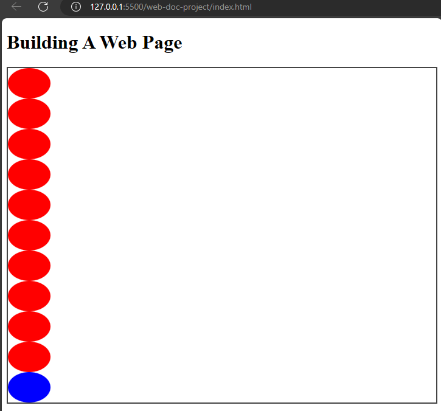

### The `grid-template-columns` property
This property specifies the number and width of the columns in the grid layout. The values can be specified as keyword, length or percentages.


Example,

`index.html`
```
<!DOCTYPE html>
  <html>
    <head>
      <meta charset="utf-8"/>
      <title>A simple html page</title>
      <link rel="stylesheet" href="css/styles.css"/>
    </head>
    <body>
      <h1>Building A Web Page</h1>
      <div class="grid-container">
        <span class="grid-item"></span>
        <span class="grid-item"></span>
        <span class="grid-item"></span>
        <span class="grid-item"></span>
        <span class="grid-item"></span>
        <span class="grid-item"></span>
        <span class="grid-item"></span>
        <span class="grid-item"></span>
        <span class="grid-item"></span>
        <span class="grid-item"></span>
        <span class="grid-item blue first-p"></span> 
      </div>   
    </body>
  </html>
```

`styles.css`
```
.grid-container {
  border: 2px solid #444;
  display: grid;
  grid-template-columns: 200px 2fr;
}
```

This will cause the `div` element to have a template columns of 200px and 2fr.

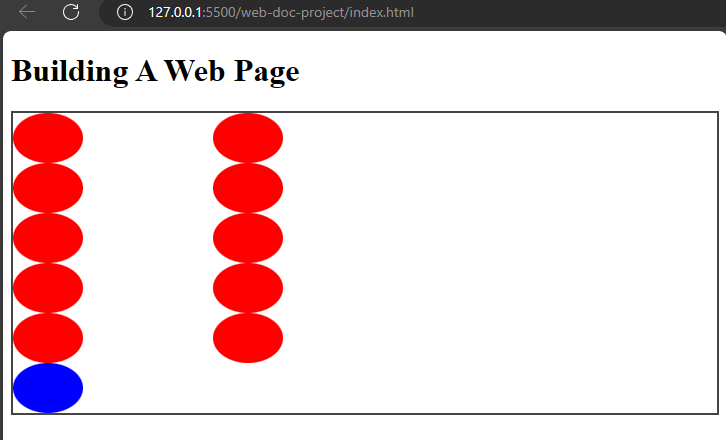

### The `grid-template-rows` property
This property has to do with the heights of rows in the grid layout. The values can be in keyword, length or percentages.


Example,

`index.html`
```
<!DOCTYPE html>
  <html>
    <head>
      <meta charset="utf-8"/>
      <title>A simple html page</title>
      <link rel="stylesheet" href="css/styles.css"/>
    </head>
    <body>
      <h1>Building A Web Page</h1>
      <div class="grid-container">
        <span class="grid-item"></span>
        <span class="grid-item"></span>
        <span class="grid-item"></span>
        <span class="grid-item"></span>
        <span class="grid-item"></span>
        <span class="grid-item"></span>
        <span class="grid-item"></span>
        <span class="grid-item"></span>
        <span class="grid-item"></span>
        <span class="grid-item"></span>
        <span class="grid-item blue first-p"></span> 
      </div>   
    </body>
  </html>
```

`styles.css`
```
.grid-container {
  border: 2px solid #444;
  display: grid;
  grid-template-rows: repeat(10, 100px);
}
```

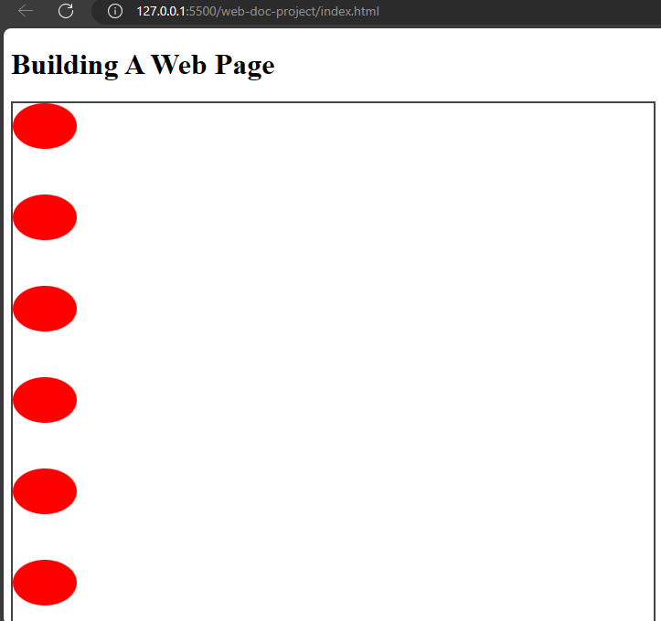

I used the `repeat` function to set the shapes in a spacing of 100px which repeats ten times so the shapes have a spacing of 100px width in between them. 

### The `grid-template-areas` property
Like the name implies, this property specifies grid areas with their names. It controls how the items are placed.
It combines the various values for `grid-template-areas` like `grid-row-start`, `grid-column-start`, `grid-column-end`, and so on.

Example,

`index.html`
```
<!DOCTYPE html>
  <html>
    <head>
      <meta charset="utf-8"/>
      <title>A simple html page</title>
      <link rel="stylesheet" href="css/styles.css"/>
    </head>
    <body>
      <h1>Building A Web Page</h1>
      <div class="grid-container">
        <span class="grid-item"></span>
        <span class="grid-item"></span>
        <span class="grid-item"></span>
        <span class="grid-item"></span>
        <span class="grid-item"></span>
        <span class="grid-item"></span>
        <span class="grid-item"></span>
        <span class="grid-item"></span>
        <span class="grid-item"></span>
        <span class="grid-item green ball2"></span>
        <span class="grid-item blue ball1"></span> 
      </div>   
    </body>
  </html>
```

`styles.css`
```
.grid-container {
  border: 2px solid #444;
  display: grid;
  grid-template-areas: 'header' 'footer';
}

 
.grid-item {
  height: 50px;
  width: 70px;
  background-color: #f00;
  border-radius: 50%;
}

.blue {
  background-color: #00f;
}

.green {
  background-color: #0f0;
}

.ball2 {
  grid-area: header;
}

.ball1 {
  grid-area: footer;
}
```

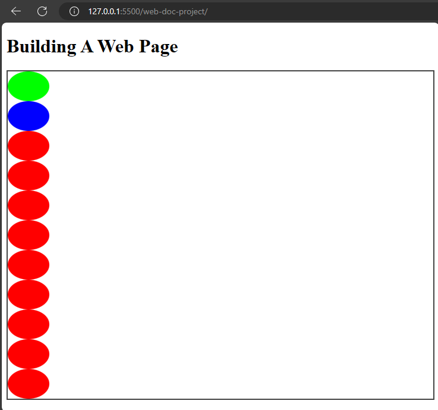

This places the green ball before the blue ball while the remaining balls are beneath it.

### The `grid-template` shorthand property
This is a shorthand property for defining `grid-template-rows`, `grid-template-columns`, and `grid-template-areas`.

Example,

`styles.css`
```
.grid-container {
  border: 2px solid #444;
  display: grid;
  grid-template: 200px 200px / 200px 200px 200px;
}
```
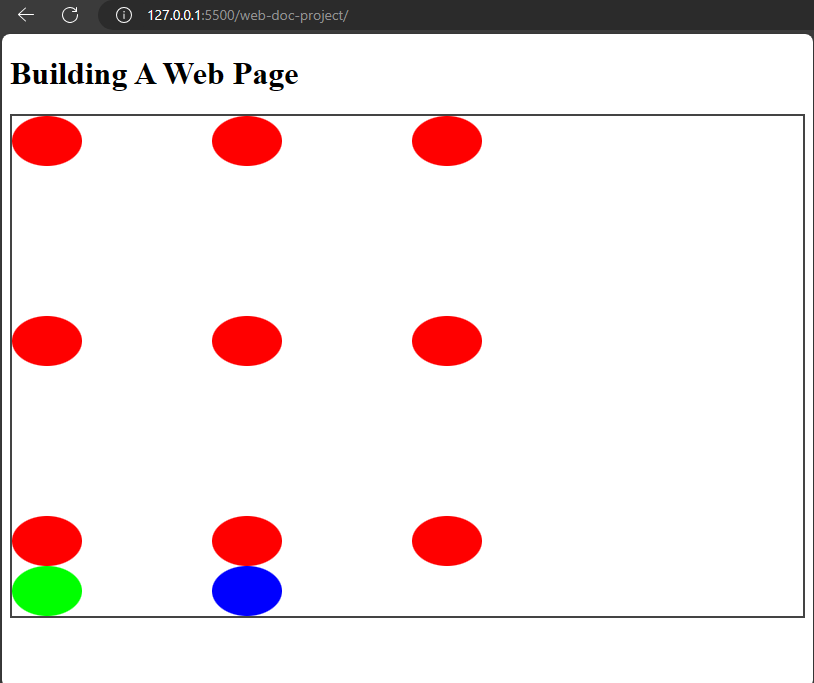

In this example, I combined `grid-template-rows` and `grid-template-columns` for the `grid-template` shorthand.

### The `grid` property
The `grid` property is a shorthand property for `grid-template-columns`,`grid-template-rows`,`grid-template-areas`,`grid-auto-rows`,`grid-auto-flow`, and `grid-auto-columns`.


Example,

`index.html`
```
<!DOCTYPE html>
  <html>
    <head>
      <meta charset="utf-8"/>
      <title>A simple html page</title>
      <link rel="stylesheet" href="css/styles.css"/>
    </head>
    <body>
      <h1>Building A Web Page</h1>
      <div class="grid-container">
        <span class="grid-item"></span>
        <span class="grid-item"></span>
        <span class="grid-item"></span>
        <span class="grid-item"></span>
        <span class="grid-item"></span>
        <span class="grid-item"></span>
        <span class="grid-item"></span>
        <span class="grid-item"></span>
        <span class="grid-item"></span>
        <span class="grid-item green"></span>
        <span class="grid-item blue"></span> 
      </div>   
    </body>
  </html>
```

`styles.css`
```
.grid-container {
  border: 2px solid #444;
  display: grid;
  grid: 50% / auto-flow dense;
}
 
.grid-item {
  height: 50px;
  width: 70px;
  background-color: #f00;
  border-radius: 50%;
}

.blue {
  background-color: #00f;
}

.green {
  background-color: #0f0;
}
```

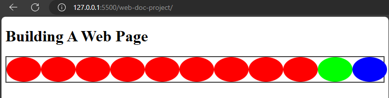

In this example, I combined `grid-template-rows` with 50%, `grid-auto-flow` for the density and the `grid-autos` for the `auto`. 

### The `gap` property
This is a shorthand property for `grid-row-gap` and `grid-column-gap` properties. The `grid-row-gap` property defines the gap between rows in the grid layout. The `grid-column-gap` defines the gap between columns in the grid layout.

Example,

`styles.css`
```
.grid-container {
  border: 2px solid #444;
  display: grid;
  grid: 50% / auto-flow dense;
  gap: 10px;
}
```

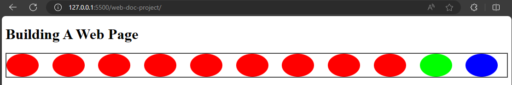

The `gap` property will make the balls which are the grid items to have an equal spacing of 10px length. If you want to give the grid items different length values (for the row and the column) you could do so too.


Example,

`styles.css`
```
.grid-container {
  border: 2px solid #444;
  display: grid;
  grid: 50% / auto-flow dense;
  gap: 10px 15px;
}
```

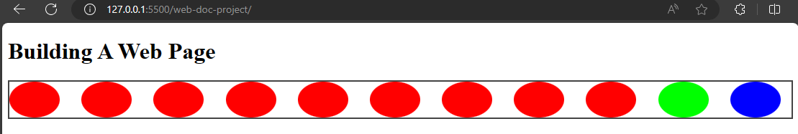

You could also use percentages or percentages and length values to specify the gap property.


### The `justify-items` property 
`justify-items` aligns items in a row in a grid container. The values are `start`, `center`, `end`, `stretch`, and so on.

1. **The `start` value**

This value aligns items at the start of the grid container. It is the opposite of the `end` value.

`styles.css`
```
.grid-container {
  border: 2px solid #444;
  display: grid;
  justify-items: start;
}
```

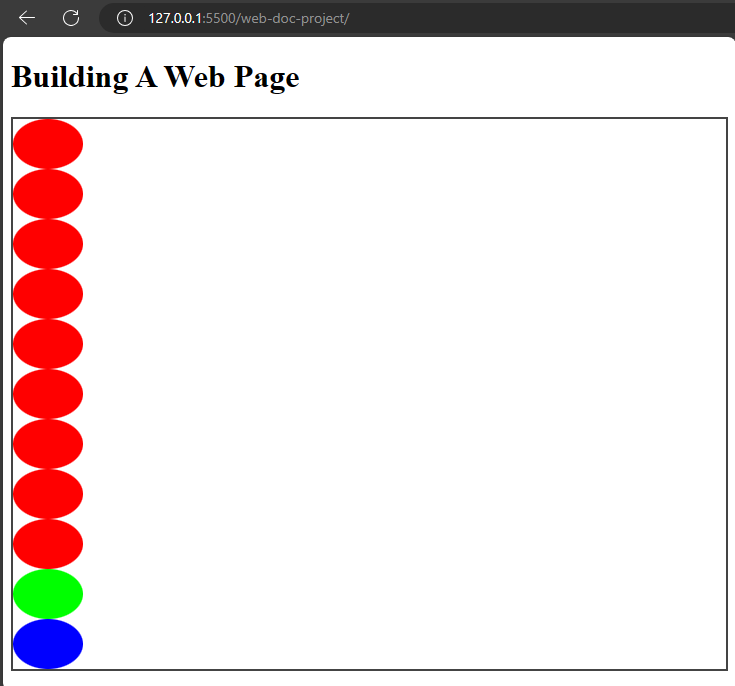

2. **The `center` value**

This value aligns items at the center of the grid container. 

`styles.css`
```
.grid-container {
  border: 2px solid #444;
  display: grid;
  justify-items: start;
}
```

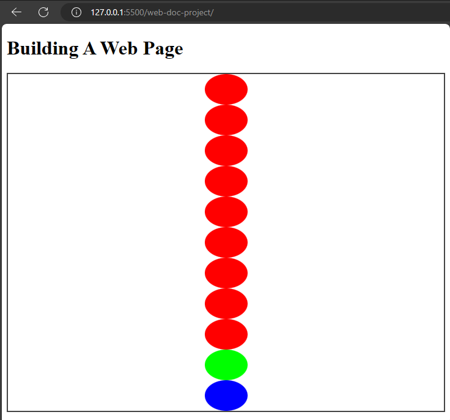

3. **The `end` value**

Aligns items at the end of the container.

Example,

`styles.css`
```
.grid-container {
  border: 2px solid #444;
  display: grid;
  justify-items: end;
}
```

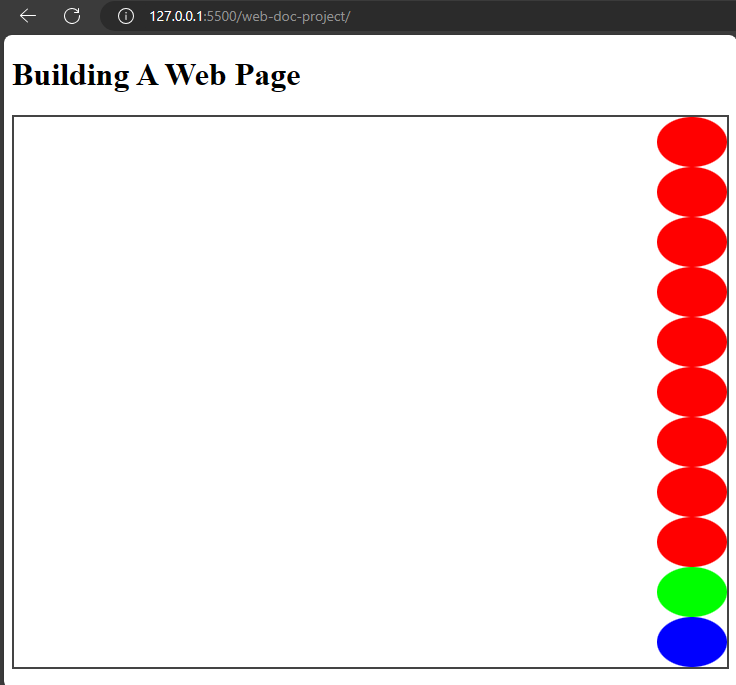

That will cause the items to align at the end of the container.

4. **The `stretch` value**
This value only works when the size of the container is larger then the items so the items could stretch to occupy the space.

The next property is the `align-items` property.

### The `align-items` property
The `align-items` property is like the `justify-items` property but it aligns items in the column axis. `justify-items` is in the row axis.
 
Example,

`styles.css`
```
.grid-container {
  display: grid;
  align-items: end;
}
```
This will cause the items to align at the bottom of the grid container.


### The `place-items` property
This is a shorthand property for both `justify-items` and `align-items` properties.


Example,

`styles.css`
```
.grid-container {
  display: grid;
  place-items: end center;
}
```
You can also set a single value for both properties using `place-items`.


Example,

`styles.css`
```
.grid-container {
  display: grid;
  place-items: center;
}
```
This will make the items to align at the center for `justify-items` and `align-items` properties.


### The `justify-content` property 
The `justify-content` property aligns items along the row axis in a grid container. The values are `start`, `center`, `stretch`, `end`, and `space-between`.


Example,

`styles.css`
```
.grid-container {
  display: grid;
  grid-template-columns: repeat(3, 1fr);
  justify-content: center;
}
```
That will make the items to be positioned at the center of the grid container.
 
### The `align-content` property
This aligns items along the cross axis of a grid container. It is the column axis of a container.
Like justify-content, it uses these values; `start`, `end`, `stretch`, `space-around`,`space-between`, `center`.


Example,

`styles.css`
```
.grid-container {
  display: grid;
  align-content: center;
}
```
### The `place-content` property

This is a shorthand property for `justify-content` and the `align-items` property. Like `place-items`, when you specify a single value, the browser assumes it to be for both `justify-content` and `align-content`.


Example,

`styles.css`
```
.grid-container {
  display: grid;
  place-content: center;
}
```
That sums up the main properties of grid in css.[Check CSS tricks for more on grids](https://css-tricks.com/snippets/css/complete-guide-grid/).
