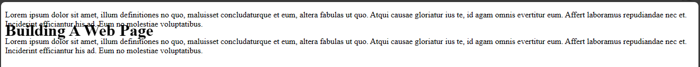
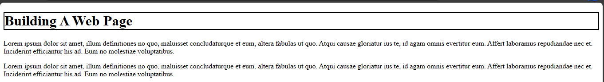
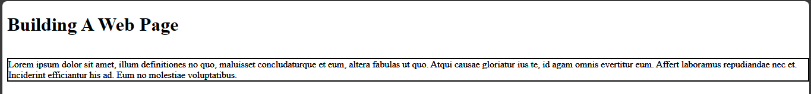

# CSS positioning 
CSS has a position property which you can use to position items on a web page. You could make html elements float on a web page or stick to it as you keep scrolling. In this page, you will learn about the various values for positioning items in css.

## Types of CSS position values
There are five different values you could use for positioning and they are: 
- static
- sticky
- fixed
- relative
- absolute

### Static

This is the default positioning of html elements. 

Example,

`index.html`

```
<!DOCTYPE html>
<html>
  <head>
    <meta charset="utf-8"/>
    <title>A simple html page</title>
    <link rel="stylesheet" href="styles.css"/>
  </head>
  <body>
    <h1>Building A Web Page</h1>
    <p>Lorem ipsum dolor sit amet, illum definitiones no quo, maluisset concludaturque et eum, altera fabulas ut quo. Atqui causae gloriatur ius te, id agam omnis evertitur eum. Affert laboramus repudiandae nec et. Inciderint efficiantur his ad. Eum no molestiae voluptatibus.
    </p> 
    <p>Lorem ipsum dolor sit amet, illum definitiones no quo, maluisset concludaturque et eum, altera fabulas ut quo. Atqui causae gloriatur ius te, id agam omnis evertitur eum. Affert laboramus repudiandae nec et. Inciderint efficiantur his ad. Eum no molestiae voluptatibus.</p>
  </body>
</html>
```

`styles.css`
```
h1 {
  position: static;
}
```

The `position: static` does not have any effect on the element as that is the default positioning. Now, let's look at the next value which is sticky.


### Sticky

When you set the position to sticky. The text moves when you scroll on the web page and then becomes fixed when you scroll down.

Example,

`index.html`

```
<!DOCTYPE html>
<html>
  <head>
    <meta charset="utf-8"/>
    <title>A simple html page</title>
    <link rel="stylesheet" href="styles.css"/>
  </head>
  <body>
    <h1>Building A Web Page</h1>
    <p>Lorem ipsum dolor sit amet, illum definitiones no quo, maluisset concludaturque et eum, altera fabulas ut quo. Atqui causae gloriatur ius te, id agam omnis evertitur eum. Affert laboramus repudiandae nec et. Inciderint efficiantur his ad. Eum no molestiae voluptatibus.
    </p> 
    <p>Lorem ipsum dolor sit amet, illum definitiones no quo, maluisset concludaturque et eum, altera fabulas ut quo. Atqui causae gloriatur ius te, id agam omnis evertitur eum. Affert laboramus repudiandae nec et. Inciderint efficiantur his ad. Eum no molestiae voluptatibus.</p>
  </body>
</html>
```
 
`styles.css`

```
h1 {
  position: sticky;
}
```

### Fixed

When positioning is fixed, it remains where it is even when you scroll up or down. 

Example,

`index.html`

```
<!DOCTYPE html>
<html>
  <head>
    <meta charset="utf-8"/>
    <title>A simple html page</title>
    <link rel="stylesheet" href="styles.css"/>
  </head>
  <body>
    <h1>Building A Web Page</h1>
    <p>Lorem ipsum dolor sit amet, illum definitiones no quo, maluisset concludaturque et eum, altera fabulas ut quo. Atqui causae gloriatur ius te, id agam omnis evertitur eum. Affert laboramus repudiandae nec et. Inciderint efficiantur his ad. Eum no molestiae voluptatibus.
    </p> 
    <p>Lorem ipsum dolor sit amet, illum definitiones no quo, maluisset concludaturque et eum, altera fabulas ut quo. Atqui causae gloriatur ius te, id agam omnis evertitur eum. Affert laboramus repudiandae nec et. Inciderint efficiantur his ad. Eum no molestiae voluptatibus.</p>
  </body>
</html>
```

`styles.css`

```
h1 {
  position: fixed;
}
```



This will keep the `h1` element in a spot where it does not move as you scroll.

### Relative

When an element is set to relative, it moves away from its normal position. 

Example,

`index.html`

```
<!DOCTYPE html>
<html>
  <head>
    <meta charset="utf-8"/>
    <title>A simple html page</title>
    <link rel="stylesheet" href="styles.css"/>
  </head>
  <body>
    <h1>Building A Web Page</h1>
    <p>Lorem ipsum dolor sit amet, illum definitiones no quo, maluisset concludaturque et eum, altera fabulas ut quo. Atqui causae gloriatur ius te, id agam omnis evertitur eum. Affert laboramus repudiandae nec et. Inciderint efficiantur his ad. Eum no molestiae voluptatibus.
    </p> 
    <p>Lorem ipsum dolor sit amet, illum definitiones no quo, maluisset concludaturque et eum, altera fabulas ut quo. Atqui causae gloriatur ius te, id agam omnis evertitur eum. Affert laboramus repudiandae nec et. Inciderint efficiantur his ad. Eum no molestiae voluptatibus.</p>
  </body>
</html>
```

`styles.css`

```
h1 {
  position: relative;
  border: 2px solid black;
}
```



### Absolute

In absolute position, the element is positioned away from the previous element. If there is no previous element, then it uses the body element as a benchmark.

Example,

`index.html`

```
<!DOCTYPE html>
<html>
  <head>
    <meta charset="utf-8"/>
    <title>A simple html page</title>
    <link rel="stylesheet" href="styles.css"/>
  </head>
  <body>
    <h1>Building A Web Page</h1>
    <p>Lorem ipsum dolor sit amet, illum definitiones no quo, maluisset concludaturque et eum, altera fabulas ut quo. Atqui causae gloriatur ius te, id agam omnis evertitur eum. Affert laboramus repudiandae nec et. Inciderint efficiantur his ad. Eum no molestiae voluptatibus.
    </p> 
    <p>Lorem ipsum dolor sit amet, illum definitiones no quo, maluisset concludaturque et eum, altera fabulas ut quo. Atqui causae gloriatur ius te, id agam omnis evertitur eum. Affert laboramus repudiandae nec et. Inciderint efficiantur his ad. Eum no molestiae voluptatibus.</p>
  </body>
</html>
```

`styles.css`

```
p {
  position: absolute;
  border: 2px solid black;
}
```



This will make the `p` element move away from the `h1` element.