# CSS selectors
 
Previously, to apply css to the web page, you selected the `body` and the `h1` elements. That is how css works, for css to apply rules. It works on a selector.

## What is a selector?
In CSS, a selector is a term used to refer to letters that can access html elements. It is simply what CSS uses to apply the styling you desire on your web page.

## Types of CSS selectors
Selectors are grouped into three major categories which are:
1. Simple selectors
2. Combinator selectors
3. Pseudo selectors

### Simple selectors

These selectors are made up of 
- Universal selectors
- Type selectors
- Class selectors
- ID selectors

**Universal selector**


As the name implies, the universal selector selects all the elements on a web page.
Example:

`index.html`

```
<!DOCTYPE html>
<html>
  <head>
    <meta charset="utf-8" />
    <title>A simple html page</title>
    <link rel="stylesheet" href="styles.css"/>
  </head>
  <body>
    <h1>Building A Web Page</h1>
    <p>How To Design A Webpage</p>
  </body>
</html>
```

`styles.css`
```
* {
   background-color: red;
 }
```

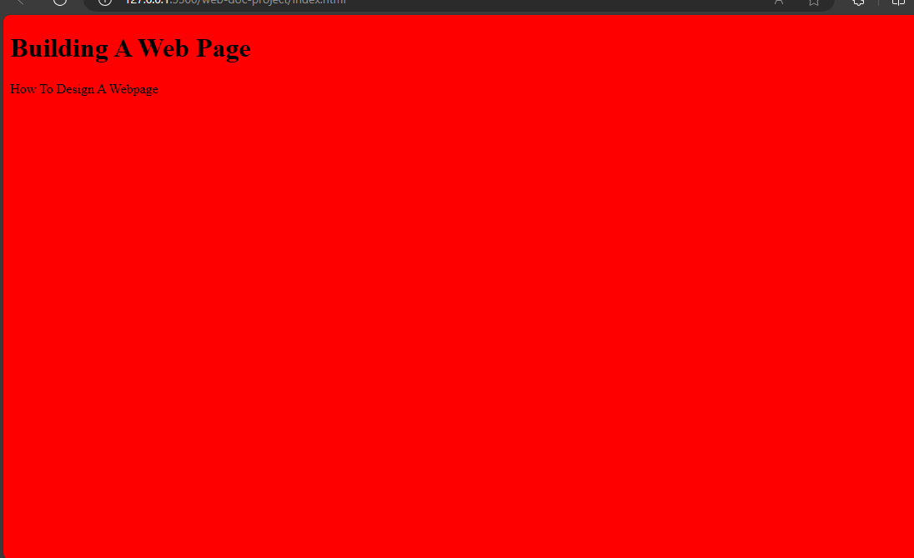

This would give all the elements including the `body` element a background colour of red.


**Type selector**

This selects an element using the name of the element.

Example:

`index.html`

```
  <!DOCTYPE html>
  <html>
    <head>
      <meta charset="utf-8" />
      <title>A simple html page</title>
      <link rel="stylesheet" href="styles.css"/>
    </head>
    <body>
      <h1>Building A Web Page</h1>
      <p>How To Design A Webpage</p>
    </body>
  </html>
```

`styles.css`
```
body {
    background-color: red;
}
```


In this case, you would use `body` as the selector to colour the web page.

**Class selector**


This selects all the elements containing the class attribute. It starts with a dot and the name assigned in the class attribute (`.classname`). 

Example:

`index.html`

```
  <!DOCTYPE html>
  <html>
    <head>
      <meta charset="utf-8" />
      <title>A simple html page</title>
      <link rel="stylesheet" href="styles.css"/>
    </head>
    <body>
      <h1>Building A Web Page</h1>
      <p class="page">How To Design A Webpage</p>
    </body>
  </html>
```

`styles.css`
```
.page{
  background-color: red;
}
```

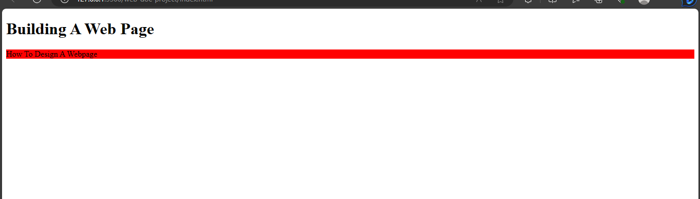

That would apply the background colour to all the elements having the class attribute. In this case, it is the `p` tag.


**ID selector**


Like the class selector, the ID selector selects elements with the id attribute. It is denoted with a hash and the name given to the ID attribute (`#IDname`).

Example

`index.html`
```
  <!DOCTYPE html>
  <html>
    <head>
      <meta charset="utf-8" />
      <title>A simple html page</title>
      <link rel="stylesheet" href="styles.css"/>
    </head>
    <body>
      <h1 id="web">Building A Web Page</h1>
      <p class="page">How To Design A Webpage</p>
    </body>
  </html>
```

`styles.css`
```
#web {
    background-color: green;
}
```

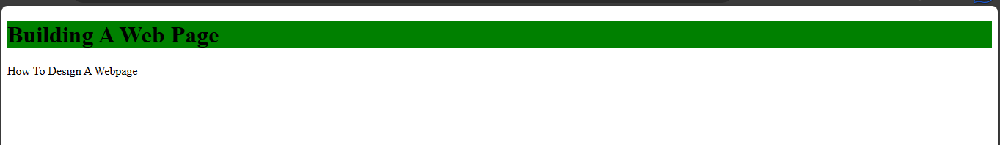

That would colour the `h1` element green as it is the only element having the ID attribute.


### Combinator selectors

These are selectors that combine more than one selector and they are:
- Descendant selector
- General selector 
- Child selector
- Adjacent selector


**Descendant selector**


The descendant selector selects all elements that are in a parent element.

Example:

`index.html`

```
<!DOCTYPE html>
  <html>
    <head>
      <meta charset="utf-8" />
      <title>A simple html page</title>
      <link rel="stylesheet" href="styles.css"/>
    </head>
    <body>
      <h1>Building A Web Page</h1>
      <p>How To Design A Webpage</p>
      <section>
        <p>Things to buy are Lorem ipsum dolor sit amet consectetur adipisicing elit. Vitae, temporibus?</p>
        <p>Accurate details of important things to buy Lorem ipsum dolor sit amet consectetur adipisicing elit. Explicabo,
           itaque amet? Quae sequi itaque cum recusandae saepe? Quas quaerat fugiat eligendi vero quibusdam, temporibus numquam.
        </p>
        <article>
          <p>Lorem, ipsum dolor sit amet consectetur adipisicing elit. Quasi ab ducimus recusandae facere, 
            tenetur quae, id maiores adipisci, ipsum laborum cupiditate architecto ex omnis exercitationem illo voluptate amet 
            magni!
          </p>
        </article>
      </section>
      <p>
        Another paragraph. Lorem ipsum dolor sit amet, consectetur adipisicing elit. Cumque, ea?
      </p>
      <p>
        Lorem ipsum dolor sit amet consectetur adipisicing elit. Excepturi, ipsam?
      </p>
    </body>
  </html>
```

`styles.css`
```
section p {
  background-color: red;
}
```

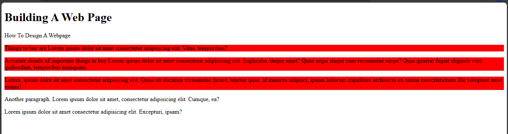

In this case, the `section` element is a parent element of the `p` element and it colors all the `p` elements within the section element regardless of whether they are in another element. In descendant selectors, class names and ID names can be used as well.

An example of descendant selectors using class names would be:

`index.html`
```
<!DOCTYPE html>
  <html>
    <head>
      <meta charset="utf-8" />
      <title>A simple html page</title>
      <link rel="stylesheet" href="styles.css"/>
    </head>
    <body>
      <h1>Building A Web Page</h1>
      <p>How To Design A Webpage</p>
      <section class="page">
        <p class="first-p">Things to buy are Lorem ipsum dolor sit amet consectetur adipisicing elit. Vitae, temporibus?</p>
        <p>Accurate details of important things to buy Lorem ipsum dolor sit amet consectetur adipisicing elit. Explicabo,
           itaque amet? Quae sequi itaque cum recusandae saepe? Quas quaerat fugiat eligendi vero quibusdam, temporibus numquam.
        </p>
        <article>
          <p>Lorem, ipsum dolor sit amet consectetur adipisicing elit. Quasi ab ducimus recusandae facere, 
            tenetur quae, id maiores adipisci, ipsum laborum cupiditate architecto ex omnis exercitationem illo voluptate amet 
            magni!
          </p>
        </article>
      </section>
      <p>
        Another paragraph. Lorem ipsum dolor sit amet, consectetur adipisicing elit. Cumque, ea?
      </p>
      <p>
        Lorem ipsum dolor sit amet consectetur adipisicing elit. Excepturi, ipsam?
      </p>
    </body>
  </html>
```

`styles.css`
```
.page {
    background-color: red;
    color: blue;
}

.page .first-p {
    background-color: black;
    color: white;
}
```
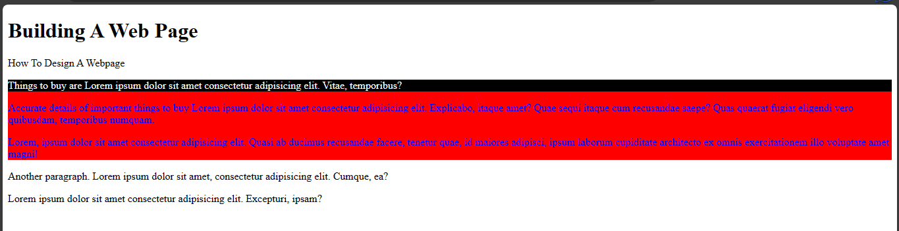

This would apply the styling on the elements as you specified in the css file.

**General sibling selector**

The general sibling selector selects elements that are from the same parent element and the next element for the particular element specified. It uses the tilde operator (`~`). When using a general selector, the next element may not necessarily be following the first element directly. 

Example:

`index.html`

```
<!DOCTYPE html>
<html>
  <head>
    <meta charset="utf-8" />
    <title>A simple html page</title>
    <link rel="stylesheet" href="styles.css"/>
  </head>
  <body>
    <h1>Building A Web Page</h1>
    <p class="page">How To Design A Webpage</p>
      <ul>
        <li>Colors</li>
        <li>Typography</li>
        <li>Selectors</li>
        <li>Box model</li>
      </ul>
      <div>Key points to note:
        <p>Preparedness</p>
        <div>Why you should prepare</div>
        <p>Wisdom is profitable to direct</p>
      </div>
    <p>Why you should read everyday</p>
  </body>
</html>
```

`styles.css`
```
div ~ p {
  background-color: red;
}
```

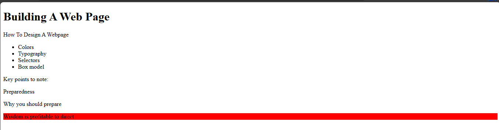

From the example, you can see that the paragraph element that is next to the first paragraph element in the `div` is styled.


**Child selector**

This selector selects all the elements that are directly connected to the parent element.

Example:

`index.html`
```
<!DOCTYPE html>
<html>
  <head>
    <meta charset="utf-8" />
    <title>A simple html page</title>
    <link rel="stylesheet" href="styles.css"/>
  </head>
  <body>
    <h1>Building A Web Page</h1>
    <p class="page">How To Design A Webpage</p>
      <ul>
        <li>Colors</li>
        <li>Typography</li>
        <li>Selectors</li>
        <li>Box model</li>
      </ul>
      <div>Key points to note:
        <p>Preparedness</p>
        <div>Why you should prepare</div>
        <p>Wisdom is profitable to direct</p>
      </div>
    <p>Why you should read everyday</p>
  </body>
</html>
```

`styles.css`
```
div > p {
  background-color: red;
}
```

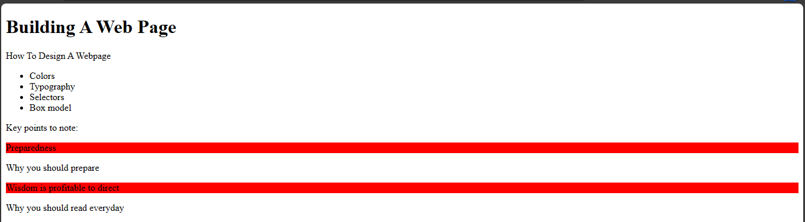

This would apply the styling on all the `p` elements inside the `div`.


**Adjacent selector**

The adjacent selector selects elements that are following the first element. Which is the next element. It uses the first operator (`+`).

Example:

`index.html`
```
<!DOCTYPE html>
<html>
  <head>
    <meta charset="utf-8" />
    <title>A simple html page</title>
    <link rel="stylesheet" href="styles.css"/>
  </head>
  <body>
    <h1>Building A Web Page</h1>
    <p class="page">How To Design A Webpage</p>
      <ul>
        <li>Colors</li>
        <li>Typography</li>
        <li>Selectors</li>
        <li>Box model</li>
      </ul>
      <div>Key points to note:
        <p>Preparedness</p>
        <div>Why you should prepare</div>
        <p>Wisdom is profitable to direct</p>
      </div>
    <p>Why you should read everyday</p>
  </body>
</html>
```
 
`styles.css`
```
div + p {
  background-color: red;
}
```

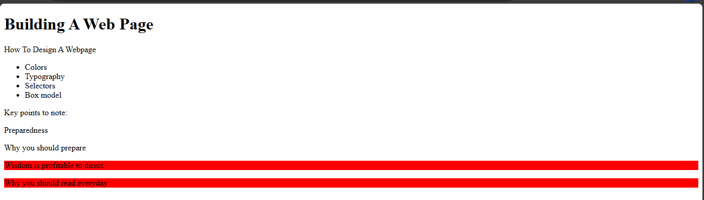

This will make the elements following the two `div` elelments in the example to be styled.

### Grouping selectors
These are selectors that use comma (,) to select items.

Example,

`index.html`
```
<!DOCTYPE html>
<html>
  <head>
    <meta charset="utf-8" />
    <title>A simple html page</title>
    <link rel="stylesheet" href="styles.css"/>
  </head>
  <body>
    <h1>Building A Web Page</h1>
    <p class="page">How To Design A Webpage</p>
      <ul>
        <li>Colors</li>
        <li>Typography</li>
        <li>Selectors</li>
        <li>Box model</li>
      </ul>
      <div>Key points to note:
        <p>Preparedness</p>
        <div>Why you should prepare</div>
        <p>Wisdom is profitable to direct</p>
      </div>
    <p>Why you should read everyday</p>
  </body>
</html>
```
 
`styles.css`
```
h1, div, p {
  background-color: red;
}
```

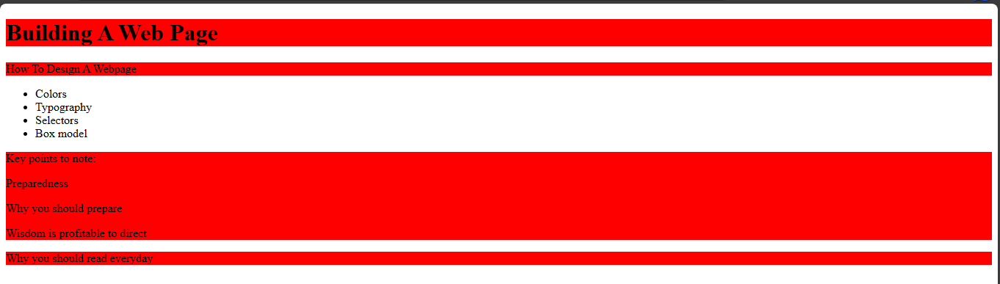

This would style `h1`,`div` and `p` elements.


### Pseudo selectors
These are made of pseudo-classes and pseudo-elements.

**Pseudo classes**


These are used to select elements depending on the events surrounding them. It uses a single colon (`:`).

Example:

`index.html`
```
<!DOCTYPE html>
  <html>
    <head>
      <meta charset="utf-8"/>
      <title>A simple html page</title>
      <link rel="stylesheet" href="styles.css"/>
    </head>
    <body>
      <h1>Building A Web Page</h1>
      <p class="page">How To Design A Webpage</p>
      <ul>
         <li>Colors</li>
         <li>Typography</li>
         <li>Selectors</li>
         <li>Box model</li>
      </ul>
      <div>Key points to note:
           <p>Preparedness</p>
            <div>Why you should prepare</div>
            <p>Wisdom is profitable to direct</p>
       </div>
       <p>Why you should read everyday</p>
    </body>
  </html>
```

`styles.css`
```
p {
    background-color: red;
  }
  
p:hover {
    background-color: white;
}
```
Now when you hover your mouse over the `p` elements, the background colour would change to white.

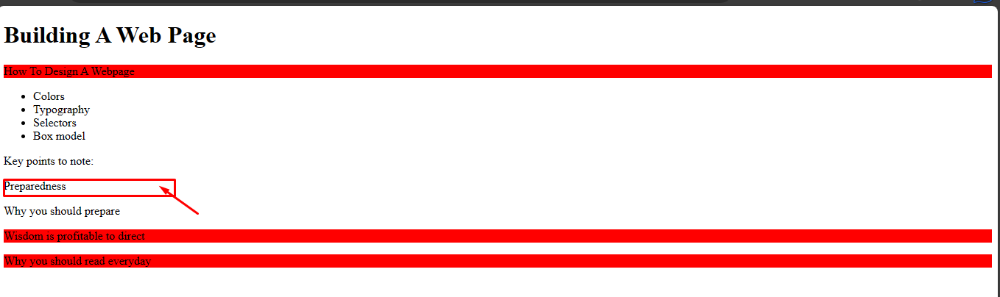

In the image above, I hovered over the `preparedness` text and it changed to white.

**Pseudo elements**

They are used to select elements using entities that describe their action.
It uses two colons (`::`).

Example:

`index.html`
```
<!DOCTYPE html>
  <html>
    <head>
      <meta charset="utf-8"/>
      <title>A simple html page</title>
      <link rel="stylesheet" href="css/styles.css"/>
    </head>
    <body>
      <h1>Building A Web Page</h1>
      <p class="page">How To Design A Webpage</p>
      <ul>
         <li>Colors</li>
         <li>Typography</li>
         <li>Selectors</li>
         <li>Box model</li>
      </ul>
      <div>Key points to note:
           <p>Preparedness</p>
            <div>Why you should prepare</div>
            <p>Wisdom is profitable to direct</p>
       </div>
       <p>Why you should read everyday</p>
    </body>
  </html>
```

`styles.css`
```
p::first-letter{
  background-color: red;
}
```

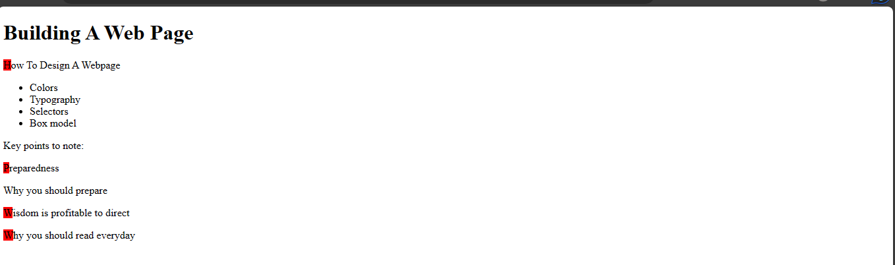

This would apply the styling on the first letter of the `p` elements.
