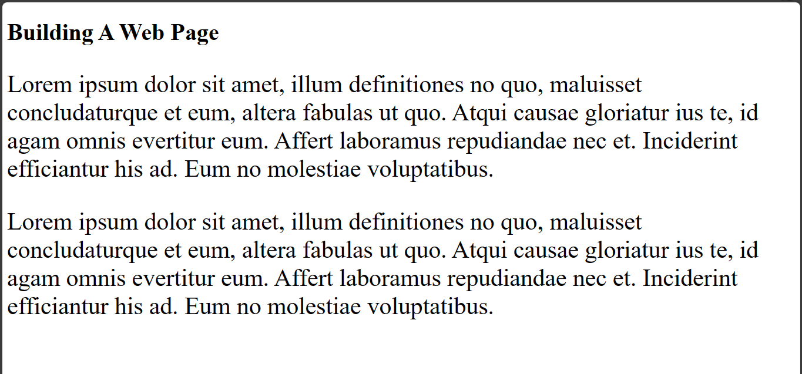
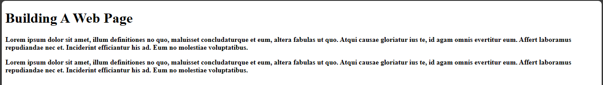
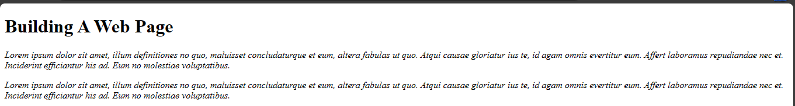
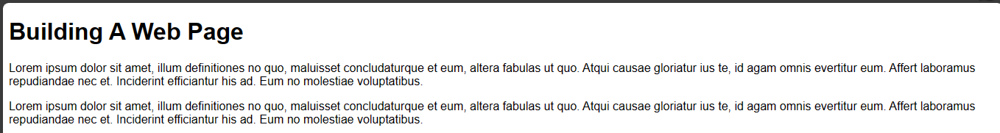
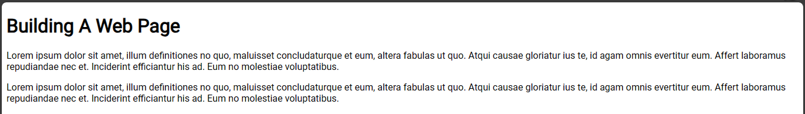
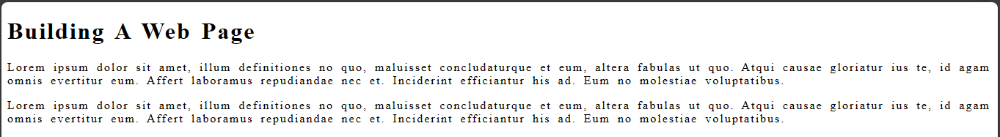
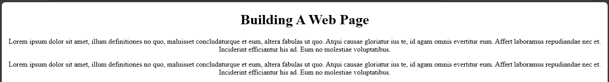
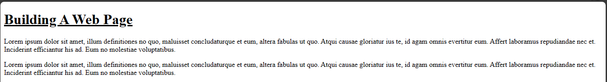

# CSS typography

Typography simply has to do with how to organise your fonts and text to give a great aesthetic appeal. Typography is applied in css and you will cover the properties of typography in this session.

## Properties of typography 
The properties of typography are:
- Font-size
- Font-family
- Font-weight
- Font-style
- Line-spacing
- Word-spacing
- Text-align
- Text-decoration

### Font-size

This has to do with the size of the text. You can use units such as pixels, em, rem, and so on to style the size of a text.

Example,

`index.html`
```
<!DOCTYPE html>
<html>
  <head>
    <meta charset="utf-8"/>
    <title>A simple html page</title>
    <link rel="stylesheet" href="styles.css"/>
  </head>
  <body>
    <h1>Building A Web Page</h1>
    <p>Lorem ipsum dolor sit amet, illum definitiones no quo, maluisset concludaturque et eum, altera fabulas ut quo. Atqui causae gloriatur ius te, id agam omnis evertitur eum. Affert laboramus repudiandae nec et. Inciderint efficiantur his ad. Eum no molestiae voluptatibus.
    </p> 
    <p>Lorem ipsum dolor sit amet, illum definitiones no quo, maluisset concludaturque et eum, altera fabulas ut quo. Atqui causae gloriatur ius te, id agam omnis evertitur eum. Affert laboramus repudiandae nec et. Inciderint efficiantur his ad. Eum no molestiae voluptatibus.</p>
  </body>
</html>
```

`styles.css`

```
body {
  font-size: 65%; 
}

h1 {
  font-size: 40px;
}

p {
  font-size: 4em;
}
```



### Font-weight

Font weight is used to determine the thickness or lightness of the text.

Example, 

`index.html`
```
<!DOCTYPE html>
<html>
  <head>
    <meta charset="utf-8"/>
    <title>A simple html page</title>
    <link rel="stylesheet" href="styles.css"/>
  </head>
  <body>
    <h1>Building A Web Page</h1>
    <p>Lorem ipsum dolor sit amet, illum definitiones no quo, maluisset concludaturque et eum, altera fabulas ut quo. Atqui causae gloriatur ius te, id agam omnis evertitur eum. Affert laboramus repudiandae nec et. Inciderint efficiantur his ad. Eum no molestiae voluptatibus.
    </p> 
    <p>Lorem ipsum dolor sit amet, illum definitiones no quo, maluisset concludaturque et eum, altera fabulas ut quo. Atqui causae gloriatur ius te, id agam omnis evertitur eum. Affert laboramus repudiandae nec et. Inciderint efficiantur his ad. Eum no molestiae voluptatibus.</p>
  </body>
</html>
```

`styles.css`
```
p {
  font-weight: bold;
}
```



This will make the `p` element appear bold. You could give font-weight using numbers too.

Example,

`index.html`
```
<!DOCTYPE html>
<html>
  <head>
    <meta charset="utf-8"/>
    <title>A simple html page</title>
    <link rel="stylesheet" href="styles.css"/>
  </head>
  <body>
    <h1>Building A Web Page</h1>
    <p>Lorem ipsum dolor sit amet, illum definitiones no quo, maluisset concludaturque et eum, altera fabulas ut quo. Atqui causae gloriatur ius te, id agam omnis evertitur eum. Affert laboramus repudiandae nec et. Inciderint efficiantur his ad. Eum no molestiae voluptatibus.
    </p> 
    <p>Lorem ipsum dolor sit amet, illum definitiones no quo, maluisset concludaturque et eum, altera fabulas ut quo. Atqui causae gloriatur ius te, id agam omnis evertitur eum. Affert laboramus repudiandae nec et. Inciderint efficiantur his ad. Eum no molestiae voluptatibus.</p>
  </body>
</html>
```

`styles.css`
```
p {
  font-weight: 600:
}
```


It will also make the paragraph font bold.


### Font-style

Font-style is used to determine the styling of the text. `font-style:normal;` makes the text normal while `font-style:italic;` makes the text slanted.

Example,

`index-html`
```
<!DOCTYPE html>
<html>
  <head>
    <meta charset="utf-8"/>
    <title>A simple html page</title>
    <link rel="stylesheet" href="styles.css"/>
  </head>
  <body>
    <h1>Building A Web Page</h1>
    <p>Lorem ipsum dolor sit amet, illum definitiones no quo, maluisset concludaturque et eum, altera fabulas ut quo. Atqui causae gloriatur ius te, id agam omnis evertitur eum. Affert laboramus repudiandae nec et. Inciderint efficiantur his ad. Eum no molestiae voluptatibus.
    </p> 
    <p>Lorem ipsum dolor sit amet, illum definitiones no quo, maluisset concludaturque et eum, altera fabulas ut quo. Atqui causae gloriatur ius te, id agam omnis evertitur eum. Affert laboramus repudiandae nec et. Inciderint efficiantur his ad. Eum no molestiae voluptatibus.</p>
  </body>
</html>
```

`styles.css`
```
h1 {
  font-style: normal;
}

p {
  font-style: italic;
}
```




From the image, the paragraph is italized because I set the font-style to italic while the `h1` element is set to normal.

### Font-family

Font-family is used to select a desired font for the text. When using font family always add a default or fallback values or the browser would choose a fallback value for you. Unless you are using a fallback value already.

Example,

`index.html`
```
<!DOCTYPE html>
<html>
  <head>
    <meta charset="utf-8"/>
    <title>A simple html page</title>
    <link rel="stylesheet" href="styles.css"/>
  </head>
  <body>
    <h1>Building A Web Page</h1>
    <p>Lorem ipsum dolor sit amet, illum definitiones no quo, maluisset concludaturque et eum, altera fabulas ut quo. Atqui causae gloriatur ius te, id agam omnis evertitur eum. Affert laboramus repudiandae nec et. Inciderint efficiantur his ad. Eum no molestiae voluptatibus.
    </p> 
    <p>Lorem ipsum dolor sit amet, illum definitiones no quo, maluisset concludaturque et eum, altera fabulas ut quo. Atqui causae gloriatur ius te, id agam omnis evertitur eum. Affert laboramus repudiandae nec et. Inciderint efficiantur his ad. Eum no molestiae voluptatibus.</p>
  </body>
</html>
```

`styles.css`
```
body {
  font-family: 'Roboto', sans-serif;
}
```

`sans-serif` is a fallback value. To have access to fonts like `Roboto`, use [google fonts](https://fonts.google.com/).



From the image above, the `sans-serif` font is what the browser is displaying because I have not linked google fonts to the web page.

To link google fonts to the web page, I can do that by inserting it as a link to the `head` element in html.
1. To access the fonts, go to [google fonts](https://fonts.google.com/). 
2. Enter `Roboto` in the serach bar or any other font of your choice.
3. Select `Regular 400` since you want to use it as a normal text.
4. Click on `Select Regular 400` by the side.
5. Copy the code and paste in your `index.html` file.

Back to the previous example, when you run the code you should see a `Roboto` font.



### Letter-spacing and word-spacing

Letter spacing is used to give equal spacing between lines while word spacing is used to give equal spacing between words.

Example,

`index.html`
```
<!DOCTYPE html>
<html>
  <head>
    <meta charset="utf-8"/>
    <title>A simple html page</title>
    <link rel="stylesheet" href="styles.css"/>
  </head>
  <body>
    <h1>Building A Web Page</h1>
    <p>Lorem ipsum dolor sit amet, illum definitiones no quo, maluisset concludaturque et eum, altera fabulas ut quo. Atqui causae gloriatur ius te, id agam omnis evertitur eum. Affert laboramus repudiandae nec et. Inciderint efficiantur his ad. Eum no molestiae voluptatibus.
    </p> 
    <p>Lorem ipsum dolor sit amet, illum definitiones no quo, maluisset concludaturque et eum, altera fabulas ut quo. Atqui causae gloriatur ius te, id agam omnis evertitur eum. Affert laboramus repudiandae nec et. Inciderint efficiantur his ad. Eum no molestiae voluptatibus.</p>
  </body>
</html>
```

`styles.css`
```
body {
  letter-spacing: 2px;
  word-spacing: 4px;
}
```



### Text-align

Text-align is used to align the position of the text. Whether to position the text right, left or centre.

It is written like this:

`index.html`
```
<!DOCTYPE html>
<html>
  <head>
    <meta charset="utf-8"/>
    <title>A simple html page</title>
    <link rel="stylesheet" href="styles.css"/>
  </head>
  <body>
    <h1>Building A Web Page</h1>
    <p>Lorem ipsum dolor sit amet, illum definitiones no quo, maluisset concludaturque et eum, altera fabulas ut quo. Atqui causae gloriatur ius te, id agam omnis evertitur eum. Affert laboramus repudiandae nec et. Inciderint efficiantur his ad. Eum no molestiae voluptatibus.
    </p> 
    <p>Lorem ipsum dolor sit amet, illum definitiones no quo, maluisset concludaturque et eum, altera fabulas ut quo. Atqui causae gloriatur ius te, id agam omnis evertitur eum. Affert laboramus repudiandae nec et. Inciderint efficiantur his ad. Eum no molestiae voluptatibus.</p>
  </body>
</html>
```

`styles.css`
```
body {
  text-align: center;
}
```



This would align the text to the centre.


### Text-decoration

Text-decoration is used to underline or remove underline from a text.

Example,

`index.html`
```
<!DOCTYPE html>
<html>
  <head>
    <meta charset="utf-8"/>
    <title>A simple html page</title>
    <link rel="stylesheet" href="styles.css"/>
  </head>
  <body>
    <h1>Building A Web Page</h1>
    <p>Lorem ipsum dolor sit amet, illum definitiones no quo, maluisset concludaturque et eum, altera fabulas ut quo. Atqui causae gloriatur ius te, id agam omnis evertitur eum. Affert laboramus repudiandae nec et. Inciderint efficiantur his ad. Eum no molestiae voluptatibus.
    </p> 
    <p>Lorem ipsum dolor sit amet, illum definitiones no quo, maluisset concludaturque et eum, altera fabulas ut quo. Atqui causae gloriatur ius te, id agam omnis evertitur eum. Affert laboramus repudiandae nec et. Inciderint efficiantur his ad. Eum no molestiae voluptatibus.</p>
  </body>
</html>
```

`styles.css`
```
h1 {
  text-decoration: underline;
}

p {
  text-decoration: none;
}
```



That would cause the `h1` element to be underlined but the `p` element won't be underlined. That brings us to the end of typograph in css. 

Next is media queries in css.
