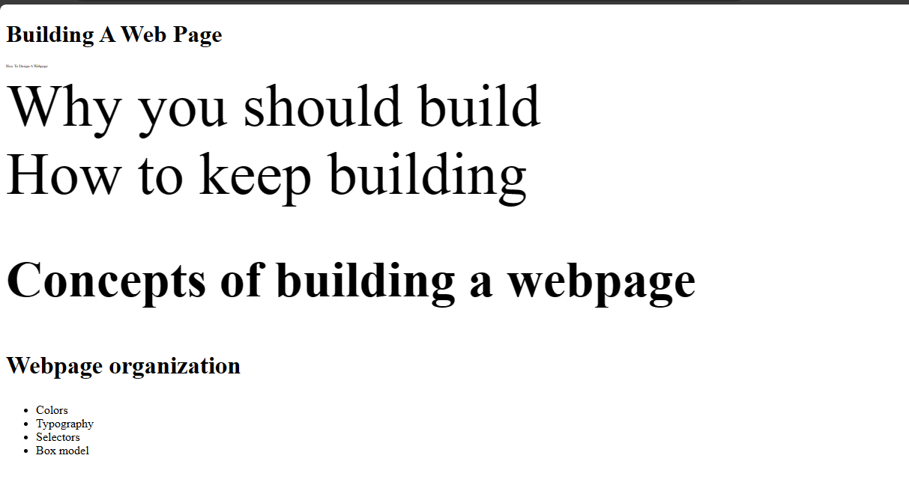

# Units intro
Units are used in CSS for measurements. For example, if you wanted to apply a margin to an element. You would use, `margin: 2px`. The `px` means pixel and it is a unit. There are various units like `px` and they are divided into two main categories, which are absolute and relative units.

**Note: When writing units, do not add spacing between the units.**

## Absolute units

Absolute units are fixed and they do not change regardless of the screen size. They make them unresponsive to your browser viewport and they could bloat up designs when they are on another screen.

These absolute units are:
- Pixel (px)
- Centimetres (cm)
- Millimetres (mm)
- Inches (in)
- Points (pt)
- Picas (pc)


## Relative units

Relative units take their measurements from one another. These units are relative to a particular measurement, hence they are responsive and can adapt to different screen sizes. 

They are:
- rem - relative to the font size of the root element.
- em - relative to the font size of its immediate element.
- vw - relative to the width of the viewport.
- vh - relative to the height of the viewport.
- vmin - relative to the viewport's smaller dimension.
- vmax - relative to the viewport's larger dimension.
- percentages (%) - relative to the font size of the parent element.

When you want to increase the size of the html fonts, you use font sizes. 

Example:

`index.html`

```
<!DOCTYPE html>
  <html>
    <head>
      <meta charset="utf-8"/>
      <title>A simple html page</title>
      <link rel="stylesheet" href="styles.css"/>
    </head>
    <body>
      <h1>Building A Web Page</h1>
      <p class="page">How To Design A Webpage</p>
      <div>Why you should build</div>
      <span>How to keep building</span>
      <h2>Concepts of building a webpage</h2>
      <h3>Webpage organization</h3>
      <ul>
         <li>Colors</li>
         <li>Typography</li>
         <li>Selectors</li>
         <li>Box model</li>
      </ul>
    </body>
  </html>
```
 
To increase the font size,

`styles.css`
```
p {
    font-size: 5px;
}
 
div {
     font-size: 5em;
}
 
span {
   font-size: 5rem;
}
 
h2 {
   font-size: 5vw;
}
 
h3 {
   font-size: 5vh;
}
```



Looking at your browser, you would see these elements have different sizes even though it's the same number. That shows you how much these units vary.


## Width and height

You could apply measurements to the width of an element to expand it when you are styling a page.

Example:

`index.html`

```
<!DOCTYPE html>
<html>
  <head>
    <meta charset=utf-8"/>
    <title>A simple html page</title>
    <link rel="stylesheet" href="styles.css"/>
  </head>
  <body>
    <h1>Building A Web Page</h1>
    <p class="page">How To Design A Webpage</p>
    <ul>
      <li>Colors</li>
      <li>Typography</li>
      <li>Selectors</li>
      <li>Box model</li>
    </ul>
  </body>
</html>
```

`styles.css`

```
body {
  width: 100vw;
}
```

This would cause the width of the element to be at 100th of the browser viewport. There may be cases when you may need to ensure the responsiveness of the page, you could use min-width and max-width.

Min-width causes the width to apply a minimum of the number given. It could expand depending on the size of the screen.

Max-width causes the width to apply the maximum of the number given. It would not exceed that measurement but would adjust depending on the screen size.


Likewise height, you use `vh`. There are also min-height and max-height.  

You could also use pixels when adding measurements to your width and height. It all depends on what you are building.
