# Flexbox
In this section, you will cover flexbox which means Flexible Box Module and all its concepts.

Flexbox is a layout model on CSS that makes it easier to position items on a web page depending on the screen size. Flexbox replaced float which was a previous technique to position items on a webpage.

To use flexbox, you would need to set the `display` property to flex. The parent element you apply `flex` to is a `container` and the children are the `items`.

Example,

`index.html`
```
<!DOCTYPE html>
  <html>
    <head>
      <meta charset="utf-8"/>
      <title>A simple html page</title>
      <link rel="stylesheet" href="css/styles.css"/>
    </head>
    <body>
      <h1>Building A Web Page</h1>
      <div class="flex-container">
        <span class="flex-item"></span>
        <span class="flex-item"></span>
        <span class="flex-item"></span>
        <span class="flex-item"></span>
        <span class="flex-item"></span>
        <span class="flex-item"></span>
        <span class="flex-item"></span>
        <span class="flex-item"></span>
        <span class="flex-item"></span>
        <span class="flex-item"></span>
        <span class="flex-item blue"></span>
      </div>   
    </body>
  </html>
```

`styles.css`
```
.flex-container {
  border: 2px solid #444;
  display: flex;
}

.flex-item {
  height: 50px;
  width: 70px;
  background-color: #f00;
  border-radius: 50%;
}

.blue {
  background-color: #00f;
}
```

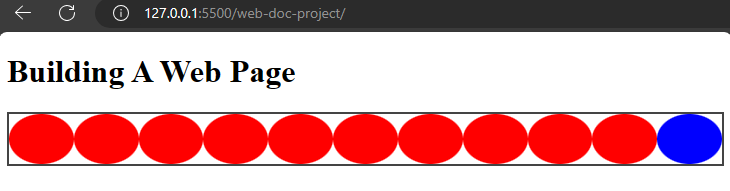

When you check your browser, you would discover flex had lined up the child elements because they are inheriting that flex property from the `div`.

## Properties of flexbox 
There are properties of flex which includes:
- `flex-direction` 
- `flex-wrap` 
- `flex-flow`
- `justify-content`
- `align-content`
- `align-items`
- `align-self`
- `gap`
- `flex-grow`
- `flex-shrink`
- `flex-basis`
- `flex`--- a shorthand for `flex-grow`, `flex-shrink`, `flex-basis`.


### The `flex-direction` property
This property specifies the direction of flex items in a flex container. It defines the main axis and how you can place the items.


The property can take the following values:
1. **The `row` value:** This is the default value of `flex-direction`. It places flex items horizontally in a row like the main axis, starting from the left and flowing to the right.


Example,

`styles.css`
```
.flex-container {
  border: 2px solid #444;
  display: flex;
  flex-direction: row;
}
```


This will show the content in the `div` element lying horizontally on the main axis.


2. **The `row-reverse` value:** This value is similar to row, but it reverses the order of flex items. Flex items are displayed in a row from right to left, with the main axis still running horizontally.


Example,

`styles.css`
```
.flex-container {
  border: 2px solid #444;
  display: flex;
  flex-direction: row-reverse;
}
```

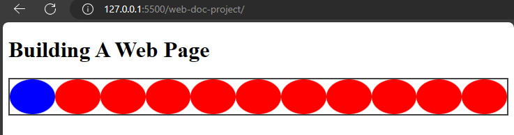

From the image, you will notice that the items were reversed with the last element moving to the first position.

3. **The `column` value:** This value places flex items vertically in a column. The main axis runs vertically, and the cross axis runs horizontally.


Example,

`styles.css`
```
.flex-container {
  border: 2px solid #444;
  display: flex;
  flex-direction: column;
}
```

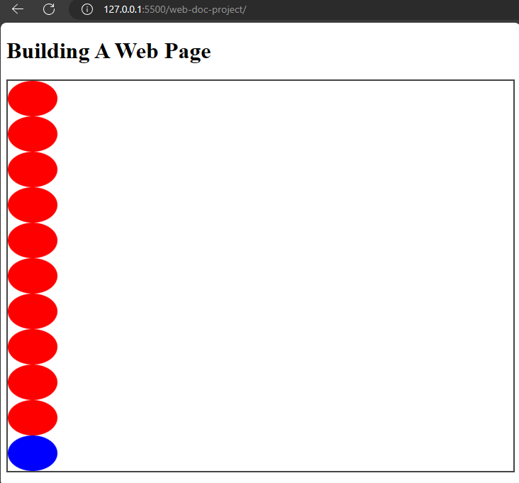

That will place the items in a vertical position in the image.

4. **The `column-reverse` value:** This reverses the order of flex items in a column.


Example,

`styles.css`
```
.flex-container {
  border: 2px solid #444;
  display: flex;
  flex-direction: column-reverse;
}
```

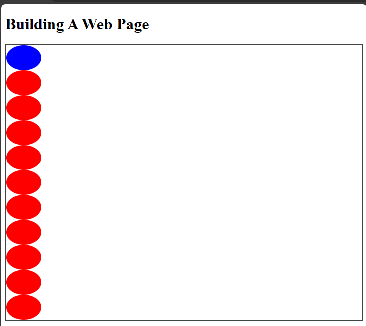


### The `flex-wrap` property 
The `flex-wrap` property controls how flex items position themselves in a container. If they are too big to fit in a line, using the `wrap` value will make the items occupy the first line and move to the second line.

There are other flex-wrap values which are:

1. **The `nowrap` value:** This is the default value that makes flex-items shrink to remain in a single line.

Example,

`styles.css`
```
.flex-container {
  border: 2px solid #444;
  display: flex;
  flex-direction: row;
  flex-wrap: nowrap;
}
```

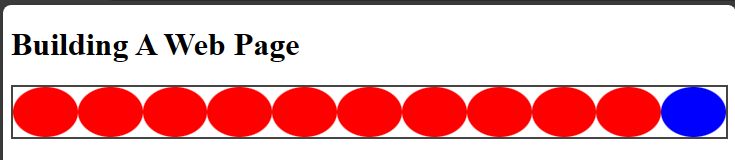

This makes the flex items remain on a single line.

2. **The `wrap` value:** The `wrap` value makes the items flow into additional lines to accommodate themselves.

Example,

`styles.css`
```
.flex-container {
  border: 2px solid #444;
  display: flex;
  flex-direction: row;
  flex-wrap: wrap;
}
```

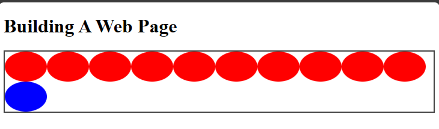

Now, the items are flowing to another line to accomodate each other.

3. **The `wrap-reverse` value:** This value is similar to wrap, but in the reverse direction.

Example,

`styles.css`
```
.flex-container {
  display: flex;
  flex-direction: row;
  flex-wrap: wrap-reverse;
}
```

The flex items will wrap but in the reverse direction.

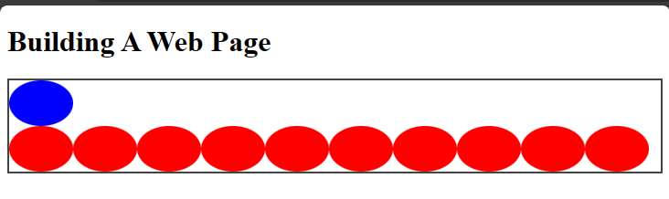


### The `flex-flow` shorthand property
The `flex-flow` is a property that combines the `flex-direction` and `flex-wrap` properties.

Example,

`styles.css`
```
.flex-container {
  display: flex;
  flex-flow: row wrap;
}
```


That will make the items be in the row direction and wrap as well.


### The `justify-content` property
The `justify-content` property makes flex items align along the main axis of a flex container. It distributes space around flex items.

The `justify-content` property accepts several values:

1. **The `flex-start` value:** This value positions the items at the start of the container's main axis.
 
Example,

`styles.css`
```
.flex-container {
  border: 2px solid #444;
  display: flex;
  flex-flow: row wrap;
  justify-content: flex-start;
}
```


This will move the items to the top left position of the container which is its default position.

2. **The `flex-end` value:** This moves the flex items to the bottom of the flex container.

Example,

`styles.css`
```
.flex-container {
  border: 2px solid #444;
  display: flex;
  flex-flow: row wrap;
  justify-content: flex-end;
}
```

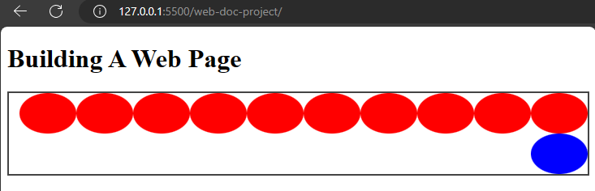

This will move the items to the bottom of the container.
 
3. **The `center` value:** This value centers flex items along the main axis of the container. 


Example,

`styles.css`
```
.flex-container {
  border: 2px solid #444;
  display: flex;
  flex-flow: row wrap;
  justify-content: center;
}
```

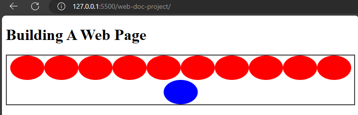

This will place the flex items at the center of the flex container.


4. **The `space-between` value:** This value distributes flex items equally along the main axis. It creates consistent spacing among the flex items.


Example,

`styles.css`
```
.flex-container {
  border: 2px solid #444;
  display: flex;
  flex-flow: row wrap;
  justify-content: space-between;
}
```

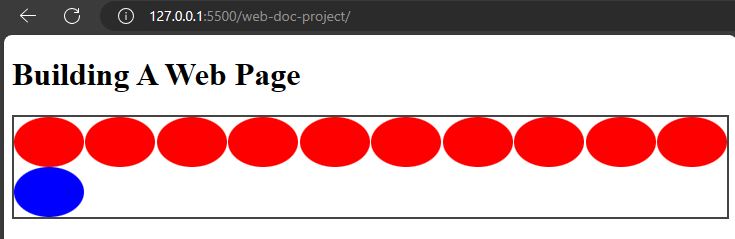

This will make the items space out in the container. 

5. **The `space-around` value:** This value evenly distributes the flex items along the main axis, but with space both before and after each item. The space between items is equal and half the size of the space before and after the first and last items.

Example,

`styles.css`
```
.flex-container {
  border: 2px solid #444;
  display: flex;
  flex-flow: row wrap;
  justify-content: space-around;
}
```

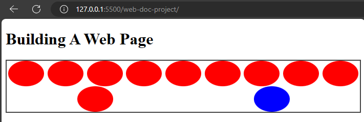

6. **The `space-evenly` value:** This value distributes flex items equally, ensuring equal spacing between the flex items.

Example,

`styles.css`
```
.flex-container {
  border: 2px solid #444;
  display: flex;
  flex-flow: row wrap;
  justify-content: space-evenly;
}
```

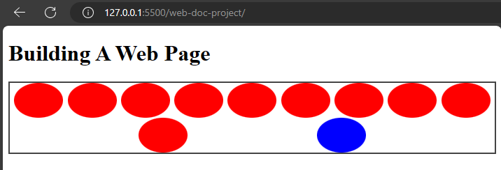

That will cause the flex items to space evenly.

### The `align-items` property
The `align-items` property aligns items vertically on the cross axis.
The values are:

- **The `stretch` value:** This is the default value which makes the items stretch and fill the container vertically.

Example,

`styles.css`
```
.flex-container {
  border: 2px solid #444;
  display: flex;
  flex-flow: row wrap;
  justify-content: space-evenly;
  align-items: stretch;
}
```

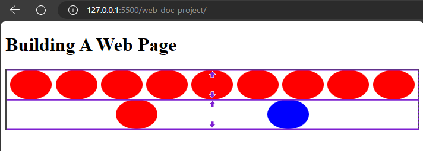


- The `flex-start` value: This value aligns flex items at the start of a container.
- The `flex-end` value: This value aligns items at the end of a container.
- The `center` value: This value aligns items at the center.
- The `baseline` value: This value aligns items at the baseline.


### The `align-self` property
This property controls the alignment of an individual flex item along the cross axis of the flex container.


The `align-self` property takes the same values as `align-items` which are: `stretch`, `flex-start`, `flex-end`, `center`, and `baseline` values. 

It also has an additional value named `auto` this is the default value and it makes the flex item inherit the value of the `align-items` property on the flex container.


Example,
`index.html`
```
<div class="flex-container">
  <span class="flex-item"></span>
  <span class="flex-item"></span>
  <span class="flex-item"></span>
  <span class="flex-item"></span>
  <span class="flex-item"></span>
  <span class="flex-item"></span>
  <span class="flex-item"></span>
  <span class="flex-item"></span>
  <span class="flex-item"></span>
  <span class="flex-item"></span>
  <span class="flex-item blue first-p"></span> 
</div>   
```

`styles.css`
```
.flex-container {
  display: flex;
  flex-direction: row;
  flex-wrap: wrap;
  justify-content: space-evenly;
  align-items: stretch;
}
.flex-container .first-p {
  align-self: center;
}
```

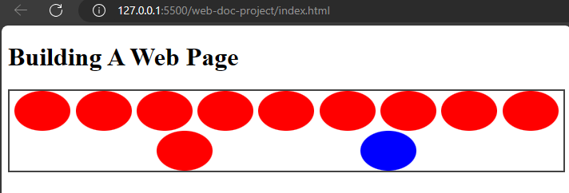

### The `gap` property
The `gap` property applies in both flex and grid containers. In a flex container, the `gap` property creates spacing between rows and columns in the flex container.

When you specify a single value, the gap property will set the value for both row and column gap.

When you specify for double values, it will set the values for row and column separately.


Example,

`styles.css`
```
.flex-container {
  border: 2px solid #444;
  display: flex;
  gap: 20px 10px;
}
```

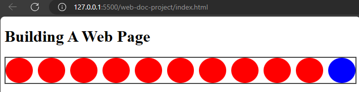

Now the shapes are spaced out with a spacing of 20px and 10px.

The `gap` property simplifies the process of adding consistent spacing between flex items within a container. 


### The `flex-grow` property
The `flex-grow` property controls how flex items grow within a flex container along the main axis.


**Key points about the `flex-grow` property**

- This `flex-grow` is applied to individual flex items.
- It accepts a unitless value, by default the value is set to `0`. Which means the flex items will not grow and will retain its original size.


Example,

`styles.css`
```
.flex-container {
  border: 2px solid #444;
  display: flex;
  gap: 20px 10px;
}

.flex-container .first-p {
  flex-grow: 1;
}
```

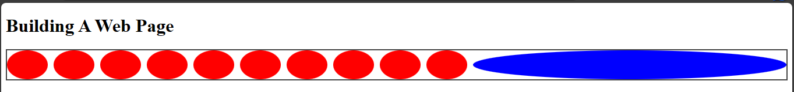

Now, the blue coloured shape will grow to accomodate the sizing.

That will cause the first paragraph to grow in size.

### The `flex-shrink` property
This property determines how flex items shrink when there is not enough space available within the flex container along the main axis.


**Key points about the `flex-shrink` property**
- The `flex-shrink` is like the `flex-grow` property as it is used on individual flex items.
- It also accepts a unitless value and the default value is `1`.


Example,

`styles.css`
```
.flex-container {
  border: 2px solid #444;
  display: flex;
  gap: 20px 10px;
}

.flex-container .first-p {
  flex-shrink: 1;
}
```


This will cause the blue circle to retain its size and shrink to accomodate any adjustment.


### The `flex-basis` property
This property specifies the ideal or default size of a flex item, regardless of its actual content or the available space within the flex container.


**Key points about the `flex-basis` property**
- It accepts length values (such as pixels or percentages) or the `auto` keyword.
- The `auto` value makes the flex item size itself based on its content or the value of the `height` or `width` property.


Example,

`styles.css`
```
.flex-container {
  border: 2px solid #444;
  display: flex;
  gap: 20px 10px;
}

.flex-container .first-p {
  flex-basis: 300px;
}
```

This will make the blue shape have an initial width of 300px along the main axis.

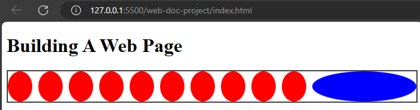


The `flex-grow`, `flex-shrink`, `flex-basis` properties work together to determine how flex items are sized and distributed within the flex container.


### The `flex` property
The `flex` property is a shorthand for `flex-grow`, `flex-shrink`, and `flex-basis` properties. It accepts three values for the `flex-grow`, `flex-shrink`, and `flex-basis` respectively.

The `flex` property is more popular and it is what most designers use instead of the other properties.

Example,

`styles.css`
```
.flex-container {
  border: 2px solid #444;
  display: flex;
  gap: 20px 10px;
}

.flex-container .first-p {
  flex: 1 0 300px;
}
```

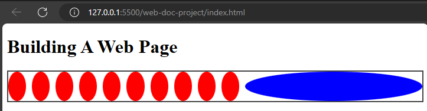

This will cause the blue shape to grow (flex-grow: 1), to not shrink (flex-shrink: 0), and to have an initial size of 300px (flex-basis: 300px).


That sums up the properties of flexbox that it uses to position items on a webpage. Flexbox uses the parent element as the flex container while the child elements are the flex items.