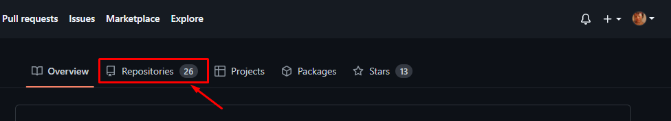
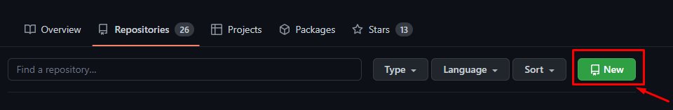
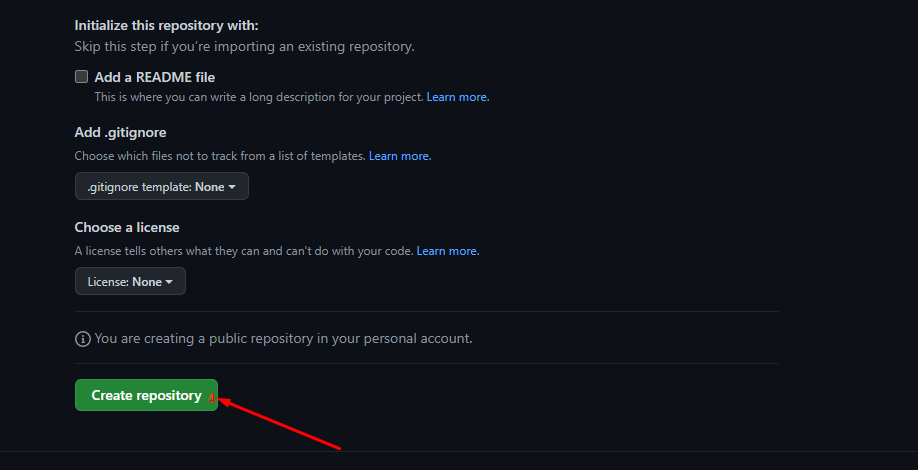

# Introduction to GitHub
In the previous section, you learned about version control systems and git; a popular version control system. In this section, you are going to cover Git and GitHub. You may have heard about GitHub prior to this course and even if you haven't, you will get to understand what it is, the basic difference between Git and GitHub and how to use GitHub.


## What is GitHub?
According to [GitHub docs](https://docs.github.com/en/get-started/quickstart/hello-world),
"GitHub is a code hosting platform for version control and collaboration that lets you and others work together on projects from anywhere."
This means that GitHub is a platform that uses Git technology to offer services like collaboration, task/project management and even more. In the last section, I mentioned that Git as a distributed version control system fosters collaboration. GitHub as a code hosting platform extends the benefits of Git to include so much more. GitHub is not the only "Git-platform" out there, there are others like GitLab and so on.
GitHub is the most popular platform having over 80 million users around the world.


## Uses of GitHub
Here are some of the uses of GitHub:


1. **It promotes collaboration:** GitHub makes collaboration much easier. It is possible for enterprise teams to work on certain projects together regardless of their locations. So GitHub makes it possible to copy,review,edit,and merge a project effortlessly.


2. **It is a great tool for open source:** GitHub is renowned for open source. According to [Wikipedia](https://en.m.wikipedia.org/wiki/GitHub), Linus Torvalds, the founder of Linux commends GitHub for "making open-source project hosting so easy". When a project is open-source, it means that it is a public repository and the owners of these repositories usually indicate in a document that they are open to contributions. Open source work is usually free which means that there are monetary rewards. Although, there are some organisations that could pay you to contribute to their projects. But the essence of open source is to make free contributions.


3. **Version Control:** 
GitHub allows you to track changes to your code over time, so you can always revert to a previous version if needed. This is essential in software development when companies could launch new updates to their software and make it public to users, only to discover there is a bug affecting their software which could cause them to lose customers. They can easily roll back the changes they have made and retain the previous version for their users until they fix the bug.


4. **It serves as a resume:** GitHub will not replace actual resumes per se. But it could be a means to show off your work to potential employers. Since GitHub keeps a record of all projects you store on it, using it as a portfolio helps potential employers to know if you are fit or not.


## How to push your projects to GitHub
In order to use GitHub, you need to create a GitHub account.
- Go to [GitHub](https://github.com/) and create the account.
Now, you are going to push the calculator project to GitHub.

- Click on Repositories.


- When it opens, click on `New Repository`.


- Name it `calculator-folder`, give a brief description(this is optional), leave the remaining details blank and click on `Create repository`.


- Open the terminal on your local device.

- Navigate to the calculator folder `cd calculator-folder`.

- In the folder, run `git init`. This will initialise git in your project.

- Run `git add .` to stage the changes.

- Then run `git commit -m "adding my calculator project`. This will serve as a description of the project on GitHub.

- Since this is a new repository on Github, run these commands:

```
git branch -M main
git remote add origin <repository-link>
git push -u origin main
```

This will push your local changes to the remote branch repository.

- Go to the repository and refresh.

You should see your project there.
That is how to push projects you have built to GitHub.


