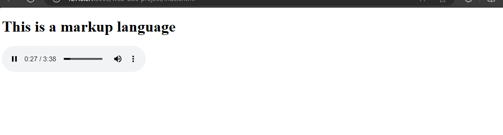
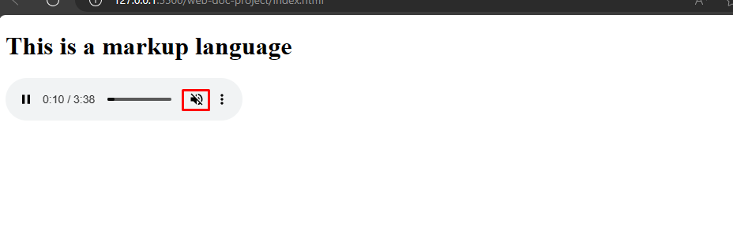
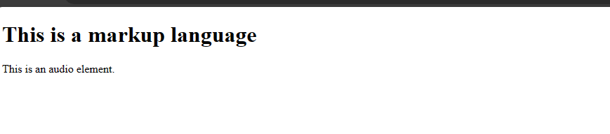

# Audio Basics
The next part of the media is adding audios in your html. If you have ever downloaded an audio like a music or voice recording from the internet. Then, you have come across the audio element in html.


Now, you are going to learn how to add your own audios to your webpage.

First, get an audio file from your storage and store it in the folder you are using for learning.

To run an audio file on html would be:
`index.html`
```
<audio controls>
  <source src="ringtone.mp3" type="audio/mpeg">
</audio>
```




Look at the attributes;
- `controls` attribute - when you specify this attribute then you can play, pause the audio.
- `src` attribute - the `src` attribute is what you use to specify the file path of the audio.
- `type` attribute - `type` attribute specifies the type of audio you are playing.


## Audio file types
There are about three audio file types which you can run in html and they are:
1. The `.mp3`
2. The `.wav`
3. The `.ogg`


It is considered best practice to add all audio file types when building a webpage because not all browser versions support all the audio types. Only the `.mp3` file type is supported by all browser versions currently.


To add all the audio file types to the audio element:


`index.html`
```
<audio controls>
  <source src="ringtone.ogg" type="audio/ogg">
  <source src="ringtone.mp3" type="audio/mpeg">
  <source src="ringtone.wav" type="audio/wav">
</audio>
```


When you run it, the browser will run only one file type from the three types you specified.

## Running an audio file with `autoplay`
The `autoplay` attribute will run an audio immediately when you open a webpage.

Example,

`index.html`
```
<audio controls autoplay>
  <source src="ringtone.mp3" type="audio/mpeg">
</audio>
```


When you run it, you will discover that the audio will start immediately you refresh the browser.

There are applications that use autoplay even in videos. YouTube, for example, uses autoplay currently. But, it is on mute when you open the YouTube app. That is because it was muted.

To mute an audio on autoplay you use the `muted` attribute.

Example,

`index.html`
```
<audio controls autoplay muted>
  <source src="ringtone.mp3" type="audio/mpeg">
</audio>
```



When you run this on your browser, you will notice that the audio runs but it is muted. 
With this you can set an audio on autoplay but on mute.


## Text in audio element
You can add text in the audio element. There may be cases where a user could disable audios from displaying on their browser. So it's important to add text to the audio element so the user will know that it is an audio file.


Example,

`index.html`
```
<audio controls>
  <source src="ringtone.mp3" type="audio/mpeg">
This is an audio element.
</audio>
```
