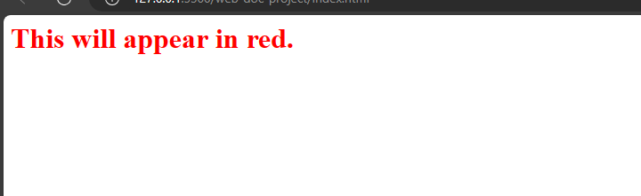

# Html Attributes
Html tags and html elements are important topics in Html. But Html attributes are important too. They help you to write proper HTML and set it up properly. In this section, you will learn about Html attributes.

## What is an html attribute?
An Html attribute is an html code that you can add to the opening tag of an element. Attributes influence the behaviour of an element they are on. They also give more details about an element and help the element the way you desire.
Image elements usually require an `src` attribute which contains the link for an image.

## Key attributes
There are some key attributes that you will always come across in Html and they are,

- The `href` attribute
- The `src` attribute
- The `alt` attribute
- The `lang` attribute
- The `style` attribute
- The `width` attribute
- The `height` attribute 

### The `href` attribute
You use the `href` attribute when you want to add links to your html. The links could be links for an external website or another file.
Example:

`index.html`
```
<link rel="stylesheet" href="styles.css"/>
```

In this example, you are linking a css file to your html.

### The `src` attribute
The `src` attribute is an attribute that contains the link to an image. The link could be a path description of the image on your local device or a link to an external website. 

Example,

`index.html`
```

```
The `src` attribute is always in the image element.

### The `alt` attribute
The `alt` attribute means alternative. It gives a text description of an image. `alt` attribute is required in [accessibility](https://link.medium.com/G5oVYOoHvyb) because of people with sight problems or poor bandwidth.

Example,

`index.html`
```

```
**Note: This is not a real image, I am only using it to illustrate attributes. You will learn about images fully as you read on.**

### The `lang` attribute
The `lang` attribute defines the language of the web page. If it is English then you use `en`, for French you would use `fr`. The value you add to your `lang` attribute depends on the language you are using in that document. `lang` attribute is in the `html` element. 

Example,

`index.html`
```
<html lang="en"></lang>
```

### The `style` attribute
You use this attribute to add CSS to an element. The `style` attribute is only used when you are writing a simple html document or when you wish to add a particular CSS property to an element.

Example,

`index.html`
```
<h1 style="color: red;">This will appear in red.</h1>
```



This attribute will make the html element have the colour red.

### The `width` attribute
You use the `width` attribute in images to set a specific width value for an image.

Example,

`index.html`
```

```

When you set the width of an image then it adjusts to it automatically.

### The `height` attribute
`height` attribute is similar to the `width` attribute. You use it to set the value of the height of an image.

Example,

`index.html`
```

```

**Note: It is better to use the `width` and `height` values when you know the right values to use. As the wrong values could distort the image.**

## Key points to note in naming attributes  
- Attributes are in `attribute_name:value` pair. The names of the attributes are attributes names while the details you add are values.
- Always write your attributes and values in small letters.
- You can add multiple attributes to an element.
- Add spacing when using multiple attributes.

