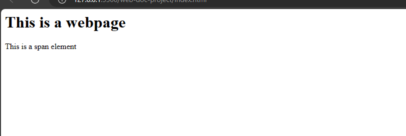
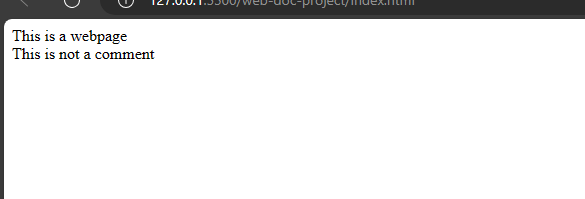
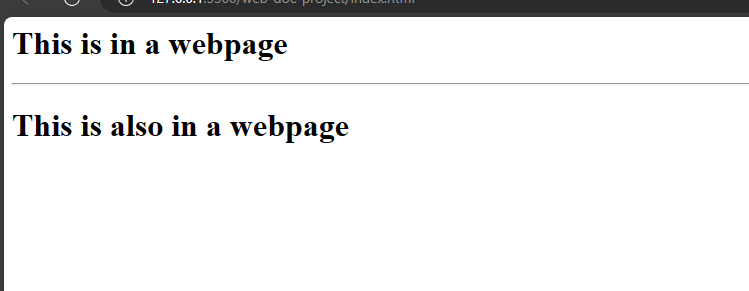

# Comments, `hr` And Linebreaks
In this section, you will learn some html tips that you could use to improve your content.
They are comments, linebreaks and the `hr` element.

## Comments
When writing code, you may wish to document a small piece of information or to take a note. You do that with comments. In Html, you can use comments. It is denoted with a tag and some dashes. `<!---->`
Example,

`index.html`
```
<h1>This is a webpage</h1>
<!--Adding a comment-->
<span>This is a span element</span>
```



## Linebreaks
A linebreak is used to denote a new line when writing code. Previously, you added some comments signifying linebreaks. Now, add a linebreak.
Example,

`index.html`
```
<span>This is a webpage</span>
<!--Adding a linebreak-->
<br/>
<span>This is not a comment</span>
```


## The `hr` element
The `hr` element serves as a self-closing tag to insert a horizontal rule or line between sections of content within a webpage.
Example,

`index.html`
```
<h1>This is in a webpage</h1>
<hr>
<h1>This is also in a webpage</h1>
```


The `hr` element will separate both `h1` elements using a horizontal line.
