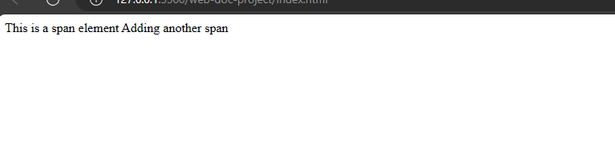
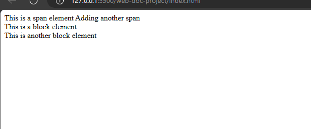

# Html Elements
Html elements are nodes of an Html document. They form the content on a web page. In this section, you will learn html elements and their types.

## What is an html element?
An html element is an html code that begins with an html tag and ends with an html tag. Html elements contain an opening, content and a closing tag.

When you use a heading tag `h1` to create content, then it becomes an `h1` element. All elements contain content always.

Example,
`index.html`
```
<h1>Hello World</h1>
```
When you run this in the browser, it shows content. 

Not all elements have a closing tag, some elements are self-closing. 

## Types of elements
Elements have types based on their uses and they are,
-Inline elements 
-Block elements 

### Inline elements
Inline elements are elements that do not begin with a new line. They only occupy the width of the body of their content. `span` is an example of an in-line element. When you use `span` to add content on a web page, it only occupies the width of that text.

Example,

`index.html`
```
<span>This is a span element</span>

<span>Adding another span</span>
```



When you run it in the browser, you would notice that the second `span` element begins immediately after the first `span`. 


### Block elements
Block elements are the opposite of inline elements. They begin on a new line and they occupy the full width for the content. `div` and `p` are examples of block elements.
To illustrate this, 

-Open your `index.html` file.
-Under the `span` elements you wrote earlier.
Add this,

`index.html`
```
<span>This is a span element</span>

<span>Adding another span</span>

<div>This is a block element</div>
<div>This is another block element</div>
```


Both `div` elements begin on a new line unlike the `span` elements because they are block elements.

