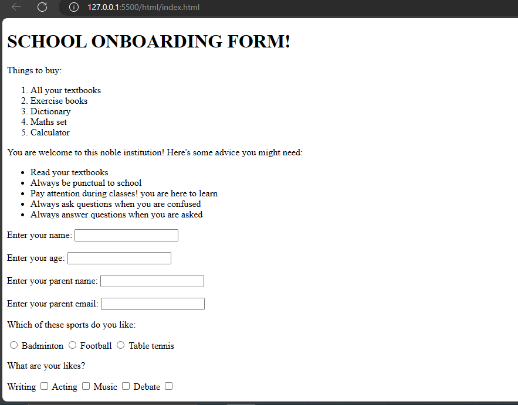
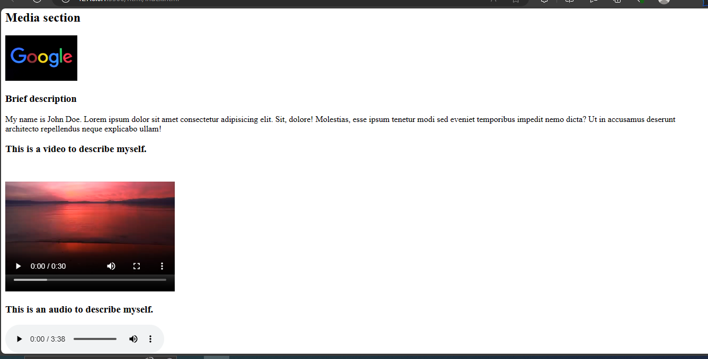
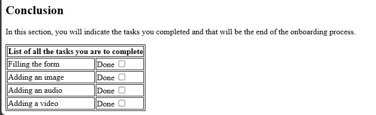

# Html Exercise 
Now you have come to the end of Html. Before you move on to CSS, you should try this exercise to revise all you have learned.

This is a screenshot of what you are to build. A school onboarding page. This is more of a manual that this school gives to their newly admitted students on the things they need to do to settle in for school activities.

You are going to replicate this by creating lists, a form, using media elements, and tables.
With this, you will cover the core topics you learned in HTML.

**Section 1** - 
Creating a list (an ordered list of things a student needs to buy)

Creating an unordered list (an unordered list of activities or advice a student might need)

**Section 2** - Creating a form (a basic form that a student should fill after gaining admission)

**Section 3** - Creating media elements (adding images, videos, and audios) of the students to introduce themselves.

**Section 4** - Creating a table that details activities the student must complete and which one they have yet to complete.

You can view the code if you are having any challenges or if you are done.
 
[Section 1](https://github.com/ezinneanne/Html-exercise/blob/main/section1.html)

[Section 2](https://github.com/ezinneanne/Html-exercise/blob/main/section2.html)

[Section 3](https://github.com/ezinneanne/Html-exercise/blob/main/section3.html)

[Section 4](https://github.com/ezinneanne/Html-exercise/blob/main/section4.html)

