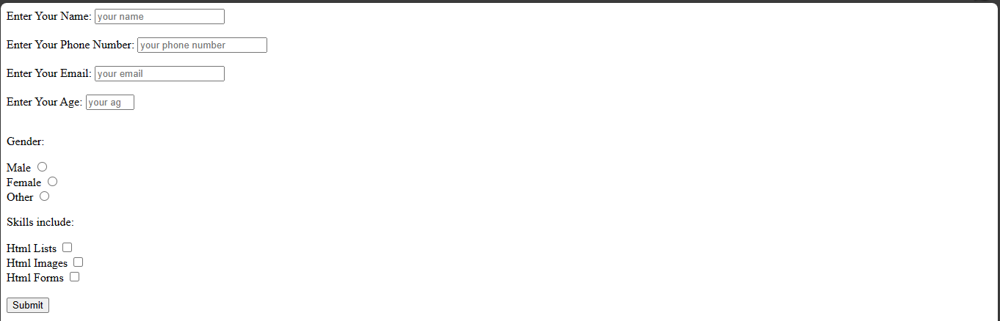

# Html Forms
Html forms are used to fill in user data and process the information.


This is the syntax:
```
<form>


</form>
```
## The `action` attribute
The form has an action attribute that accepts the link for submission to the server. If the action attribute is empty. The form will try to submit by validating user input.


This is the syntax:


```
<form action="">


</form>
```


To create forms in html, there are two popular elements which are input and label elements, others are button, option, select, textarea elements amongst the other elements.


## The `input` element 
The input element has attributes such as `type`,`id`,`name`, `placeholder,`required`,`autocomplete`, `min` and `max`, `size`  attributes, and so on. Each of them have their own features which they offer.
 
### The `type` attribute 
Input elements have several type attributes which are:
- The `<type=text>` attribute for simple text. 
- The `<type=number>` for digits.
- The `<type=email>` for email.
- The `<type=radio>` for using radio buttons
- The `<type=checkbox>` for making checkboxes.
- The `<type=submit>` for submitting data


There are other type attributes, you can check this [reference for a list of all input types](https://www.w3schools.com/html/html_form_input_types.asp).


### The `id` attribute
This attribute is used in an element. The element could have a particular id the browser can identify it with. With this attribute, you could add JavaScript to your html with ease.


### The `name` attribute
This attribute is used to give the element a name which you could use to describe the purpose of using that element.


### The `placeholder` attribute
As the name implies, this attribute serves as an initial text on the input element until the user types in data. 


### The `required` attribute
The `required` attribute is used to denote compulsory data which the user must fill before they submit the data.


### The `autocomplete` attribute
This attribute is used to indicate whether the browser should store the user's data and use it to autocomplete the user's data on their next visit or not.


### The `min` and `max` attribute
These attributes serve as a measure for a particular range you would want for your users. An example is when you set an input element for age and set 12 years as the minimum and 35 years as the maximum.


### The `size` attribute
The `size` attribute displays the numbers of characters the user is allowed to type in.


## The `label` element
This element is used to describe the `input` element for the user. The `label` element is used for accessibility too. Screen readers usually read label elements so it's best practice to add them. 


**Note:** *The `for` attribute should contain the same info as your `id` attribute*


Now, you will look at an example that covers the elements and attributes.


```
<!Doctype html>
<html>
  <head>
    <meta charset="utf-8" />
    <meta http-equiv="X-UA-Compatible" content="ie=edge" />
    <meta name="viewport"
    content="width=device-width,
    initial-scale=1.0">
    <title>Html Forms</title>
   </head>
   <body>
    <form action="">
     <label for="your_name">Enter Your Name:</label>
     <input type="text" id="your_name" name="user name"  placeholder="your name" required="true" autocomplete="off"/><br>
     <br>
    <label for="phone_number">Enter Your Phone Number:</label>
    <input type="numbers" id="phone_number" name="phone number" placeholder="your phone number" required="true" autocomplete="on"/><br><br>


    <label for="email">Enter Your Email:</label>
    <input type="email" id="email" name="email" placeholder="your email" required="true" autocomplete="on"/><br><br>
    
    <label for="age">Enter Your Age:</label>
    <input type="number" id="age" name="age" placeholder="your age" min="12" max="35" autocomplete="off"/><br><br>
    
      <p>Gender:</p>
      <label for="male">Male</label>
      <input type="radio" id="male" name="gender_type" placeholder="Male" required="true"/>
      <br/>
      
      <label for="female">Female</label>
      <input type="radio" id="female" name="gender_type" placeholder="Female" required="true"/>
      <br/>
      
      <label for="other">Other</label>
      <input type="radio" id="other" name="gender_type" placeholder="Other" required="true"/>
      <br/>


      <p>Skills include:</p>
      <label for="lists">Html Lists</label>
      <input type="checkbox" id="lists" name="lists" placeholder="Html Lists"/>
      <br>
      
      <label for="images">Html Images</label>
      <input type="checkbox" id="images" name="images" placeholder="Html Images"/>
      <br>
      
      <label for="forms">Html Forms</label>
      <input type="checkbox" id="forms" name="forms" placeholder="Html Forms"/>
      <br>
      <br>
      
      <input type="submit" id="submit" placeholder="submit"/>
   </form>
   </body>
  </html>
```



When you click on the submit button without adding the required data, you will be prompted to do so.


## The `button` element
Like the name implies, the `button` element is used for creating buttons on a web page.


Example,
```
<button type="button">Click here</button> 
```


You can also set the `button` element with a type of submit to submit data or a type of reset to reset data.


Example,
```
<button type="submit">Click here</button>
```
This will tell the browser that it is meant to submit data.


Example,
```
<button type="reset">Click here</button>
```
This will tell the browser that it should reset the data.


## The `select` and `option` elements 
The `select` element is best used in a form for a list of options to choose from. It is usually in a drop-down format. 
The `option` element is used for options either in a `select` element or other type of elements like the `datalist` element.


Example,


`index.html`
```
<label for="country">What is the name of your country?</label>

<select name="country" id="country">
  <option value="kenya">Kenya</option>
  <option value="nigeria">Nigeria</option>
  <option value="ghana">Ghana</option>
  <option value="benin">Benin</option>
</select>
```


That will display a list of some countries to choose from.


## The `textarea` element 
This element is used to collect user input. It can accommodate text depending on the size you specify.


Example,


`index.html`
```
<textarea id="impact" name="impact" maxlength="800" placeholder="Briefly describe how much this program has impacted you"></textarea>
```

Now, let's add up the elements to the previous form example.

Example,

```
<!Doctype html>
<html>
  <head>
    <meta charset="utf-8" />
    <meta http-equiv="X-UA-Compatible" content="ie=edge" />
    <meta name="viewport"
    content="width=device-width,
    initial-scale=1.0">
    <title>Html Forms</title>
  </head>
  <body>
    <form action="">
     <label for="your_name">Enter Your Name:</label>
     <input type="text" id="your_name" name="user name"  placeholder="your name" required="true" autocomplete="off"/><br>
     <br>
    <label for="phone_number">Enter Your Phone Number:</label>
    <input type="numbers" id="phone_number" name="phone number" placeholder="your phone number" required="true" autocomplete="on"/><br><br>


    <label for="email">Enter Your Email:</label>
    <input type="email" id="email" name="email" placeholder="your email" required="true" autocomplete="on"/><br><br>
    
    <label for="age">Enter Your Age:</label>
    <input type="number" id="age" name="age" placeholder="your age" min="12" max="35" autocomplete="off"/><br><br>
    
      <p>Gender:</p>
      <label for="male">Male</label>
      <input type="radio" id="male" name="gender_type" placeholder="Male" required="true"/>
      <br/>
      
      <label for="female">Female</label>
      <input type="radio" id="female" name="gender_type" placeholder="Female" required="true"/>
      <br/>
      
      <label for="other">Other</label>
      <input type="radio" id="other" name="gender_type" placeholder="Other" required="true"/>
      <br/>


      <p>Skills include:</p>
      <label for="lists">Html Lists</label>
      <input type="checkbox" id="lists" name="lists" placeholder="Html Lists"/>
      <br>
      
      <label for="images">Html Images</label>
      <input type="checkbox" id="images" name="images" placeholder="Html Images"/>
      <br>
      
      <label for="forms">Html Forms</label>
      <input type="checkbox" id="forms" name="forms" placeholder="Html Forms"/>
      <br>
      <br>

      <label for="country">What is the name of your country?</label>

      <select name="country" id="country">
        <option value="kenya">Kenya</option>
        <option value="nigeria">Nigeria</option>
        <option value="ghana">Ghana</option>
        <option value="benin">Benin</option>
      </select> <br><br>

      <textarea maxlength="800" rows="4" cols="50" placeholder="Briefly describe how much this program has impacted you"></textarea>
      <br>
      <input type="submit" id="submit" placeholder="submit"/>
      <button type="reset">Reset form data</button>
   </form>
  </body>
</html>
```

This is an example of a simple form in html.