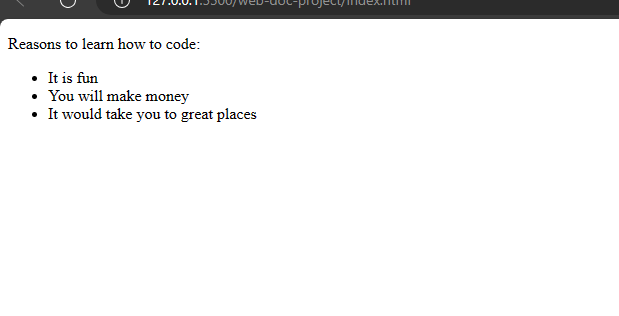
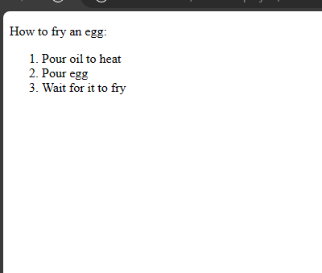
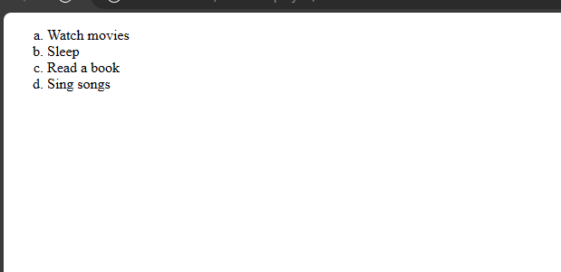
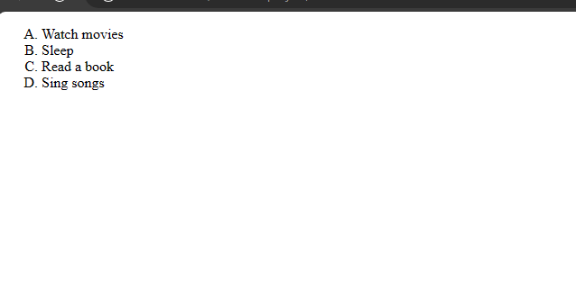
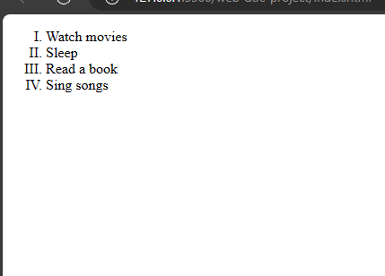
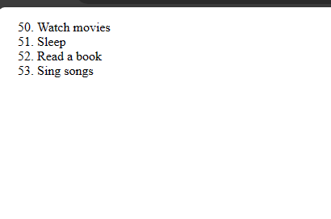
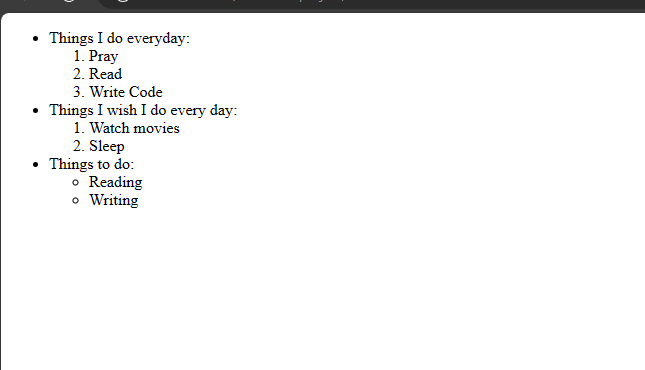

# Html Lists
 
Lists in Html are used to group items or organize contents. There are two popular types of lists which are: unordered, ordered, and description lists. 

## Unordered Lists

Unordered Lists are used to group items that you do not wish to number. They are usually represented in bullets, circles or square.

Example,

`index.html`
```
<p>Reasons to learn how to code:</p>
<ul>
  <li>It is fun</li>
  <li>You will make money</li>
  <li>It would take you to great places</li>
<ul>
```




The `li` is used to denote the items while the `ul` indicates that it is an unordered list.

## Ordered Lists

Ordered Lists are used to group items in a numerical or alphabetical order. Ordered lists are used for hierarchy purpose. When writing a set of items that must follow each other then use ordered lists. Also use ordered lists for organizations of items.

Example,

`index.html`
```
<p>How to fry an egg:</p>
<ol>
  <li>Pour oil to heat</li>
  <li>Pour egg</li>
  <li>Wait for it to fry</li>
</ol>
```




You could also use it for other instances, like calling a list of names.

### The `type` attribute
When using ordered lists, numbers are used as the default but if you want alphabets then you can specify with the `type` attribute.

Example,

`index.html`
```
<ol type="a">
  <li>Watch movies</li>
  <li>Sleep</li>
  <li>Read a book</li>
  <li>Sing songs</li>
</ol>
```



**Note:** This is for small letters. To use capital letters you use "A".

Example,

`index.html`
```
<ol type="A">
  <li>Watch movies</li>
  <li>Sleep</li>
  <li>Read a book</li>
  <li>Sing songs</li>
</ol>
```



You could also use roman numerals as lists as well.

Example,

`index.html`
```
<ol type="I">
  <li>Watch movies</li>
  <li>Sleep</li>
  <li>Read a book</li>
  <li>Sing songs</li>
</ol>
```




### The `start` attribute
The `start` attribute works well for numbered lists. With the `start` attribute, you can specify the particular number you wish to start the lists you are making.

Example,

`index.html`

```
<ol start="50">
  <li>Watch movies</li>
  <li>Sleep</li>
  <li>Read a book</li>
  <li>Sing songs</li>
</ol>
```




## Nested Lists

Nested lists are lists stacked in each other. You could be writing a program and you would need to use lists both ordered and unordered lists. So that is how nested lists came to be. 

Example,

`index.html`
```
<ul>
  <li>Things I do everyday:</li>
  <ol>
    <li>Pray</li>
    <li>Read</li>
    <li>Write Code</li>
  </ol>
  <li>Things I wish I do every day:</li>
  <ol>
    <li>Watch movies</li>
    <li>Sleep</li>
  </ol>
  <li>Things to do:</li>
  <ul>
    <li>Reading</li>
    <li>Writing</li>
  </ul>
</ul>
```




## Description Lists

As the name implies, the description list is used to list and describe items. It has a different syntax from the other list types as it does not use `li` tags. Instead it uses a `dd` tag to describe an item while the `dt` tag will list the item for description.

This is the syntax:

```
<dl>
  <dt>Title</dt>
  <dd>Description of the title.</dd>
  <dt>Title 2</dt>
  <dd>Description of the title.</dd>
</dl>
```

That sums up lists in html. In the next page, you will look at links in html.


