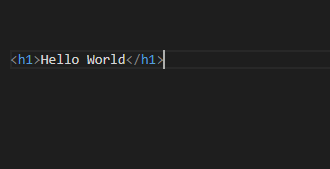
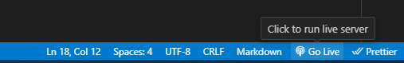
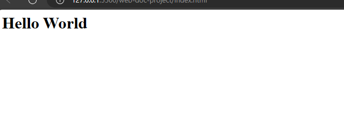

# Html Tags
In the previous section, you covered the basics of web development and how to set up a web page. In this session, you will learn about html tags and their types.

## What is a tag
An html tag is a code that html uses to present content on the screen. Tags make up html syntax. 
When you write in an html file without using tags, the browser will interpret it to be plain text.
Html tags are what tell the browser how to render a text. Each tag has its own meaning.
Tags usually have opening tags `<>` and closing tags `</>`. Although some html tags do not need closing tags.
Html is written in a `.html` file. If you were to write html in a `.txt` file. The browser will render it as plain text even though you are writing html.

Example,
Create a file in the vscode text editor and save it as `index.html`.

Enter this:
`index.html`
```
<h1>Hello World</h1>
```


Click on Live extension Run to run the file in your browser.



You should see this.



## Types of html tags
The tag you used to write html above is a heading tag. Html tags have tags used for headings, footings, and quoting of a webpage.

When you look at a website, you would notice there is text positioned throughout the page. Some are at the top of the page, some are at the centre, some are big and some are small. They are all written with the html tags.

Html tags are classified into eleven types and they are;

- heading tags
- footing tags
- quoting tags
- form tags
- list tags
- table tags
- Media tags
- meta tags
- link tags
- scripting tags


### Heading tags
These are tags that are used for headings. They represent a hierarchical order of topics. For example, a web page may have a main title, a subheading and a smaller title under the subheading. 

### Footing tags 
You use these tags to place content at the bottom of the web page. For example, the `footer` tag.

### Quoting tags
Quoting tags are used to represent quotes on a web page. Html tags have different tags for long quotes and short quotes.

### Form tags
 Form tags are tags that are used in creating html forms. You could use form tags for data collection generally. Examples are, `form` and `input`.

### List tags
They are used for the organisation and arrangement of content: for example, the `ul` tag.

### Table tags
Table tags are used to create tables and add contents to tables. For example, the `tr` tag.

### Media tags 
Media tags add images, audio and videos to a web page. They are used to add descriptions to media content too. For example, the `img` tag.

### Meta tags
These tags provide information about the web page to search engine bots and other bots that would be accessing the page. For example, the `meta charset` tag.

### Link tags
Link tags are used to add links to content or to link another file on a web page. Example, `link` tag, `a` tag.

### Scripting tags
Scripting tags are used to add scripts to a page. A script is a file for a programming language, for example, JavaScript. Script tags are also used to denote when there is no file on a page. For example, the `script` tag.
