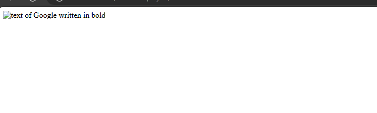
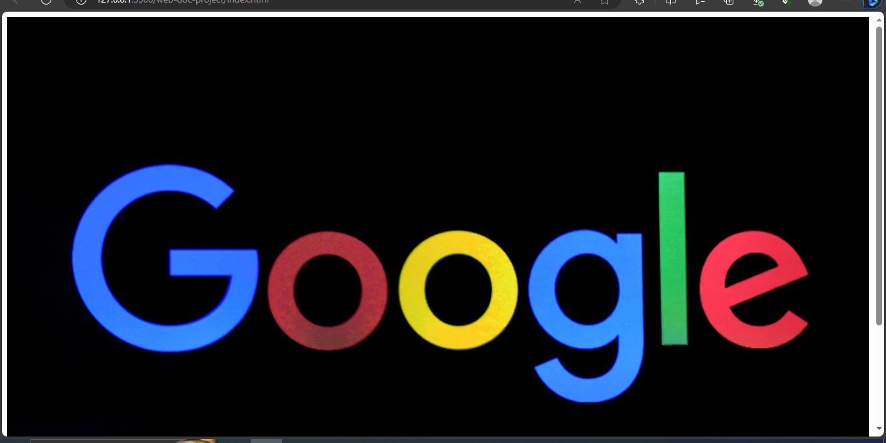

# Media Elements
Media elements are elements that html uses to display media content like images, videos and audios.
In this section, you will learn how to add images, audios and videos in html.


## Image basics
You could see images on every webpage and they bring out the aesthetics in every page. Images require a source attribute in it, which is denoted by the `src`. Images also require an `alt` attribute which means alternative to describe the image content.


To create an image, you can use an image in your local device or use this image from [google](https://www.google.com/url?sa=i&url=https%3A%2F%2Fmarketingedge.com.ng%2Fgoogle-launches-ai-powered-features-for-advertisers%2F&psig=AOvVaw1yUoTHS4U9g-0CSDZJzRHP&ust=1693631719204000&source=images&cd=vfe&opi=89978449&ved=0CBAQjhxqFwoTCJD5n4LUiIEDFQAAAAAdAAAAABAH).


To get the image:
- Go to Google chrome browser or any other browser.
- Type "Google image link" in the search bar and press "enter".
- That will bring up different types of Google images, you can select any one and copy the link.
 
`index.html`
```

```


**Note: I gave the image a width of 100% so it will exceed its container size.**

The image above is saved in the same path as your html file.


What if you had saved the image in a different directory? It will not show when you run it in the browser and your browser will simply display the description of the image.



It will show something like this.

So how do you correct that?


### Images in a different directory 
Images can be in a different directory. The previous image was not in a different directory but in the same file path as your `index.html` file. 
To place your images in a different directory:
-Create a new folder inside the folder where your `index.html` is located.
- Save the folder as `img`.
- Move the image you added recently to the folder.


This should be your file path:
```
main-folder
  |
  |— index.html
  |– img
  |  |– google_image.jpg
```


Update your code;


`index.html`
```

```



That will make the image to display. What if you wanted to display the image from the web?


### Images from the web
You can add an image from the web to your html without downloading the image.


All you have to do is to copy the image link and add it to the `src` attribute.


```

```


When you check your browser, you should see that image showing.


### Width and Height
Images have width and height attributes which you can add to them while writing your code.
You could work on the previous image and give it specific height and weight values.


`index.html`
```

```


**Note: when adding widths and heights to images, do not use values that are too big or too small. Else, it would distort the image quality.**

In this next page of this doc, you will learn about audios in html which is also a type of media elements.