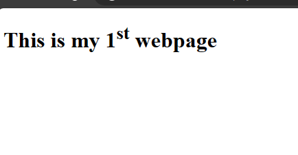
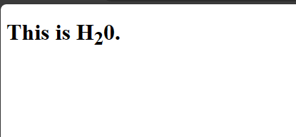
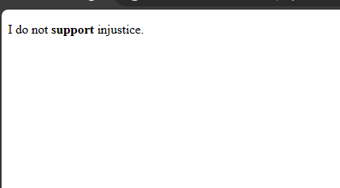
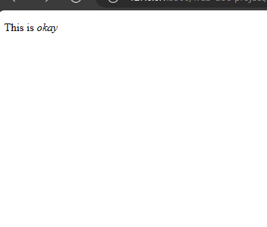
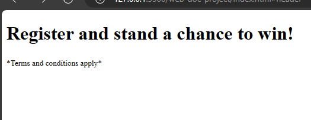
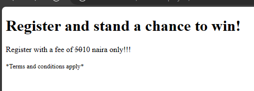
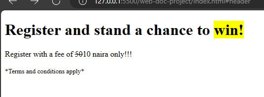

# Other Elements 
There are other elements that you would come across randomly as you use Html. Which are,

- The `sup` element.
- The `sub` element.
- The`strong`element.
- The `em` element.
- The `small` element.
- The `s` element.

## The `sup` element
Sup elements denote small writings added to the top of a font. For example, 1st. To make the two letters `st` be small and at the top, use the `sup` element.

Example,

`index.html`
```
<h1>This is my 1<sup>st</sup> webpage</h1>
```




## The `sub` element
Sub elements denote short writings. For example, H20. To make the number smaller than the letters, you would use the sub elements.


Example,

`index.html`
```
<h1>This is H<sub>2</sub>0.</h1>
```




## The `strong` element
A `strong` element is used to denote important text.

Example,

`index.html`
```
<p>I do not <strong>support</strong> injustice.</p>
```




## The `em` element
The `em` element like the name implies, is used to note emphasis on a text. Such that the text is usually italicized.

Example,

`index.html`
```
<p>This is <em>okay</em></p>
```




## The `small` element
This element is used for messages that are relevant but need to be in smaller fonts.

Example,

`index.html`
```
<h1>Register and stand a chance to win!</h1>
<small>*Terms and conditions apply*</small>
```




From the image, you would see that the *Terms and conditions* are in smaller fonts and it is important but not the main point. 

## The `s` element
This element is used to strike out outdated or unimportant information. 
To illustrate it, I will use the previous example.

Example,

`index.html`
```
<h1>Register and stand a chance to win!</h1>
<p>Register with a fee of <s>50</s>10 naira only!!!</p>
<small>*Terms and conditions apply*</small>
```



In the example, the `s` element strikes out 50 because it is outdated info. 

## The `mark` element
The `mark` element is a highlighter element. You use it when you wish to highlight a particular message.

Example,

`index.html`
```
<h1>Register and stand a chance to <strong><mark>win!</mark></strong></h1>
<p>Register with a fee of <s>50</s>10 naira only!!!</p>
<small>*Terms and conditions apply*</small>
```



When you run this code in your browser, you would notice that *win* is highlighted in a yellow background. 

A yellow background is what most browsers use.

