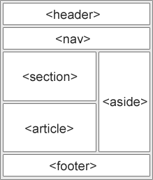
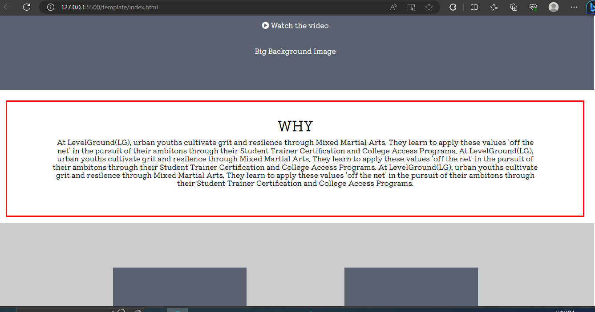
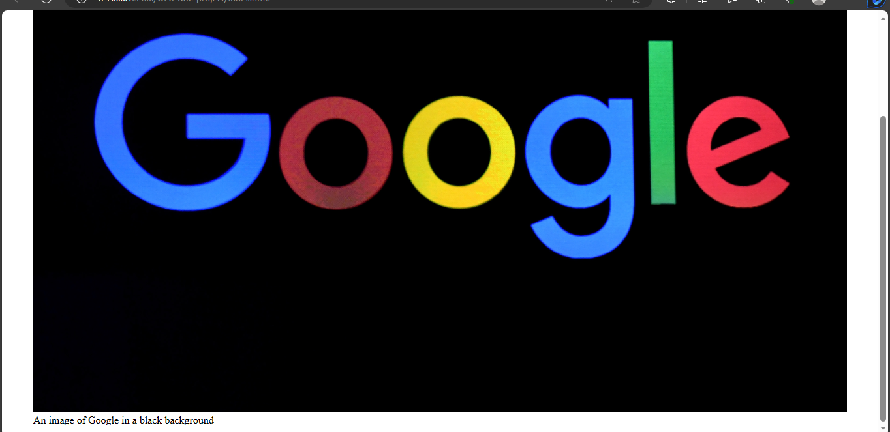

# Semantic Elements
There are categories of the different html elements available.
In this section, you will learn about semantic elements and the types.

## What is a semantic element?
Semantic elements are meaningful elements. They have specific uses and are not to be used unnecessarily. Semantic elements give meaning to a html document.



[Image source](https://www.w3schools.com/html/html5_semantic_elements.asp)

Example,

`index.html`
```
<header>
  <h2>Title of the document</h2>
  <nav>
    <ul>
      <li>First list</li>
      <li>Second list</li>
    </ul>
  </nav>
</header>
<main>
  This is the main body of the page
</main>
<section>This is the first section 
  <article>This is an article</article>
  <aside>This is an example to illustrate semantic elements</aside>
</section>
<footer>
  <p>
    This is the bottom of the page.
  </p>
</footer>
```

Previously, web developers used `divs` and `spans` with CSS for laying out content on a web page even though that was not the use of those elements. 

So semantic elements were introduced in html5 to serve that purpose.

## Semantic elements
Some of the semantic elements are,
1. The `section` element.
2. The `article` element.
3. The `header` element.
4. The `footer` element.
5. The `main` element.
6. The `figure` element.
7. The `figcaption` element.
8. The `aside` element. 
9. The `details` element.
10. The `summary` element.
11. The `time` element.
12. The `mark` element.
13. The `nav` element.

These are the elements that were added as semantic elements in order to give meaning to their contents.

In this documentation, you have covered `header`,`footer` and `mark` elements. You will learn about the rest on this page.

### The `section` and `article` elements 
The `section` element is used to part the layers of a page. When accessing a page, you would notice there are about three or four sections on the page. So the `section` element is used to group the parts of a webpage. 

An article is used for content that could be in a `section` element or on its own.

Example,

`index.html`
```
<section>
  <h2>Who we are</h2>
  <article>
    Yesterday was a great day. But, everything was a mess. Could it be any worse than this? Working on making today a better day. What if I see tomorrow and say "everything was a mess". Maybe I could stop being negative and become positive. Yesterday was a great day and everything was good. That's better, much better.
  </article>
</section>
```
*Note: The content in the `article` is just an example to illustrate the use of the `article` element.*

### The `main` element
The `main` element is used to describe the main content on the web page. The layout is the most important information about the web page.




On this site, the layout that I circled is the most important body of the page and should therefore use the body element.

### The `figure` and `figcaption` elements 
The `figure` element was introduced for diagrammatic illustrations including code snippets. The `figcaption` element was introduced for adding a caption to the illustrations. It goes in line with the `figure` element.

Example,

`index.html`
```
<figure>
  
  <figcaption>An image of Google in a black background</figcaption>
</figure>
```



That's an example of the `figure` element and the `figcaption` element.

### The `aside` element
The `aside` element is used to place content at the side of a page. Normally, a hint, tip or necessary information.

Example,


`index.html`
```
<section>
  <h2>Who we are</h2>
  <article>
    Yesterday was a great day. But,   everything was a mess. Could it be any worse than this? Working on making today a better day. What if I see tomorrow and say "everything was a mess". Maybe I could stop being negative and become positive. Yesterday was a great day and everything was good. That's better, much better.
  </article>
  <aside>The content in the `article` is just an example to illustrate the use of the `article` element.
 </aside>
</section>
```
Previously, I added the text in the `aside` element as a note. But now, with the `aside` element, I can add it to the html document.

Using the `aside` element does not give the text any styling, you would have to do that using positioning in css.

### The `details`  and `summary` elements 
The `details` element is used to add more details about a topic.

The `summary` element is used to give a short descriptive summary. It is used as a *heading* for the `details` element.


### The `time` element 
The `time` element is an element you can use to add time in html. The `time` element helps search engines and other bots to access date and timezone. It has an attribute `datetime` where you can add date and time.

Example,


`index.html`
```
<time datetime="2023-04-10T02:46:22+01:00">Monday, 10 April 2023
</time>
```

The `datetime` attribute consists of date,time and timezone values respectively.

### The `nav` element 
The `nav` element is used for navigation links. That is, links that you could use to access other pages or content about the web page.

Example,


`index.html`
```
<nav>
  <ul>
    <li><a href="/product">Product 2</a></li>
    <li><a href="/about">About us</a></li>
    <li><a href="/pricing">Pricing</a></li>
    <li><a href="/contact">Contact us</a></li>
    <li><a href="/sign">Sign up</a></li>
  </ul>
</nav>
```

This is an example of using the `nav` element.
