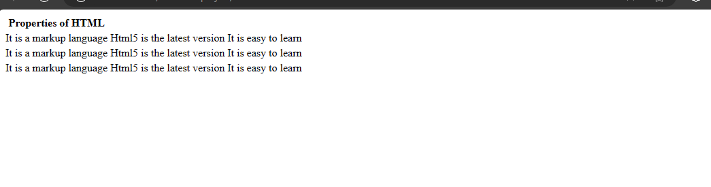
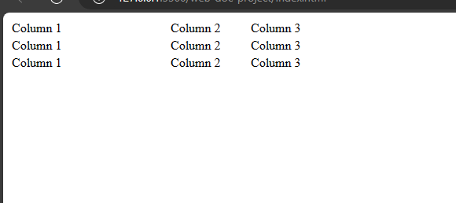
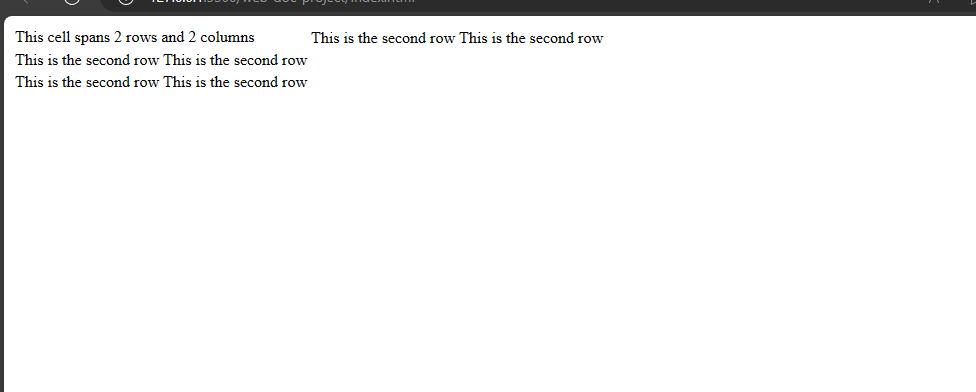

# Table Elements
The table element as the name implies is for tabular data. Tables have been useful in the development of web pages. Before the introduction of some css styling, developers used tables to style html. In this section, you will learn how to create tables in html.


## The structure of the table
```
<table>
  <thead>
    <tr>
      <th>Properties of HTML</th>
    </tr>
  </thead>
  <tbody>
    <tr>
      <td>It is a markup language</td>
      <td>Html5 is the latest version</td>
      <td>It is easy to learn</td>
    </tr>
    <tr>
      <td>It is a markup language</td>
      <td>Html5 is the latest version</td>
      <td>It is easy to learn</td>
    </tr>
    <tr>
      <td>It is a markup language</td>
      <td>Html5 is the latest version</td>
      <td>It is easy to learn</td>
    </tr>
  </tbody>
</table>
```



1. The table uses a general element called `<table></table>`. This is where you place all the tabular content.
2. Inside the `<table>` element. It uses the `<thead>` element to distinguish the heading from the body of the table.
3. Inside the `<thead>`, it uses the `<tr>` to specify the rows for the tables. The `<th>` carries the actual content for the heading of the table.
4. For the body, the `<tbody>` element is used. Inside the `<tbody>`, you have the `<tr>` for the rows and `<td>` which contains the actual content for the body.


## The `colgroup` and `col` properties


The `colgroup` element is a container for one or more `col` elements. The `col` element defines the properties of a single column.


Example,

`index.html`
```
<table>
  <colgroup>
    <col width="200px">
    <col width="100px">
    <col width="*">
  </colgroup>
  <tr>
    <td>Column 1</td>
    <td>Column 2</td>
    <td>Column 3</td>
  </tr>
  <tr>
    <td>Column 1</td>
    <td>Column 2</td>
    <td>Column 3</td>
  </tr>
  <tr>
    <td>Column 1</td>
    <td>Column 2</td>
    <td>Column 3</td>
  </tr>
</table>
```



In this example, the `colgroup` element has three `col` elements. The first `col` element specifies a width of 200 pixels, the second `col` element specifies a width of 100 pixels, and the third `col` element specifies a width of *, which means that it will take up the remaining width of the table.


The `td` elements in the `tr` element will inherit the widths of the columns in the `colgroup` element. This means that the first `td` element will be 200 pixels wide, the second `td` element will be 100 pixels wide, and the third `td` element will be the remaining width of the table.


## The `colspan` and `rowspan` attributes 
The properties are used to merge cells in a table. The colspan property determines the number of columns a cell should merge. The rowspan property determines the number of rows a cell should merge. It is placed in the `<td>` tag.


Example,


`index.html`
```
<table>
  <tr>
    <td rowspan="2" colspan="2">This cell spans 2 rows and 2 columns</td>
  </tr>
  <tr>
    <td>This is the second row</td>
    <td>This is the second row</td>
  </tr>
  <tr>
    <td>This is the second row</td>
    <td>This is the second row</td>
  </tr>
  <tr>
    <td>This is the second row</td>
    <td>This is the second row</td>
  </tr>
</table>
```



This will cause the first `<td>` tag to span two rows and columns.


## The `<caption>` property 
You can add captions to tables using the caption property. To do that, add the caption element immediately after the `<table>` tag. It is usually centred by default.


Example,
`index.html`
```
<table>
  <caption>Properties of HTML</caption>
  <tr>
    <td>It is a markup language</td>
    <td>Html5 is the latest version</td>
    <td>It is easy to learn</td>
  </tr>
  <tr>
    <td>It is a markup language</td>
    <td>Html5 is the latest version</td>
    <td>It is easy to learn</td>
  </tr>
  <tr>
    <td>It is a markup language</td>
    <td>Html5 is the latest version</td>
    <td>It is easy to learn</td>
  </tr>
</table>
```
This is the first example I used in this section. Now, the `caption` property is used as a title for the table. 
