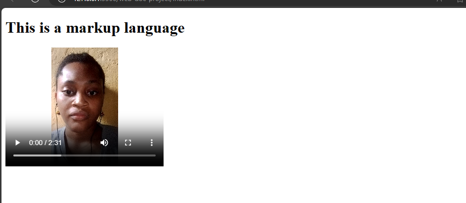
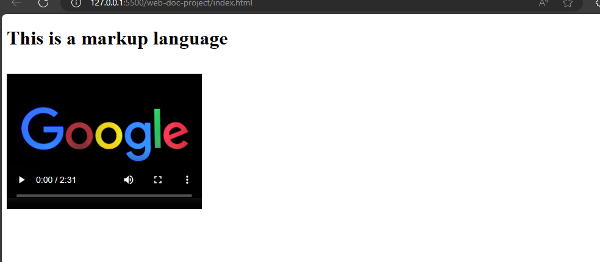

# Video Basics
This is the last part on media elements. You can insert videos on a webpage using the video element. The audio and the video element are somewhat similar as they share similar attributes.

The video element supports the use of three video file types which are .mp4, .webm and .ogg.


To insert a video on a webpage, you could use:


`index.html`
```
<video width="320" height="240" controls>
  <source src="new_video.mp4" type="video/mp4">
  <source src="new_video.ogg" type="video/ogg">
  <source src="new_video.webm" type="video/webm"> 
</video>
```



In videos, you can add width and height attributes to specify the size of your video or the browser will use default values.


The `controls`,`src`, and `type` attributes in the video element perform the same functions as they do in the audio element.


## The `poster` attribute 
When you run the current video file in your browser, it will show a default poster image which the browser is using or the an image of the video.
This is because you have yet to specify a poster image for your video.


You can do that with the poster attribute and add an image which the browser will display until you play the video.


Example,

`index.html`
```
<video width="320" height="240" controls poster="img/google_image.jpg">
  <source src="new_video.mp4" type="video/mp4">
  <source src="new_video.ogg" type="video/ogg">
  <source src="new_video.webm" type="video/webm"> 
</video>
```




## The `autoplay` and `muted` attributes

Like in audio, you can add autoplay and muted attributes to run the video immediately the user opens the browser.


Also, you can add text in a video to display if the user disables video from their browser settings.


Example,

`index.html`
```
<video width="320" height="240" controls poster="img/google_image.jpg" autoplay muted>
  <source src="new_video.mp4" type="video/mp4">
  <source src="new_video.ogg" type="video/ogg">
  <source src="new_video.webm" type="video/webm"> 
  Video is disabled.
</video>
```


Now, that is how to add videos to your webpage using Html.
