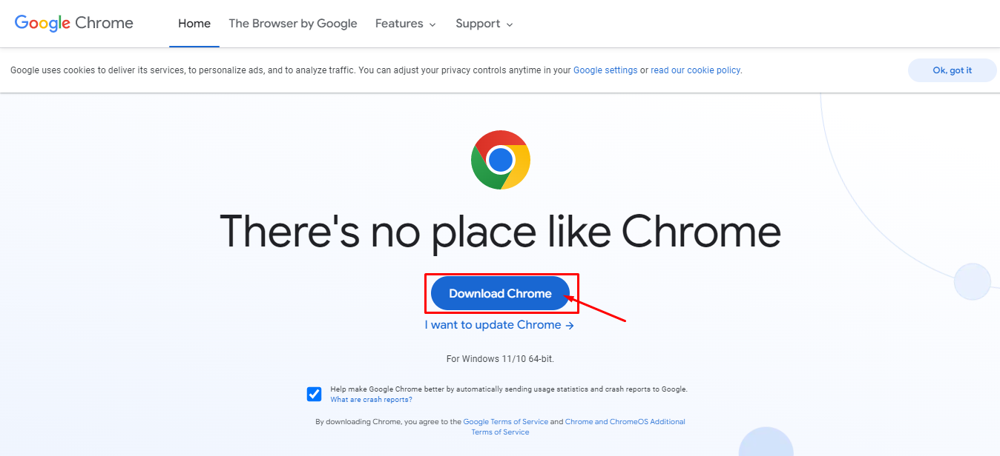
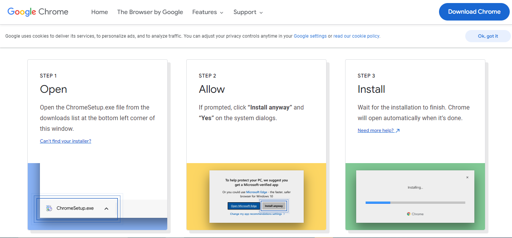
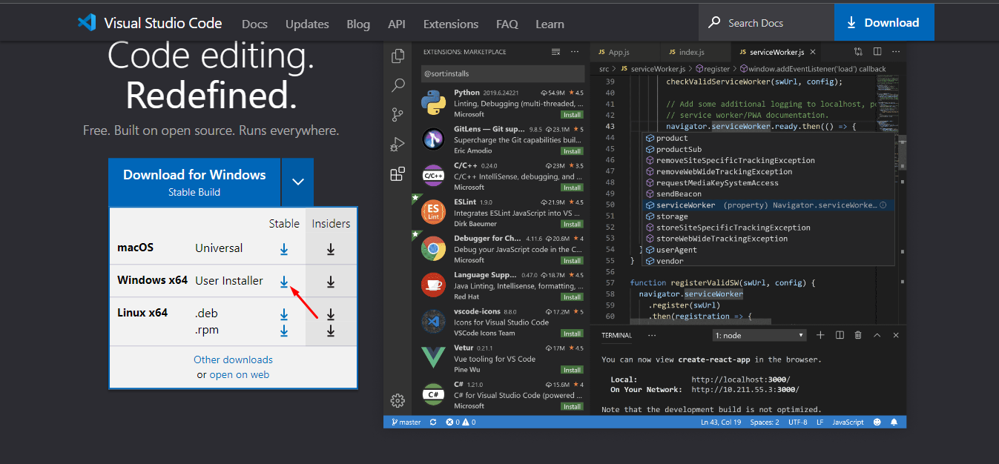
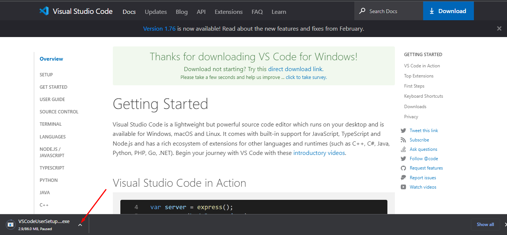

# Introduction
## Introduction to web development
Web development is the process of building websites. Building a website requires technical knowledge. Markup languages like html and css are paramount in building web pages. 
 
Html lays the structure of the web page while CSS styles the page and makes it presentable. Then programming languages are used to make websites dynamic. When you register your details on a site and the site saves it and sends a welcome message with your name. That is the work of programming languages. These languages are used to interact with the web without the programming languages, [websites would be static](https://link.medium.com/UJHIs2IXWxb).

JavaScript is a programming language used in building websites. JavaScript was built primarily for building websites and it has advanced with great features, frameworks and libraries.

## Web design and web development
Web design and web development are used interchangably in programming often. But, there is a clear distinction between both terms.

### Web design 
Web design has to do with designing the content that a browser displays on a web page. It covers the structure, size, position and entire layout of the content on a web page and how you can perceive them. It generally has to do with making web pages presentable and easily understood. Web designers normally use design tools like, Adobe, Figma and other design tools. Their skills include all forms of designs, including markup languages--html and css. Web designers use html and css to set the structure of the site and design it. They also use css frameworks like bootstrap and tailwind. A web designer could also acquire some javascript knowledge in order to build dynamic websites(websites that perform operations).

### Web development
Web development covers the art of making websites work. Web developers usually take work created by web designers to create a functioning website. They use programming languages to make a web page able to carry out operations. A web designer might focus on design and general aesthetics but web developers master programming languages, frameworks and libraries to build all kinds of applications on the web. 
Web development have two main categories which are: 
- **Frontend web development**
- **Backend web development**

**Frontend web development**

Frontend development has to do with the client side of an application. It is the part of the application that you would see and interact with. Developers who specialize in frontend development are called *frontend developers*. They usually bring designs to life on a webpage by using a programming language. Frontend developers are familiar with markup languages but they are also good at programming language(s) usually javascript and all the necessary libraries and frameworks.

**Backend web development**

Backend web development covers the server side of the application.  As a user on the web, you would not come across server side operations. But, it is what powers the web, the backend is in charge of storing data and managing data gotten from the frontend of the application. It also makes it possible for web pages to register users on their page, subscribe to their emails and other operations. Backend developers master programming languages like Java, Javascript, C#, Python and so on.

A developer who is familiar with frontend development and backend development is called a fullstack developer.

## Getting started
Programming is fun! and so is web development. In backend development, you would not need to master many languages before you can build an application. In reality, most backend developers would master one programming language and some frameworks of that language while having a shallow knowlege of others.

This documentation serves as a beginner's guide to the basics of web development. By the end of this documentation, you should be familiar with 
- html tags
- html elements
- html lists and forms
- css
- css basics
- topography and display
- other topics in css
- javascript basics
- functions and conditional statements
- building basic applications with html,css and javascript

## Prerequisites
To follow properly through the sections of this tutorial, you will need:

- A web browser like [Chrome](https://www.google.com/chrome/) or [Firefox](https://www.mozilla.org/en-US/firefox/new/).
- A text editor like [VSCode](https://code.visualstudio.com/).

## Installing tools
### Installing  Chrome
I will use Chrome browser to run webpages. To install Chrome, 
- Click on this  [installing Chrome on a PC](https://www.google.com/chrome/).

- Follows the steps that comes up on Chrome page while you are downloading.

- If you mistakenly closed the page, this is the [link to Chrome Installation thank you page](https://www.google.com/chrome/thank-you.html?statcb=1&installdataindex=empty&defaultbrowser=0).
 
### Installing VSCode
After installing, the next thing is to install Vscode.
- Click on this [installing VSCode](https://code.visualstudio.com/). I am using Windows so I select the one for my system.

- Download will begin immediately
 
- After downloading, click on `Run` to set it up on your browser.
- Ater installing it, open it.

Congratulations! you are now prepared to be a developer.

